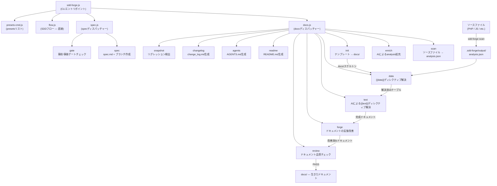

# 01. ツール概要とアーキテクチャ

## 説明

<!-- {{text: Write a 1-2 sentence overview of this chapter. Include the tool's purpose, the problem it solves, and its primary use cases.}} -->

この章では、ソースコード解析からドキュメントを自動生成し、Spec-Driven Development（SDD）ワークフローを提供する CLI ツール `sdd-forge` を紹介します。ツールのコアとなる目的、3層ディスパッチアーキテクチャ、基本概念、そしてインストールから動作するドキュメントを得るまでの典型的な手順を解説します。
<!-- {{/text}} -->

## 内容

### 目的

<!-- {{text: Describe the problem this CLI tool solves and its target users. Derive the purpose from package.json and README.}} -->

ソフトウェアプロジェクトでは、コードの進化とともにドキュメントが実装と乖離していく問題が頻繁に発生します。一度書かれたドキュメントは、その後の変更に追いつけず陳腐化してしまいます。`sdd-forge` は、ソースファイルの静的解析から構造化されたドキュメントを直接生成することで、この問題を解決します。ドキュメントは記憶や推測ではなく、実際の実装に基づいた状態を維持し続けます。

このツールは、非trivialなコードベースを管理する開発者やチームを対象としています。特に CakePHP、Laravel、Symfony などのフレームワーク上に構築された PHP Web アプリケーションで、アーキテクチャドキュメントを最新の状態に保つことが多大な手動作業を伴う場合に有効です。コントローラー、モデル、エンティティ、マイグレーション、その他のソースアーティファクトをスキャンすることで、`sdd-forge` は既存のコードを説明する手間なく、正確な Markdown ドキュメントを生成します。

ドキュメント生成に加えて、`sdd-forge` は Spec-Driven Development の規律を強制します。新しい機能追加や修正はすべて、機械的に検証可能な仕様から始まり、実装開始前にゲートチェックを通過する必要があります。これにより、要件からマージされたコードまでのトレーサブルなパスが生まれ、曖昧さや想定外のスコープ変更を減らします。
<!-- {{/text}} -->

### アーキテクチャ概要

<!-- {{text[mode=deep]: Generate a mermaid flowchart showing the tool's overall architecture. Include the dispatch structure from entry point to subcommands and the main processing flow (input → processing → output). Output only the mermaid code block.}} -->


<!-- {{/text}} -->

### 主要概念

<!-- {{text: Explain the key concepts and terminology needed to understand this tool in table format. Extract the main concepts from source code.}} -->

| 概念 | 説明 |
|---|---|
| `analysis.json` | `sdd-forge scan` が生成する中心的なアーティファクト。ソースファイルから抽出した構造化データ（クラス、メソッド、リレーション、カラム、ファイルメタデータ）を含み、すべての後続コマンドによって使用される。 |
| `{{data}}` ディレクティブ | `sdd-forge data` によって解決されるテンプレートのプレースホルダー。指定された DataSource メソッド（例: `controllers.list(...)`）を呼び出し、`analysis.json` から生成された Markdown テーブルでディレクティブブロックを置き換える。 |
| `{{text}}` ディレクティブ | `sdd-forge text` によって解決されるテンプレートのプレースホルダー。AI エージェントが周囲のコンテキストと解析データを読み取り、説明文でブロックを埋める。ディレクティブの枠は再生成をまたいで保持され、本文の内容のみが置き換えられる。 |
| DataSource | `scan()` メソッド（ソースファイルから構造化データを抽出）と、そのデータを Markdown 出力としてフォーマットする解決メソッドを組み合わせたクラス。各プリセットは対象フレームワークの規約に合わせた DataSource を提供する。 |
| プリセット | DataSource、ドキュメント章テンプレート、および特定のフレームワークやプロジェクトタイプ（例: `node-cli`、`symfony`、`cakephp2`）を対象とした `preset.json` マニフェストで構成される自己完結型バンドル。プリセットは実行時に自動的に探索される。 |
| `docs/` | 生成されたドキュメントのディレクトリ。章構成はプリセットの `chapters` 配列で定義され、`data` および `text` の解決パスを通じて内容が埋められる。 |
| `spec.md` | `sdd-forge spec --title` によって作成される構造化仕様ファイル。SDD ワークフローを駆動し、実装開始前と完了後の両方で `sdd-forge gate` によって検証される。 |
| ゲートチェック | 仕様が完成しており、未解決の疑問点がなく、事後実装モードでは実際の変更が記載された要件と一致していることを確認する検証ステップ（`sdd-forge gate`）。事前ゲートを通過するまで実装はブロックされる。 |
| Forge | 反復的なドキュメント改善ループ（`sdd-forge forge`）。AI エージェントが現在の `docs/` コンテンツとソースを比較し、精度・完全性・一貫性を向上させるためにセクションを書き直す。 |
| SDD フロー | このツールが強制するエンドツーエンドの Spec-Driven Development プロセス: `spec → gate → implement → forge → review`。ガイド付き実行のために `/sdd-flow-start` および `/sdd-flow-close` スキルによってサポートされる。 |
<!-- {{/text}} -->

### 典型的な使用フロー

<!-- {{text: Describe the typical steps from installation to first output in step format. Derive the steps from help output and command definitions in the source code.}} -->

**ステップ 1 — パッケージのインストール**

```bash
npm install -g sdd-forge
```

**ステップ 2 — プロジェクトの登録**

プロジェクトルートから `sdd-forge setup` を実行します。これにより `.sdd-forge/config.json` が作成され、フレームワークに適したプリセットが選択され、AI エージェントにプロジェクトコンテキストを提供する `AGENTS.md` が生成されます。

**ステップ 3 — フルビルドパイプラインの実行**

```bash
sdd-forge build
```

`scan → enrich → init → data → text → readme → agents` の完全なパイプラインを順番に実行し、初回実行で `docs/` ディレクトリに内容を完全に生成します。

**ステップ 4 — 生成されたドキュメントのレビュー**

`docs/` ディレクトリを開き、生成された Markdown の各章を確認します。`sdd-forge review` を実行して自動品質チェックを行い、改善が必要なセクションを特定します。

**ステップ 5 — forge による改善**

```bash
sdd-forge forge --prompt "Improve the database schema overview"
```

`sdd-forge forge` を使用して特定のセクションを反復的に改善し、すべてのチェックが通過するまで `sdd-forge review` を再実行します。

**ステップ 6 — SDD ワークフローで新機能を開始する**

```bash
sdd-forge spec --title "add-export-command"
sdd-forge gate --spec specs/NNN-add-export-command/spec.md
```

コードを書く前に仕様を作成し、事前ゲートチェックを通過してから機能を実装し、`sdd-forge forge` と `sdd-forge review` でドキュメントを最新の状態に保ちながらサイクルを完了させます。
<!-- {{/text}} -->
