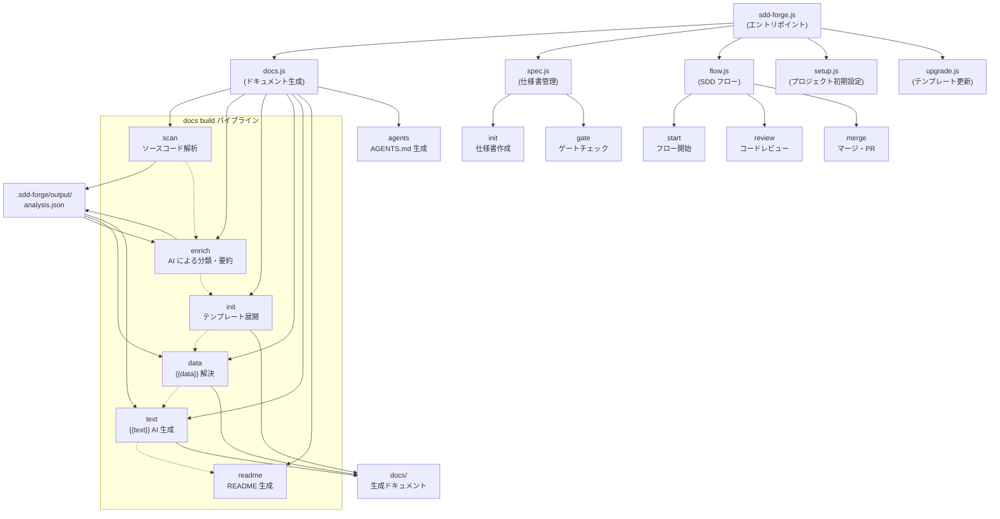

# ツール概要とアーキテクチャ

## 説明

<!-- {{text({prompt: "この章の概要を1〜2文で記述してください。ツールの目的・解決する課題・主要なユースケースを踏まえること。"})}} -->

sdd-forge は、ソースコードの静的解析とAIによるテキスト生成を組み合わせて、プロジェクトのドキュメントを自動生成する CLI ツールです。さらに、仕様書の作成からゲートチェック・実装・レビュー・マージまでを一貫して管理する Spec-Driven Development（SDD）ワークフローを提供し、ドキュメントとコードの乖離を防ぎます。
<!-- {{/text}} -->

## 内容

### ツールの目的

<!-- {{text({prompt: "このCLIツールが解決する課題と、ターゲットユーザーを説明してください。ソースコードの package.json や README から目的を読み取ること。"})}} -->

ソフトウェアプロジェクトでは、ソースコードの変更にドキュメントが追従できず、情報が陳腐化する問題が頻繁に発生します。手動でドキュメントを保守するコストは高く、AI に丸投げすると構成が安定しません。

sdd-forge はこの課題を、以下のアプローチで解決します。

- **ソースコード解析による事実抽出** — `{{data}}` ディレクティブがコードから構造情報を自動取得し、テーブルやリストとして挿入します。推測に依存しないため、正確性が担保されます。
- **AI によるテキスト生成の制御** — `{{text}}` ディレクティブが AI の記述範囲を限定します。段落構成はテンプレートが定義し、AI は枠内で文章を生成するため、構成の安定性と可読性を両立します。
- **SDD ワークフローによる開発管理** — 仕様書作成・ゲートチェック・実装・レビュー・マージを一連のフローとして管理し、ドキュメントの同期更新まで自動化します。

ターゲットユーザーは、中〜大規模プロジェクトの開発チーム、フレームワークベースの Web アプリケーション開発者、CLI ツール・ライブラリの作成者です。Node.js 18 以上の環境で動作し、外部依存なしで利用できます。
<!-- {{/text}} -->

### アーキテクチャ概要

<!-- {{text({prompt: "ツール全体のアーキテクチャを mermaid flowchart で図示してください。エントリポイントからサブコマンドへのディスパッチ構造、主要な処理フロー（入力→処理→出力）を含めること。出力は mermaid コードブロックのみ。", mode: "deep"})}} -->


<!-- {{/text}} -->

### 主要コンセプト

<!-- {{text({prompt: "このツールを理解するうえで重要なコンセプト・用語を表形式で説明してください。ソースコードから主要な概念を抽出すること。"})}} -->

| コンセプト | 説明 |
|---|---|
| **プリセット (Preset)** | フレームワーク固有のスキャン設定・データソース・テンプレートをまとめたパッケージです。`parent` フィールドによる単一継承チェーンで構成され、`base → webapp → laravel` のように段階的に特化します。 |
| **`{{data}}` ディレクティブ** | ソースコード解析結果（analysis.json）からデータを取得し、マークダウンのテーブルやリストとして挿入する出力ディレクティブです。DataSource クラスのメソッドを呼び出して値を解決します。 |
| **`{{text}}` ディレクティブ** | AI エージェントにプロンプトを渡し、指定された範囲内で文章を生成させる出力ディレクティブです。`light`（解析データのみ参照）と `deep`（ソースコードを再読）の 2 モードがあります。 |
| **DataSource / Scannable** | `{{data}}` の値を提供する OOP クラスです。`Scannable` ミックスインを適用すると、scan フェーズでソースコードを解析して analysis.json に書き込む機能が追加されます。 |
| **analysis.json** | `scan` コマンドが生成するソースコード構造の永続データです。`.sdd-forge/output/` に保存され、後続の enrich・data・text フェーズの入力になります。 |
| **SDD フロー** | 仕様書作成（spec）→ ゲートチェック（gate）→ 実装（implement）→ レビュー（review）→ マージ（merge）の一連のワークフローです。進行状態は `flow.json` に永続化され、中断・再開が可能です。 |
| **テンプレート継承** | `` / `` 制御ディレクティブにより、親プリセットのテンプレートを子プリセットで部分的に上書きできる仕組みです。 |
| **章 (Chapter)** | ドキュメントの構成単位です。`preset.json` の `chapters` 配列で順序が定義され、各章は `docs/` ディレクトリ内の個別マークダウンファイルに対応します。 |
<!-- {{/text}} -->

### 典型的な利用フロー

<!-- {{text({prompt: "ユーザーがインストールしてから最初の成果物を得るまでの典型的な手順をステップ形式で説明してください。ソースコードのヘルプ出力やコマンド定義から手順を導出すること。"})}} -->

1. **インストール** — npm からグローバルインストールします。
   ```bash
   npm install -g sdd-forge
   ```

2. **プロジェクト初期設定** — 対象プロジェクトのルートディレクトリで `setup` を実行します。対話形式でプリセット（フレームワーク種別）、言語、AI エージェントを設定し、`.sdd-forge/config.json` が生成されます。
   ```bash
   cd /path/to/your-project
   sdd-forge setup
   ```

3. **ドキュメント一括生成** — `docs build` コマンドで、scan → enrich → init → data → text → readme → agents の全パイプラインを実行します。
   ```bash
   sdd-forge docs build
   ```

4. **成果物の確認** — `docs/` ディレクトリに章ごとのマークダウンファイル、ルートに `README.md` と `AGENTS.md` が生成されます。

5. **継続的な更新** — ソースコードを変更した後に `docs build` を再実行すると、変更箇所に対応するドキュメントが差分更新されます。

6. **SDD フローの利用（任意）** — 新機能の追加や修正を行う場合は、`sdd-forge flow start --request "要望"` で SDD フローを開始し、仕様書作成からマージまでを管理できます。
<!-- {{/text}} -->

---

<!-- {{data("base.docs.nav")}} -->
[技術スタックと運用 →](stack_and_ops.md)
<!-- {{/data}} -->
