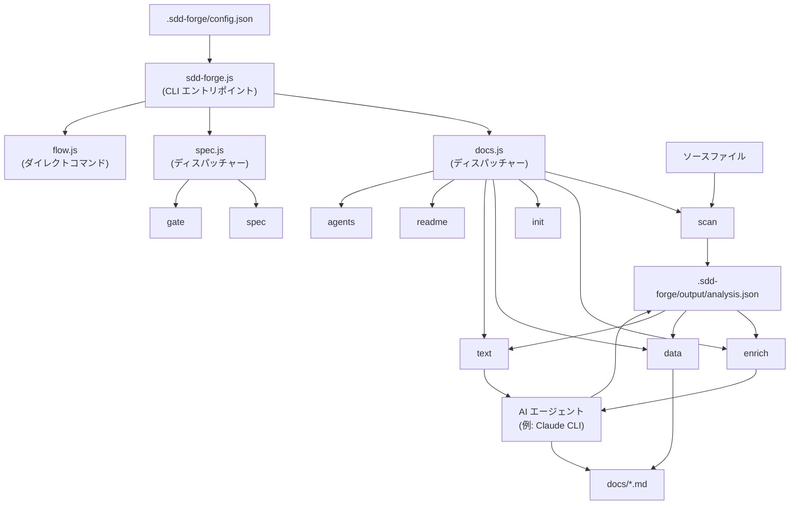

# 01. システム概要

## 説明

<!-- {{text: Write a 1-2 sentence overview of this chapter. Include the project's architecture and whether it integrates with external systems.}} -->

本章では、Spec-Driven Development を通じてドキュメント生成を自動化する Node.js CLI ツール「sdd-forge」の概要を説明します。3 層コマンドディスパッチアーキテクチャ、AI 支援ビルドパイプライン、ソース解析のエンリッチメントと構造化プロジェクトドキュメント生成に使用する外部 AI エージェント連携について解説します。
<!-- {{/text}} -->

## 内容

### アーキテクチャ図

<!-- {{text: Generate a mermaid flowchart showing the project architecture. Include data flows between major components. Output only the mermaid code block.}} -->

<!-- {{/text}} -->

### コンポーネントの責務

<!-- {{text[mode=deep]: Describe the major components with their location, responsibilities, and I/O in table format.}} -->

| コンポーネント | 配置場所 | 責務 | 入力 | 出力 |
|---|---|---|---|---|
| CLI エントリポイント | `src/sdd-forge.js` | トップレベルのサブコマンドルーティング。`--project` フラグまたは `projects.json` を通じてプロジェクトコンテキストを解決し、`SDD_SOURCE_ROOT` / `SDD_WORK_ROOT` 環境変数を設定する | CLI 引数、`.sdd-forge/projects.json` | docs.js、spec.js、flow.js、または help.js へ委譲 |
| docs ディスパッチャー | `src/docs.js` | ドキュメント関連のサブコマンド（`build`、`scan`、`enrich`、`init`、`data`、`text`、`readme`、`forge`、`review`、`changelog`、`agents`、`snapshot` など）をルーティングする | サブコマンド名 + 引数 | `src/docs/commands/*.js` へ委譲 |
| spec ディスパッチャー | `src/spec.js` | `spec` および `gate` サブコマンドをルーティングする | サブコマンド名 + 引数 | `src/specs/commands/*.js` へ委譲 |
| flow | `src/flow.js` | SDD ワークフロー全体をエンドツーエンドで自動実行する（DIRECT_COMMAND — サブルーティングなし） | フローリクエスト文字列、spec パス | オーケストレーションされた SDD ステップの実行 |
| scan | `src/docs/commands/scan.js` | ソースファイルを走査し、言語固有のアナライザーを使用してモジュール・メソッド・ルート・設定構造を抽出する | 設定済みスキャンパス配下のソースファイル | `.sdd-forge/output/analysis.json` |
| enrich | `src/docs/commands/enrich.js` | AI をバッチ実行して各 analysis エントリに `summary`、`detail`、`chapter`、`role` フィールドを付与する。再開可能性のため処理済みエントリはスキップする | `analysis.json` | エンリッチメントフィールドが追加された `analysis.json` |
| init | `src/docs/commands/init.js` | `@extends` / `@block` テンプレート継承を適用しながら、プリセットテンプレートから `docs/` を初期化する | プリセットテンプレート、`config.json` | ディレクティブを含む `docs/*.md` ファイルのスキャフォールド |
| data | `src/docs/commands/data.js` | アクティブなプリセットからロードした DataSource クラスを照会して `{{data}}` ディレクティブを解決する | `analysis.json`、`{{data}}` ディレクティブを含む doc ファイル | テーブルとリストが解決された `docs/*.md` |
| text | `src/docs/commands/text.js` | ソースを考慮したプロンプトで設定済み AI エージェントを呼び出し、`{{text}}` ディレクティブを解決する | `{{text}}` ディレクティブを含む doc ファイル、`analysis.json`、ソースファイル | AI 生成テキストが埋め込まれた `docs/*.md` |
| forge | `src/docs/commands/forge.js` | 変更されたセクションに対して AI 生成を再実行することで、既存の `docs/*.md` コンテンツを反復的に改善する | `docs/*.md`、`analysis.json`、変更プロンプト | 改善された `docs/*.md` |
| review | `src/docs/commands/review.js` | チェックリストに照らしてドキュメント品質をチェックし、AI 出力を構造化された PASS/FAIL レポートにパースする | `docs/*.md`、レビューチェックリストテンプレート | 基準ごとの PASS/FAIL を含むレビュー結果 |
| gate | `src/specs/commands/gate.js` | 実装前（pre）または実装後（post）に spec ファイルの完全性を検証する | `specs/NNN-xxx/spec.md` | 未解決項目を含む PASS/FAIL レポート |
| agent | `src/lib/agent.js` | AI CLI サブプロセスの呼び出しを同期（`execFileSync`）または非同期（`spawn`）でラップし、`{{PROMPT}}` プレースホルダーを通じてプロンプトを注入する | プロンプト文字列、`config.json` からのエージェント設定 | AI 生成テキスト文字列 |
| config | `src/lib/config.js` | `.sdd-forge/config.json` を読み込み検証する。`.sdd-forge/` 配下のすべてのリソースに対するパスヘルパーを提供する | `.sdd-forge/config.json`、`.sdd-forge/context.json` | 検証済み設定オブジェクト、解決済みファイルパス |
| presets | `src/lib/presets.js` | `src/presets/` 配下の `preset.json` ファイルを自動検出し、`PRESETS` 定数とルックアップヘルパーを公開する | `src/presets/**/preset.json` | init、data、scan が使用するプリセットレジストリ |
| flow-state | `src/lib/flow-state.js` | SDD ワークフローの進行状態（現在の spec パス、ブランチ名、worktree 状態）を `.sdd-forge/current-spec` に永続化する | JSON 状態オブジェクト | `.sdd-forge/current-spec` ファイル |
<!-- {{/text}} -->

### 外部連携

<!-- {{text: If there are external system integrations, describe their purpose and connection method in table format.}} -->

sdd-forge は、ローカルファイルシステム以外の外部サービスやネットワークへの実行時依存を持ちません。唯一の外部連携ポイントは AI エージェント CLI（通常は Claude CLI）であり、複数のコマンドからサブプロセスとして呼び出されます。

| 連携先 | 使用するコマンド | 目的 | 接続方式 |
|---|---|---|---|
| AI エージェント CLI（例: Claude CLI） | `enrich`、`text`、`forge`、`review`、`agents` | ドキュメントの文章を生成・改善する。analysis エントリにセマンティックなメタデータを付与する | `child_process.spawn`（非同期）または `execFileSync`（同期）でサブプロセスとして起動。設定済みの `args` 配列内の `{{PROMPT}}` プレースホルダーにプロンプトテキストを注入する |

エージェントのバイナリ、引数、タイムアウト値はすべて `.sdd-forge/config.json` の `providers` および `defaultAgent` フィールドで定義されており、ツールレベルでエージェントに依存しない設計となっています。
<!-- {{/text}} -->

### 環境ごとの差異

<!-- {{text: Describe the configuration differences across environments (local/staging/production).}} -->

sdd-forge は開発者向け CLI ツールであり、従来のローカル/ステージング/本番環境というデプロイモデルには従いません。設定の差異はプロジェクトごとに `.sdd-forge/config.json` と環境変数で管理されます。

| 側面 | インタラクティブな開発者利用 | CI / 自動化パイプライン |
|---|---|---|
| プロジェクト解決 | `--project <name>` フラグ、または `projects.json` の `default` エントリ | `SDD_SOURCE_ROOT` および `SDD_WORK_ROOT` 環境変数 |
| AI エージェント | ローカルマシンに設定済みエージェント CLI がインストールされ認証されている必要がある | 同様の要件。CI 環境の `PATH` にエージェント CLI が存在する必要がある |
| タイムアウト | デフォルト値が適用される: 120 秒（標準）、180 秒（中）、300 秒（長） | 処理が遅い CI ランナー向けに `config.json` の `limits.designTimeoutMs` で延長可能 |
| 出力言語 | `config.json` の `output.languages` および `output.default` で制御 | 差異なし。同じ設定ファイルを使用する |
| 並列処理数 | デフォルトは 5 並列ファイル操作（`limits.concurrency`） | リソースが制約された環境では低い値に調整可能 |
| Worktree モード | `sdd-forge spec` または `EnterWorktree` を通じてインタラクティブに利用可能 | 利用可能。worktree パスは `.sdd-forge/current-spec` で追跡される |
<!-- {{/text}} -->
