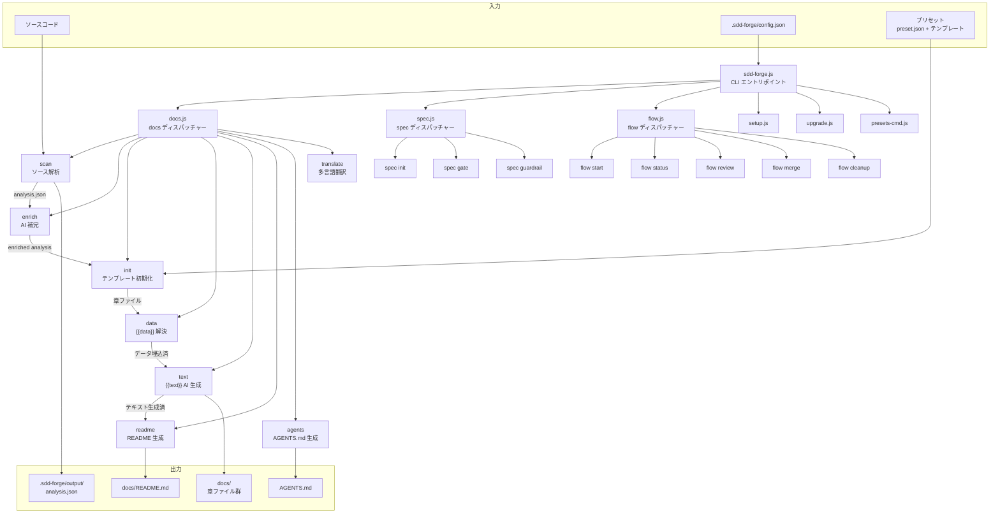

# 01. ツール概要とアーキテクチャ

## 説明

<!-- {{text: この章の概要を1〜2文で記述してください。ツールの目的・解決する課題・主要なユースケースを踏まえること。}} -->

sdd-forge は、ソースコード解析に基づくドキュメント自動生成と Spec-Driven Development（SDD）ワークフローを提供する Node.js CLI ツールです。手動でのドキュメント作成・維持の負担を解消し、ソースコードと常に同期した技術ドキュメントを生成することが主なユースケースです。

<!-- {{/text}} -->

## 内容

### ツールの目的

<!-- {{text: このCLIツールが解決する課題と、ターゲットユーザーを説明してください。ソースコードの package.json や README から目的を読み取ること。}} -->

sdd-forge は、ソースコードの変更にドキュメントが追従できないという課題を解決します。ソースコードを静的解析し、AI による補完を加えて構造化されたドキュメントを自動生成します。さらに、仕様駆動の開発フロー（SDD）を組み込むことで、設計→実装→ドキュメント更新を一貫したワークフローとして管理できます。

ターゲットユーザーは、Web アプリケーション（CakePHP 2、Laravel、Symfony 等）や CLI ツール（Node.js）、ライブラリを開発するチームです。プリセットシステムにより、各フレームワーク固有のコントローラ・モデル・マイグレーション等の解析にも対応しています。

外部依存は一切なく、Node.js 18 以上の組み込みモジュールのみで動作します。

<!-- {{/text}} -->

### アーキテクチャ概要

<!-- {{text[mode=deep]: ツール全体のアーキテクチャを mermaid flowchart で図示してください。エントリポイントからサブコマンドへのディスパッチ構造、主要な処理フロー（入力→処理→出力）を含めること。出力は mermaid コードブロックのみ。}} -->

<!-- {{/text}} -->

### 主要コンセプト

<!-- {{text: このツールを理解するうえで重要なコンセプト・用語を表形式で説明してください。ソースコードから主要な概念を抽出すること。}} -->

| コンセプト | 説明 |
|---|---|
| プリセット | プロジェクト種別（webapp/cli/library）とフレームワーク（cakephp2, symfony 等）に応じた章構成・テンプレート・DataSource の定義セット。`base → アーキテクチャ層 → リーフ` の階層で継承されます。 |
| `{{data}}` ディレクティブ | テンプレート内のマーカーで、DataSource のメソッドを呼び出して解析結果（テーブル等）を埋め込みます。`{{data: source.method("Label1\|Label2")}}` の形式で記述します。 |
| `{{text}}` ディレクティブ | テンプレート内のマーカーで、AI エージェントにプロンプトを渡して文章を生成・埋め込みます。段落構成はディレクティブ側で制御され、AI が構成を変更することはありません。 |
| DataSource | `{{data}}` ディレクティブの解決を担うクラス。`scan()` で解析データを収集し、`relations()` や `columns()` 等のメソッドでマークダウンテーブルを返します。プリセットごとにフレームワーク固有の DataSource を定義できます。 |
| テンプレート継承 | `@extends` / `@block` / `@endblock` により、プロジェクトローカル→リーフプリセット→アーキテクチャ層→base の 4 層でテンプレートをオーバーライドできます。 |
| build パイプライン | `scan → enrich → init → data → text → readme → agents → [translate]` の順にドキュメント生成を実行する一括処理コマンドです。 |
| SDD フロー | 仕様作成（spec）→ ゲートチェック（gate）→ 実装 → レビュー → マージの一連の開発ワークフロー。`flow start` で開始し、状態は `.sdd-forge/` に永続化されます。 |
| CommandContext | すべてのコマンドに渡される統一コンテキスト。プロジェクトルート、設定、言語、AI エージェント設定、i18n 関数などを保持します。 |

<!-- {{/text}} -->

### 典型的な利用フロー

<!-- {{text: ユーザーがインストールしてから最初の成果物を得るまでの典型的な手順をステップ形式で説明してください。ソースコードのヘルプ出力やコマンド定義から手順を導出すること。}} -->

1. **インストール**: `npm install -g sdd-forge` でグローバルインストールします。
2. **セットアップ**: 対象プロジェクトのルートで `sdd-forge setup` を実行します。対話形式でプロジェクト種別・フレームワーク・ドキュメントの目的・言語・AI エージェントなどを設定し、`.sdd-forge/config.json` が生成されます。
3. **ドキュメント一括生成**: `sdd-forge docs build` を実行します。ソース解析（scan）→ AI 補完（enrich）→ テンプレート初期化（init）→ データ埋め込み（data）→ テキスト生成（text）→ README 生成（readme）→ AGENTS.md 生成（agents）がパイプラインとして順次実行されます。
4. **成果物の確認**: `docs/` ディレクトリに章ごとのマークダウンファイルと `README.md` が出力されます。`AGENTS.md` にはプロジェクトの構造情報が集約され、AI アシスタントへのコンテキストとして利用できます。
5. **継続的な更新**: ソースコードを変更した後は `sdd-forge docs build` を再実行することで、ドキュメントを最新の状態に同期できます。個別ステップ（例: `sdd-forge docs scan` や `sdd-forge docs text`）を単体で実行することも可能です。

<!-- {{/text}} -->
