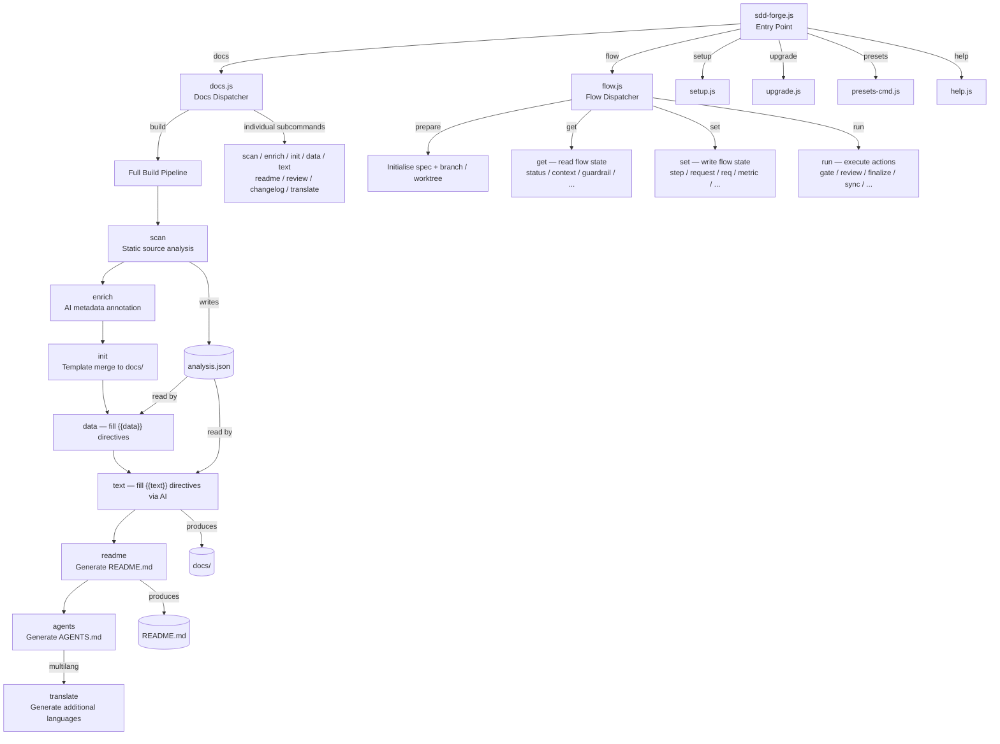

<!-- {{data("base.docs.langSwitcher", {labels: "relative"})}} -->
**English** | [日本語](ja/overview.md)
<!-- {{/data}} -->

# Tool Overview and Architecture

## Description

<!-- {{text({prompt: "Write a 1-2 sentence overview of this chapter. Include the tool's purpose, the problem it solves, and its primary use cases."})}} -->

This chapter introduces sdd-forge, a CLI tool that automates documentation generation from static source code analysis and orchestrates a Spec-Driven Development (SDD) workflow. It covers the tool's core purpose, its three-level command dispatch architecture, and the pipeline that takes source code from scan through to finished documentation.
<!-- {{/text}} -->

## Content

### Purpose

<!-- {{text({prompt: "Describe the problem this CLI tool solves and its target users. Derive the purpose from package.json and README."})}} -->

Software projects routinely suffer from documentation that drifts out of sync with source code, manual documentation effort that repeats with every feature, and ad-hoc development processes that do not scale with AI coding agents. sdd-forge addresses these problems by statically analysing source code to extract structure, classes, methods, configuration, and dependencies, then injecting the extracted data into versioned templates to produce structured `docs/` content and `README.md`. It also provides a spec-first development flow that gates implementation behind a validated specification, ensuring AI agents operate within well-defined boundaries.

Target users are software developers and teams who maintain Node.js projects (or projects supported by the available presets) and want deterministic, always-current documentation alongside a repeatable, spec-driven feature development cycle. The tool is especially useful when onboarding onto legacy codebases or when working with AI coding assistants such as Claude Code or Codex CLI.
<!-- {{/text}} -->

### Architecture Overview

<!-- {{text({prompt: "Generate a mermaid flowchart showing the tool's overall architecture. Include the dispatch structure from entry point to subcommands and the main processing flow (input → processing → output). Output only the mermaid code block.", mode: "deep"})}} -->


<!-- {{/text}} -->

### Key Concepts

<!-- {{text({prompt: "Explain the key concepts and terminology needed to understand this tool in table format. Extract the main concepts from source code."})}} -->

| Concept | Description |
|---|---|
| **Preset** | A named, inheritable configuration bundle (`preset.json` + data sources + scan parsers + templates) that models a specific project type such as `node-cli`, `laravel`, or `nextjs`. Presets form a parent-chain hierarchy rooted at `base`. |
| **SDD Flow** | The three-phase development cycle enforced by `sdd-forge flow`: *plan* (spec drafting and gate check), *implement* (coding and AI code review), and *merge* (doc sync, commit, and branch cleanup). |
| **analysis.json** | The structured output of the `docs scan` step, stored in `.sdd-forge/output/`. Contains file-level metadata — class names, methods, dependencies, and category assignments — that all subsequent pipeline steps consume. |
| **Directive** | A comment-embedded instruction in a template file. `{{data("source.method")}}` is replaced with structured table data; `{{text({prompt: "..."})}}` is replaced with AI-generated prose. Content between a directive and its closing tag is automatically overwritten on each build. |
| **DataSource** | A JavaScript class that reads `analysis.json` and produces Markdown-formatted content (typically tables) for `{{data}}` directives. Scannable DataSources additionally implement `match()` and `scan()` to populate `analysis.json` during the scan step. |
| **Spec Gate** | A programmatic validation checkpoint (`sdd-forge flow run gate`) that checks for unresolved specification items and missing approvals. Implementation is blocked until the gate passes. |
| **Guardrail** | A project-specific design principle stored in the spec directory and checked automatically against each specification draft to prevent architectural drift. |
| **Chapter** | A single Markdown file in `docs/` representing one section of the project's documentation. Chapter order is defined in `preset.json` under the `chapters` array and can be overridden per project in `config.json`. |
| **flow.json** | The persisted state file for an active SDD flow, located inside the working directory. It records the current phase, step completion flags, requirements, and metrics, enabling flow resumption after context compression. |
| **Enrich** | The pipeline step that passes `analysis.json` entries to an AI agent and annotates each entry with a human-readable summary, a chapter classification, and a role description before documentation text is generated. |
<!-- {{/text}} -->

### Typical Usage Flow

<!-- {{text({prompt: "Describe the typical steps from installation to first output in step format. Derive the steps from help output and command definitions in the source code."})}} -->

**1. Install the package globally**

```bash
npm install -g sdd-forge
```

Requires Node.js 18 or later. No additional runtime dependencies are needed.

**2. Run the setup wizard in your project directory**

```bash
cd /path/to/your/project
sdd-forge setup
```

The interactive wizard prompts for the project type (preset), the operating language, and the AI agent to use. It writes `.sdd-forge/config.json` and generates an `AGENTS.md` file.

**3. Generate documentation**

```bash
sdd-forge docs build
```

This runs the full pipeline: `scan → enrich → init → data → text → readme → agents`. Source files are analysed, templates are merged, data directives are filled from `analysis.json`, and AI-generated prose fills the `{{text}}` directives. The result is a complete `docs/` directory and an updated `README.md`.

**4. Start the SDD flow for a new feature**

```bash
sdd-forge flow prepare "Short feature title"
```

This creates a feature branch (and optionally a git worktree), initialises `flow.json`, and opens the spec drafting phase. From Claude Code, the same phase is reached with the `/sdd-forge.flow-plan` skill.

**5. Check flow progress at any time**

```bash
sdd-forge flow get status
```

Outputs a JSON envelope showing the current phase, completed steps, and any blocking items. Use `sdd-forge flow run gate` to validate the spec before moving to implementation.
<!-- {{/text}} -->

---

<!-- {{data("base.docs.nav")}} -->
[Technology Stack and Operations →](stack_and_ops.md)
<!-- {{/data}} -->
