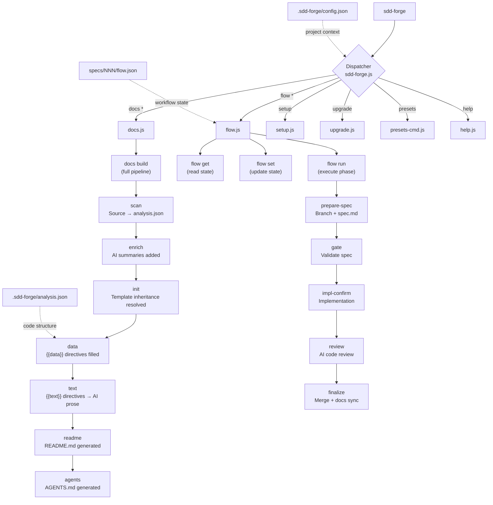

<!-- {{data("base.docs.langSwitcher", {labels: "relative"})}} -->
**English** | [日本語](ja/overview.md)
<!-- {{/data}} -->

# Tool Overview and Architecture

## Description

<!-- {{text({prompt: "Write a 1-2 sentence overview of this chapter. Include the tool's purpose, the problem it solves, and its primary use cases."})}} -->

This chapter introduces sdd-forge, a CLI tool that automates documentation generation through static source code analysis and provides a structured Spec-Driven Development (SDD) workflow for AI-assisted coding projects. It covers the tool's core purpose, high-level architecture, essential terminology, and the typical steps to get from installation to your first generated documentation output.
<!-- {{/text}} -->

## Content

### Purpose

<!-- {{text({prompt: "Describe the problem this CLI tool solves and its target users. Derive the purpose from package.json and README."})}} -->

Technical documentation is notoriously difficult to keep accurate as code evolves. Manual doc updates are time-consuming, easy to skip under deadline pressure, and prone to drift — leaving teams with outdated references that slow onboarding and introduce bugs.

sdd-forge addresses this by treating documentation as a generated artifact rather than a hand-written one. It scans your project's source code to extract structural information (classes, routes, configuration, dependencies, and more), then uses a template-and-directive system to produce structured Markdown documentation automatically. An integrated AI layer fills in explanatory prose wherever static analysis alone is insufficient.

The tool is also the backbone of a Spec-Driven Development workflow: before any code is written, a feature specification is drafted and gate-checked; after implementation, documentation is re-synced and verified. This keeps AI coding agents within well-defined boundaries and ensures every merged feature leaves the project better documented than it found it.

**Primary target users:**
- Development teams adopting AI coding agents (such as Claude Code) who need guardrails and auditability
- Individual developers who want living, code-synchronized documentation with minimal manual effort
- Projects using Node.js-based toolchains; zero external dependencies are required beyond Node.js ≥ 18
<!-- {{/text}} -->

### Architecture Overview

<!-- {{text({prompt: "Generate a mermaid flowchart showing the tool's overall architecture. Include the dispatch structure from entry point to subcommands and the main processing flow (input → processing → output). Output only the mermaid code block.", mode: "deep"})}} -->


<!-- {{/text}} -->

### Key Concepts

<!-- {{text({prompt: "Explain the key concepts and terminology needed to understand this tool in table format. Extract the main concepts from source code."})}} -->

| Concept | Description |
|---|---|
| **Preset** | A framework-specific configuration bundle that defines which code patterns to scan, how to structure documentation chapters, and what templates to use. Presets are inherited in chains (e.g., `base → cli → node-cli`), allowing shared logic to be reused across similar project types. |
| **Directive** | A special marker embedded in documentation templates. `{{data("source.method")}}` is replaced with structured tables from static analysis; `{{text({prompt: "..."})}}` is replaced with AI-generated prose. Directives define *where* content goes; the tool fills them in automatically. |
| **Analysis** | A JSON file (`.sdd-forge/analysis.json`) produced by the `scan` command. It captures the structural details of a project's source code — classes, methods, routes, configuration, dependencies, and more — and serves as the data source for all `{{data}}` directives. |
| **Enrich** | An optional pipeline step that augments `analysis.json` with AI-generated summaries and role descriptions for each extracted entry, making downstream `{{text}}` generation more context-aware. |
| **Spec** | A feature specification file (`specs/NNN-feature-name/spec.md`) that describes requirements, approach, and test plan before implementation begins. The spec is validated by the gate check and persists as the source of truth throughout a flow. |
| **Flow** | The end-to-end SDD workflow that guides a feature from initial request through spec, implementation, review, merge, and documentation sync. Flow state is persisted in `specs/NNN/flow.json` and managed via `flow get`, `flow set`, and `flow run` commands. |
| **Gate** | A validation step that checks whether a spec satisfies all required criteria before implementation is permitted. A failing gate blocks the workflow until outstanding items are resolved. |
| **Template** | A Markdown file in a preset's `templates/` directory. Templates support inheritance (``) and block overrides (``), letting child presets customize only the sections they need to change. |
| **Config** | The project-level configuration file at `.sdd-forge/config.json`. It specifies the project type (preset), output language, AI agent settings, concurrency, and flow merge strategy. |
| **DataSource** | A JavaScript class inside a preset's `data/` directory that transforms raw analysis entries into formatted output for a specific `{{data}}` directive. Each DataSource method maps to one directive identifier. |
<!-- {{/text}} -->

### Typical Usage Flow

<!-- {{text({prompt: "Describe the typical steps from installation to first output in step format. Derive the steps from help output and command definitions in the source code."})}} -->

**1. Install the package**

Install sdd-forge globally via npm:

```bash
npm install -g sdd-forge
```

Node.js 18 or later is required. The tool has no external runtime dependencies.

**2. Register your project**

From the root of the project you want to document, run the setup command:

```bash
sdd-forge setup
```

This creates a `.sdd-forge/config.json` file and prompts you to choose a preset that matches your project type (e.g., `node-cli`, `laravel`, `nextjs`). It also generates an initial `AGENTS.md` and creates a `docs/` directory.

**3. Scan the source code**

Extract structural information from your codebase:

```bash
sdd-forge docs scan
```

This produces `.sdd-forge/analysis.json`, which contains classes, methods, routes, configuration, and other code-level details used to populate documentation.

**4. Build the documentation**

Run the full documentation pipeline in a single command:

```bash
sdd-forge docs build
```

This sequentially executes `scan → enrich → init → data → text → readme → agents`. Chapter files are written to `docs/`, and `README.md` is generated at the project root.

**5. Review the output**

Open the generated files in `docs/` to review the result. To check documentation quality, run:

```bash
sdd-forge docs review
```

From this point, re-running `sdd-forge docs build` after code changes keeps documentation synchronized with the source automatically.
<!-- {{/text}} -->

---

<!-- {{data("base.docs.nav")}} -->
[Technology Stack and Operations →](stack_and_ops.md)
<!-- {{/data}} -->
