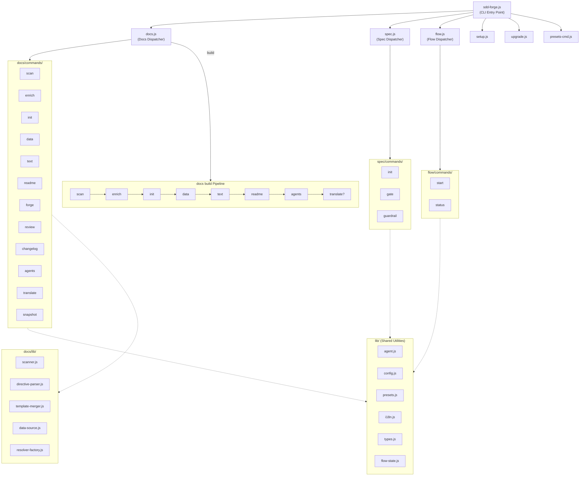

# 01. Tool Overview and Architecture

## Description

<!-- {{text: Write a 1-2 sentence overview of this chapter. Include the tool's purpose, the problem it solves, and its primary use cases.}} -->

This chapter introduces sdd-forge, a CLI tool for Spec-Driven Development that automates technical documentation generation from source code analysis. It covers the tool's architecture, key concepts, and the typical workflow from project setup to document output.
<!-- {{/text}} -->

## Content

### Purpose

<!-- {{text: Describe the problem this CLI tool solves and its target users. Derive the purpose from package.json and README.}} -->

sdd-forge addresses the challenge of keeping technical documentation accurate and up-to-date with a constantly evolving codebase. Manually written docs tend to drift from the actual implementation over time, leading to outdated or misleading information that hinders onboarding and maintenance.

The tool targets development teams and technical leads who need structured, reliable project documentation without the overhead of manual authoring. By scanning source code, enriching the analysis with AI, and generating documentation through a template-driven pipeline, sdd-forge ensures that docs always reflect the current state of the code.

sdd-forge operates with zero external dependencies (Node.js built-in modules only) and supports multiple web application frameworks — including CakePHP 2.x, Laravel, Symfony, and generic webapp/library presets — through a configurable preset system. It also provides a Spec-Driven Development workflow (`flow` and `spec` commands) that integrates specification management with the documentation pipeline.
<!-- {{/text}} -->

### Architecture Overview

<!-- {{text[mode=deep]: Generate a mermaid flowchart showing the tool's overall architecture. Include the dispatch structure from entry point to subcommands and the main processing flow (input → processing → output). Output only the mermaid code block.}} -->


<!-- {{/text}} -->

### Key Concepts

<!-- {{text: Explain the key concepts and terminology needed to understand this tool in table format. Extract the main concepts from source code.}} -->

| Concept | Description |
|---|---|
| **Preset** | A framework-specific configuration package (e.g., `symfony`, `cakephp2`, `laravel`) that defines scan logic, DataSources, chapter templates, and default settings. Presets are located under `src/presets/` and are selected during `sdd-forge setup`. |
| **DataSource** | A class responsible for scanning source files of a specific category (controllers, models, entities, etc.) and resolving `{{data}}` directives by producing structured data such as markdown tables. Each preset provides its own DataSource implementations. |
| **Directive** | A template marker embedded in documentation files. `{{data: ...}}` directives insert structured data (tables, lists) from DataSources. `{{text: ...}}` directives mark sections where AI-generated prose is placed. |
| **Build Pipeline** | The end-to-end documentation generation sequence: `scan → enrich → init → data → text → readme → agents → [translate]`. Running `sdd-forge docs build` executes all steps in order. |
| **Enrichment** | An AI-powered step that takes the raw scan output (analysis.json) and augments each entry with role classifications, summaries, and chapter assignments, providing context for downstream text generation. |
| **Chapter** | A single documentation file (e.g., `overview.md`, `cli_commands.md`) whose order is defined by the `chapters` array in `preset.json`. Chapters contain directives that are filled during the `data` and `text` pipeline steps. |
| **Spec-Driven Development (SDD)** | A workflow where feature development starts from a specification (`spec init`), passes a gate check (`spec gate`), and proceeds to implementation. The `flow` commands orchestrate this lifecycle. |
| **AGENTS.md / CLAUDE.md** | Auto-generated project context files that provide AI coding assistants with up-to-date knowledge about the project structure, conventions, and architecture. |
<!-- {{/text}} -->

### Typical Usage Flow

<!-- {{text: Describe the typical steps from installation to first output in step format. Derive the steps from help output and command definitions in the source code.}} -->

1. **Install sdd-forge** — Install the package globally or as a dev dependency:
   ```
   npm install -g sdd-forge
   ```

2. **Initialize the project** — Run the interactive setup wizard in your project root. This creates the `.sdd-forge/config.json` configuration file and selects the appropriate preset for your framework:
   ```
   sdd-forge setup
   ```

3. **Generate documentation** — Run the full build pipeline to scan your source code, enrich the analysis with AI, and generate all documentation files:
   ```
   sdd-forge docs build
   ```
   This executes the pipeline steps in sequence: `scan → enrich → init → data → text → readme → agents → [translate]`.

4. **Review the output** — The generated documentation appears in your project's `docs/` directory as a set of chapter files. A `README.md` table of contents is also generated, linking all chapters together.

5. **Iterate on individual steps** — If you need to regenerate only a specific part of the documentation, run individual subcommands:
   ```
   sdd-forge docs scan      # Re-scan source files
   sdd-forge docs enrich    # Re-enrich analysis with AI
   sdd-forge docs text      # Regenerate prose sections
   ```

6. **Maintain docs over time** — After code changes, re-run `sdd-forge docs build` to update the documentation. The tool detects changes and regenerates affected sections, keeping your docs in sync with the codebase.
<!-- {{/text}} -->
