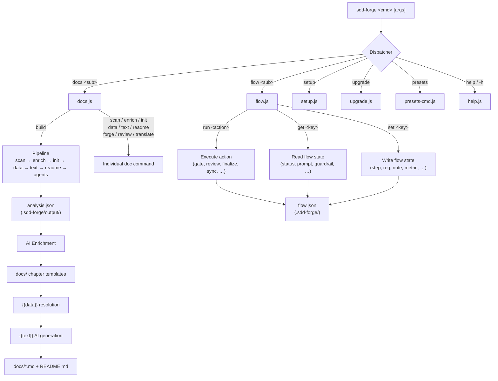

<!-- {{data("base.docs.langSwitcher", {labels: "relative"})}} -->
**English** | [日本語](ja/overview.md)
<!-- {{/data}} -->

# Tool Overview and Architecture

## Description

<!-- {{text({prompt: "Write a 1-2 sentence overview of this chapter. Include the tool's purpose, the problem it solves, and its primary use cases."})}} -->

This chapter introduces sdd-forge, a CLI tool that automates documentation generation from static source code analysis and orchestrates a Spec-Driven Development (SDD) workflow. It covers the tool's core purpose, its overall architectural structure, and the key concepts needed to use it effectively.
<!-- {{/text}} -->

## Content

### Purpose

<!-- {{text({prompt: "Describe the problem this CLI tool solves and its target users. Derive the purpose from package.json and README."})}} -->

Development teams routinely face a painful gap between their source code and their documentation — as code evolves, manually maintained docs fall out of sync, consuming time and introducing inaccuracies. sdd-forge addresses this by statically analysing a project's source files to extract file structure, classes, methods, configuration, and dependencies, then writing that data into structured Markdown templates automatically. Beyond documentation, the tool provides a three-phase Spec-Driven Development workflow (plan → implement → merge) that coordinates AI coding agents with deterministic validation steps, preventing unconstrained AI changes while ensuring documentation is refreshed automatically at merge time. The primary users are software developers and teams who work with AI coding assistants and want to keep design intent, implementation, and documentation consistently aligned without manual overhead.
<!-- {{/text}} -->

### Architecture Overview

<!-- {{text({prompt: "Generate a mermaid flowchart showing the tool's overall architecture. Include the dispatch structure from entry point to subcommands and the main processing flow (input → processing → output). Output only the mermaid code block.", mode: "deep"})}} -->


<!-- {{/text}} -->

### Key Concepts

<!-- {{text({prompt: "Explain the key concepts and terminology needed to understand this tool in table format. Extract the main concepts from source code."})}} -->

| Concept | Description |
|---|---|
| **Preset** | A named project-type profile (e.g., `node-cli`, `laravel`, `nextjs`) that bundles scan rules, data providers, and chapter templates. Presets form an inheritance chain rooted at `base`. |
| **DataSource** | A class that reads source code or configuration and exposes structured data consumed by `{{data}}` directives in templates. |
| **`{{data}}` directive** | A template placeholder resolved deterministically from DataSource output. The generated content is overwritten on every build; text outside the directive is preserved. |
| **`{{text}}` directive** | A template placeholder whose content is written by an AI agent using a supplied prompt. Like `{{data}}`, the block is overwritten on each run. |
| **analysis.json** | The JSON artifact produced by `docs scan`. It catalogues every discovered file, class, method, config entry, and dependency in the project. |
| **Enrich** | An AI-assisted pass that annotates each entry in `analysis.json` with a role summary, prose description, and chapter classification before templates are populated. |
| **Chapter** | One Markdown file within `docs/` corresponding to a single documentation topic. Chapter order is defined in `preset.json` and can be overridden in `config.json`. |
| **flow.json** | A persistent state file (`.sdd-forge/flow.json`) that tracks the current SDD phase, requirements, notes, and metrics across AI context resets. |
| **SDD Flow** | The three-phase Spec-Driven Development workflow: **plan** (spec authoring and gate validation), **implement** (AI-assisted coding under guardrails), and **merge** (finalization with automatic doc sync). |
| **Guardrail** | A deterministic validation rule checked during the flow that prevents the implementation from deviating from the approved spec. |
| **Gate** | A checkpoint command (`flow run gate`) that validates the spec meets defined quality criteria before implementation begins. |
<!-- {{/text}} -->

### Typical Usage Flow

<!-- {{text({prompt: "Describe the typical steps from installation to first output in step format. Derive the steps from help output and command definitions in the source code."})}} -->

**1. Install the package globally**

```bash
npm install -g sdd-forge
```

**2. Register your project**

Run the interactive setup wizard from your project root. It detects the project type, selects the appropriate preset, configures your AI agent, and writes `.sdd-forge/config.json`.

```bash
sdd-forge setup
```

**3. Analyse the source code**

Scan the project to produce `analysis.json` in `.sdd-forge/output/`. This step requires no AI agent and can be re-run at any time.

```bash
sdd-forge docs scan
```

**4. Build the full documentation**

Run the complete pipeline in a single command. It enriches the analysis with AI summaries, initialises chapter templates, resolves all directives, and writes final Markdown files to `docs/`.

```bash
sdd-forge docs build
```

**5. Review the generated output**

Open the files in `docs/` to see the generated documentation. The `README.md` at the project root is also updated automatically.

**6. (Optional) Start the SDD workflow for new features**

When you are ready to plan and implement a change under the structured SDD flow, initialise a new flow. This creates a spec branch and guides you through plan, implement, and merge phases.

```bash
sdd-forge flow run prepare-spec
```
<!-- {{/text}} -->

---

<!-- {{data("base.docs.nav")}} -->
[Technology Stack and Operations →](stack_and_ops.md)
<!-- {{/data}} -->
