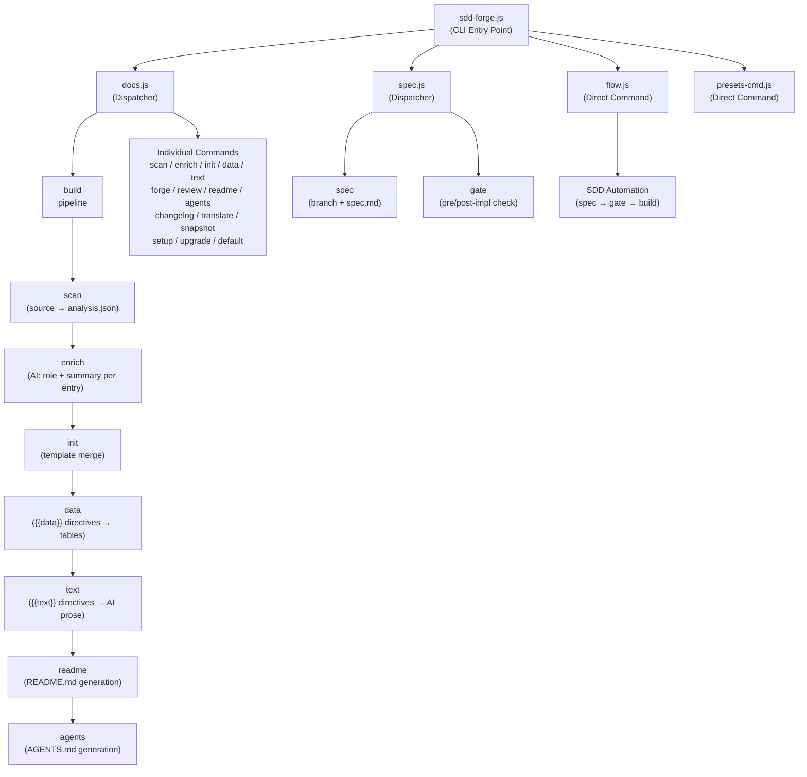

# 01. Tool Overview and Architecture

## Description

<!-- {{text: Write a 1-2 sentence overview of this chapter. Include the tool's purpose, the problem it solves, and its primary use cases.}} -->

This chapter describes `sdd-forge`, a CLI tool that automates project documentation by analyzing source code and rendering structured markdown through a template-directive system. It also covers the Spec-Driven Development (SDD) workflow the tool provides to keep implementation aligned with written specifications.

<!-- {{/text}} -->

## Content

### Purpose

<!-- {{text: Describe the problem this CLI tool solves and its target users. Derive the purpose from package.json and README.}} -->

Maintaining accurate technical documentation alongside an evolving codebase is a persistent overhead for development teams. Documentation written by hand quickly drifts from the actual source, and onboarding new contributors requires repeated manual effort to reconstruct project context.

`sdd-forge` addresses this by treating documentation as a generated artifact. It scans a project's source files — controllers, models, entities, migrations, and more — extracts structured metadata, and renders that metadata into pre-defined markdown chapters through a template-directive pipeline. Developers define *where* each piece of information appears once; the tool fills in the content automatically on each run.

The tool is aimed at backend developers and technical leads working on PHP web applications (Symfony, CakePHP, Laravel) and Node.js CLI projects who want living documentation without manual upkeep. The SDD workflow layer further assists teams that want to enforce a spec-review gate before implementation begins.

<!-- {{/text}} -->

### Architecture Overview

<!-- {{text[mode=deep]: Generate a mermaid flowchart showing the tool's overall architecture. Include the dispatch structure from entry point to subcommands and the main processing flow (input → processing → output). Output only the mermaid code block.}} -->



<!-- {{/text}} -->

### Key Concepts

<!-- {{text: Explain the key concepts and terminology needed to understand this tool in table format. Extract the main concepts from source code.}} -->

The following table defines the core concepts used throughout this tool and its documentation.

| Concept | Description |
|---|---|
| **Directive** | A marker embedded in a markdown template, either `{{data: source.method("Labels")}}` or `{{text: instruction}}`. The build pipeline replaces each directive's content with generated output while leaving the marker line itself intact. |
| **DataSource** | A JavaScript class responsible for scanning a specific category of source files (e.g., controllers, entities) and exposing resolve methods that return markdown tables for `{{data}}` directives. |
| **Preset** | A named configuration bundle (e.g., `symfony`, `node-cli`, `cakephp2`) that groups DataSource definitions, chapter templates, and scan rules for a particular project type. Presets are auto-discovered via `preset.json`. |
| **analysis.json** | The intermediate JSON file produced by `sdd-forge scan`. It stores all extracted source metadata and serves as the single input for every subsequent pipeline stage. |
| **enrich** | An AI-assisted pipeline stage that annotates each entry in `analysis.json` with a role, summary, and chapter classification — enabling smarter `{{text}}` generation downstream. |
| **Chapter** | A single markdown file inside `docs/` corresponding to one documentation section. Chapter order is defined by the `chapters` array in `preset.json` and can be overridden per project in `config.json`. |
| **SDD (Spec-Driven Development)** | A built-in workflow where a feature spec is authored and reviewed via a gate check *before* implementation begins, ensuring code stays aligned with its written specification. |
| **flow-state** | A persistent state file (`.sdd-forge/flow-state.json`) that tracks the current SDD workflow step, allowing the `flow` command to resume across shell sessions. |

<!-- {{/text}} -->

### Typical Usage Flow

<!-- {{text: Describe the typical steps from installation to first output in step format. Derive the steps from help output and command definitions in the source code.}} -->

The following steps describe the path from installation to a fully generated documentation set.

1. **Install the package globally.**
   ```
   npm install -g sdd-forge
   ```

2. **Run setup inside your project root.** This initialises `.sdd-forge/config.json`, selects the appropriate preset for your project type, and creates the `docs/` template structure and `AGENTS.md`.
   ```
   sdd-forge setup
   ```

3. **Scan the source code.** The scanner walks your project files, extracts metadata (classes, routes, columns, relations, etc.), and writes the result to `.sdd-forge/output/analysis.json`.
   ```
   sdd-forge scan
   ```

4. **Run the full build pipeline.** This executes `scan → enrich → init → data → text → readme → agents` in sequence, populating all `{{data}}` and `{{text}}` directives across every chapter file.
   ```
   sdd-forge build
   ```

5. **Review the generated docs.** Markdown files are written to the `docs/` directory. Content inside directive blocks is replaced on each build; any text you write *outside* directive blocks is preserved.

6. *(Optional)* **Translate the documentation.** If multilingual output is configured, run:
   ```
   sdd-forge translate
   ```

7. *(Optional)* **Use the SDD workflow for new features.** When starting a feature or fix, use `sdd-forge flow --request "<description>"` to create a spec branch, write a specification, pass the gate check, implement, and finalise with a closing gate.

<!-- {{/text}} -->
