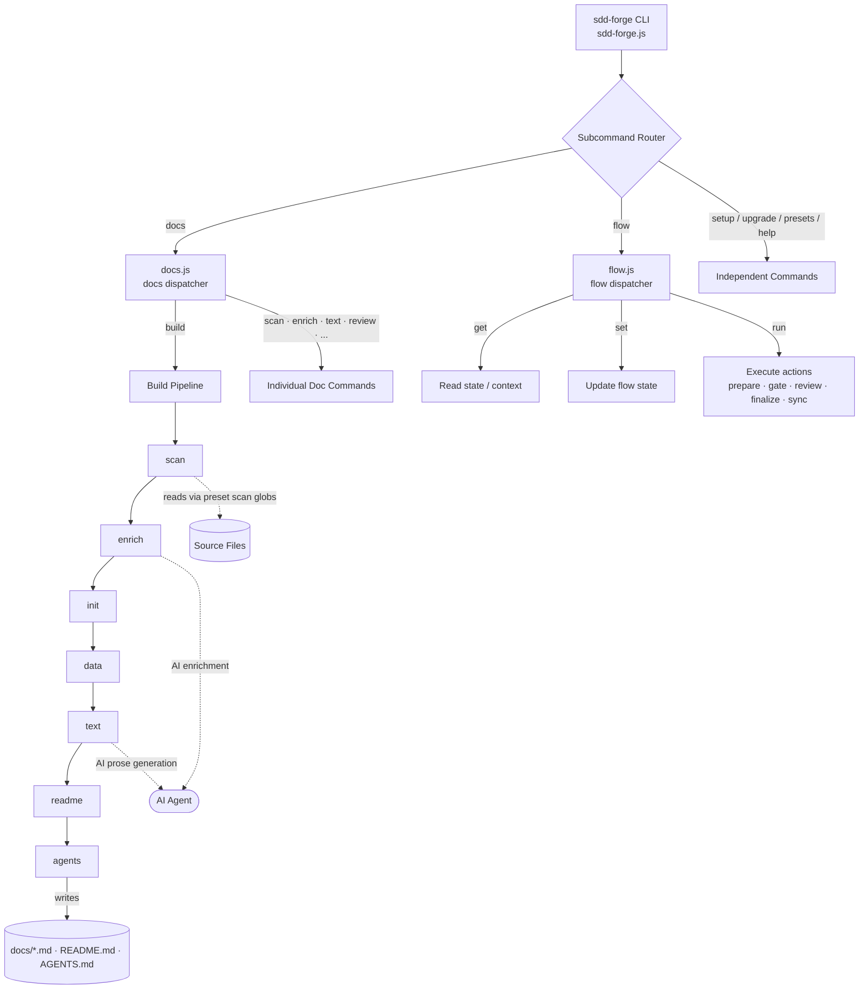

<!-- {{data("base.docs.langSwitcher", {labels: "relative"})}} -->
**English** | [日本語](ja/overview.md)
<!-- {{/data}} -->

# Tool Overview and Architecture

## Description

<!-- {{text({prompt: "Write a 1-2 sentence overview of this chapter. Include the tool's purpose, the problem it solves, and its primary use cases."})}} -->

This chapter provides a high-level introduction to sdd-forge, a CLI tool that automates technical documentation generation through static source code analysis and orchestrates a Spec-Driven Development workflow to keep documentation synchronized with every code change. It covers the tool's purpose, target users, architectural structure, core terminology, and the typical steps from installation to first output.
<!-- {{/text}} -->

## Content

### Purpose

<!-- {{text({prompt: "Describe the problem this CLI tool solves and its target users. Derive the purpose from package.json and README."})}} -->

Technical documentation written by hand drifts from the codebase it describes as soon as code changes. Teams end up with outdated references that slow onboarding, complicate maintenance, and erode trust in written specs. sdd-forge addresses this by extracting structure, classes, methods, configuration, and dependencies directly from source files and injecting them into version-controlled Markdown templates — so documentation reflects the actual state of the codebase without requiring manual updates.

The tool is designed for software development teams working with AI coding agents who want a repeatable, structured workflow (plan → implement → merge) that enforces specification quality before implementation begins. It targets individual developers maintaining CLI tools or libraries as well as teams running web applications on frameworks such as Laravel, Next.js, or Symfony. A composable preset system covers a broad range of project types out of the box, requiring only a one-time setup to configure source scanning patterns, output languages, and AI agent providers.
<!-- {{/text}} -->

### Architecture Overview

<!-- {{text({prompt: "Generate a mermaid flowchart showing the tool's overall architecture. Include the dispatch structure from entry point to subcommands and the main processing flow (input → processing → output). Output only the mermaid code block.", mode: "deep"})}} -->


<!-- {{/text}} -->

### Key Concepts

<!-- {{text({prompt: "Explain the key concepts and terminology needed to understand this tool in table format. Extract the main concepts from source code."})}} -->

| Concept | Description |
|---|---|
| **Preset** | A reusable project-type configuration (e.g., `node-cli`, `laravel`, `nextjs`) that defines which source files to scan, which documentation chapters to produce, and the order of those chapters. Presets use single inheritance (e.g., `node-cli` → `cli` → `base`). |
| **Directive** | A template marker embedded in Markdown chapter files. `{{data(...)}}` injects structured analysis results; `{{text(...)}}` triggers AI-generated prose within a bounded region. Content inside directive tags is overwritten on each build run. |
| **DataSource** | A class that provides structured data for a specific domain (package metadata, project structure, command definitions, etc.). DataSources are discovered per-preset and consumed by `{{data}}` directives at build time. |
| **Analysis entry** | A record produced by `docs scan` for each source file, containing extracted metadata such as classes, methods, exports, and configuration values. Entries are stored in `.sdd-forge/output/analysis.json`. |
| **Enrich** | An AI-assisted pipeline step (`docs enrich`) that reads the complete set of analysis entries and annotates each one with a role, summary, and chapter classification, providing context for downstream `docs text` generation. |
| **SDD Flow** | The three-phase Spec-Driven Development workflow (plan → implement → merge) orchestrated through `sdd-forge flow`. State is persisted in `flow.json` so the workflow survives context resets. |
| **Gate** | A validation checkpoint (`flow run gate`) that evaluates a spec against defined requirements before allowing implementation to proceed, ensuring specification quality before any code is written. |
| **Chapter** | A Markdown file within the `docs/` directory representing one section of the project's documentation. Chapter filenames and ordering are defined in the preset's `chapters` array and can be overridden in `config.json`. |
| **Skill** | A Claude Code slash command (e.g., `/sdd-forge.flow-plan`) deployed to the project by `sdd-forge setup` or `sdd-forge upgrade`. Skills orchestrate multi-step SDD phases within an AI agent session. |
| **Config** | The project-level configuration file at `.sdd-forge/config.json`, specifying the preset type, language settings, AI agent providers, scan patterns, chapter ordering, and flow merge strategy. |
<!-- {{/text}} -->

### Typical Usage Flow

<!-- {{text({prompt: "Describe the typical steps from installation to first output in step format. Derive the steps from help output and command definitions in the source code."})}} -->

**Step 1 — Install sdd-forge globally**

Run the following command using npm or pnpm:

```
npm install -g sdd-forge
```

Node.js 18 or later is required. sdd-forge uses only Node.js built-in modules and has no additional runtime dependencies.

**Step 2 — Run the interactive setup wizard**

From your project root, run:

```
sdd-forge setup
```

The wizard prompts for the project type (preset selection), primary language, AI agent provider, and output languages. It writes `.sdd-forge/config.json` and deploys Claude Code skills to `.claude/skills/`.

**Step 3 — Build the documentation**

Generate all documentation chapters with the single build command:

```
sdd-forge docs build
```

This executes the full pipeline in sequence: `scan → enrich → init → data → text → readme → agents`. Source files are scanned according to preset glob patterns, analysis entries are enriched with AI annotations, `{{data}}` directives are filled from extracted metadata, and `{{text}}` regions are generated by the configured AI agent.

**Step 4 — Review the generated output**

Generated chapters appear in the `docs/` directory (e.g., `docs/overview.md`, `docs/cli_commands.md`). The top-level `README.md` and `AGENTS.md` are also regenerated. Chapter filenames and order follow the preset definition and any overrides in `config.json`.

**Step 5 — Start a Spec-Driven Development workflow**

For new features, use the deployed Claude Code skill inside an agent session:

```
/sdd-forge.flow-plan
```

This starts the plan phase, produces a spec, runs gate validation, and prepares a dedicated branch. Continue with `/sdd-forge.flow-impl` for implementation and code review, then `/sdd-forge.flow-finalize` to merge and automatically sync documentation.
<!-- {{/text}} -->

---

<!-- {{data("base.docs.nav")}} -->
[Technology Stack and Operations →](stack_and_ops.md)
<!-- {{/data}} -->
