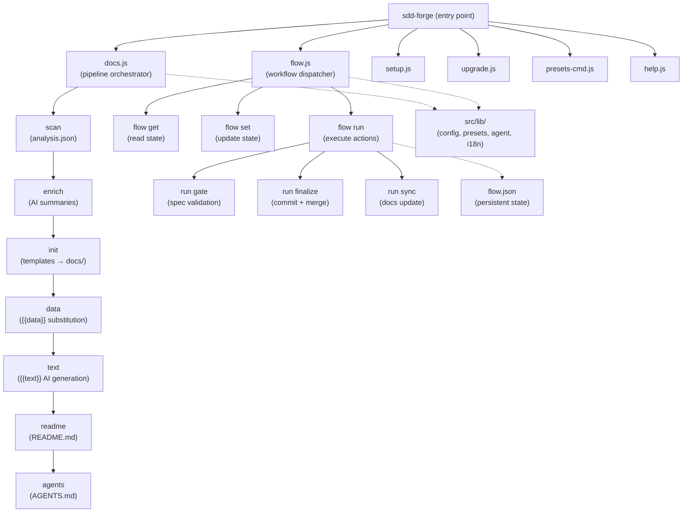

<!-- {{data("base.docs.langSwitcher", {labels: "relative"})}} -->
**English** | [日本語](ja/overview.md)
<!-- {{/data}} -->

# Tool Overview and Architecture

## Description

<!-- {{text({prompt: "Write a 1-2 sentence overview of this chapter. Include the tool's purpose, the problem it solves, and its primary use cases."})}} -->

sdd-forge is a CLI tool that automates technical documentation generation from source code analysis and orchestrates Spec-Driven Development (SDD) workflows for AI-assisted development teams. It addresses the persistent problem of documentation drift and unstructured AI coding sessions by providing a deterministic pipeline from source scanning through AI text generation, combined with a gated plan-implement-merge workflow.
<!-- {{/text}} -->

## Content

### Purpose

<!-- {{text({prompt: "Describe the problem this CLI tool solves and its target users. Derive the purpose from package.json and README."})}} -->

Software projects commonly suffer from documentation that falls out of sync with the codebase, onboarding guides that become stale, and AI coding agents that operate without clear guardrails or structured handoffs. sdd-forge addresses these problems by providing two integrated capabilities: an automated documentation pipeline that parses source code into structured analysis data and uses AI to populate markdown templates, and a Spec-Driven Development workflow that enforces a three-phase cycle (plan → implement → merge) with deterministic validation gates before implementation can begin.

The tool is aimed at developers and teams who use AI coding assistants such as Claude and want to keep project documentation accurate with minimal manual effort. It is equally suited to maintainers of legacy codebases who need to generate comprehensive documentation quickly, and to teams that want a repeatable, auditable process for feature development rather than unconstrained AI-generated changes.
<!-- {{/text}} -->

### Architecture Overview

<!-- {{text({prompt: "Generate a mermaid flowchart showing the tool's overall architecture. Include the dispatch structure from entry point to subcommands and the main processing flow (input → processing → output). Output only the mermaid code block.", mode: "deep"})}} -->


<!-- {{/text}} -->

### Key Concepts

<!-- {{text({prompt: "Explain the key concepts and terminology needed to understand this tool in table format. Extract the main concepts from source code."})}} -->

| Concept | Description |
|---|---|
| **Preset** | A framework-specific configuration bundle (e.g., `nextjs`, `laravel`, `node-cli`) that defines scan rules, data sources, and document templates. Presets are selected during `sdd-forge setup`. |
| **Preset Chain** | A linear inheritance hierarchy where a child preset extends a parent (e.g., `base → webapp → js-webapp → nextjs`). Each child can override the parent's scan rules, data sources, and templates. |
| **Analysis** | The structured representation of a project's source code, produced by the `scan` command and stored as `analysis.json`. It captures files, classes, methods, routes, and configuration entries. |
| **DataSource** | A plugin class responsible for extracting entries from `analysis.json` and rendering them as markdown tables inside `{{data}}` directives. Each preset supplies its own data sources. |
| **Directive** | A template placeholder that marks dynamic content. `{{data("source.method")}}` is replaced with structured analysis data; `{{text({prompt: "..."})}}` is replaced with AI-generated prose. |
| **Template** | A markdown file containing directives and optional `` / `` inheritance tags. Templates are initialised into the `docs/` directory by the `init` command. |
| **Flow State** | A JSON file (`.sdd-forge/flow.json`) that records the current SDD phase, requirement statuses, metrics, and notes. It persists across Claude context resets and tool restarts. |
| **Spec Gate** | A deterministic validation step that checks whether all spec requirements are resolved and all guardrail rules pass before allowing the implementation phase to begin. |
| **Guardrail** | Project-level design principles stored in the spec that the gate checks against. They prevent implementation from violating established architecture decisions. |
| **Enrich** | An AI-assisted step that annotates each entry in `analysis.json` with a natural-language summary and a chapter classification, providing richer context for subsequent `text` generation. |
| **SDD Phases** | The three top-level workflow stages: **Plan** (draft → spec → gate → test), **Implement** (code → review), and **Merge** (docs sync → commit → merge → cleanup). |
<!-- {{/text}} -->

### Typical Usage Flow

<!-- {{text({prompt: "Describe the typical steps from installation to first output in step format. Derive the steps from help output and command definitions in the source code."})}} -->

**1. Install the package globally**

```bash
npm install -g sdd-forge
```

**2. Run the interactive setup wizard**

From the root of your project, run:

```bash
sdd-forge setup
```

The wizard prompts for the project name, source code path, project type (preset such as `node-cli`, `nextjs`, or `laravel`), primary documentation language, and AI agent credentials. It writes the resulting configuration to `.sdd-forge/config.json`.

**3. Build the documentation pipeline**

```bash
sdd-forge docs build
```

This single command orchestrates the full pipeline in sequence:

- **scan** — parses source files and produces `.sdd-forge/output/analysis.json`
- **enrich** — calls the configured AI agent to add summaries and chapter classifications to each analysis entry
- **init** — copies preset templates into the `docs/` directory, respecting the preset inheritance chain
- **data** — resolves all `{{data}}` directives in the templates using analysis data
- **text** — calls the AI agent to fill every `{{text}}` directive with generated prose
- **readme** — assembles the root `README.md` from the completed chapter files
- **agents** — generates `AGENTS.md` containing AI agent guidelines for the project

**4. Review the generated output**

The `docs/` directory now contains a complete set of technical documentation pages. `README.md` at the project root is also updated. Both can be committed to version control and will stay in sync by re-running `sdd-forge docs build` (or individual pipeline steps) whenever the source code changes.
<!-- {{/text}} -->

---

<!-- {{data("base.docs.nav")}} -->
[Technology Stack and Operations →](stack_and_ops.md)
<!-- {{/data}} -->
