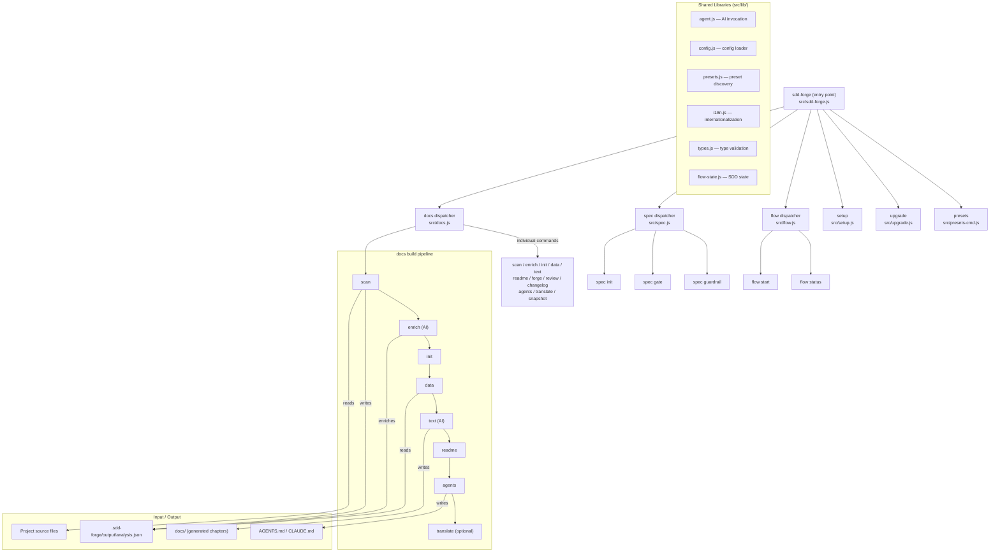

# 01. Tool Overview and Architecture

## Description

<!-- {{text: Write a 1-2 sentence overview of this chapter. Include the tool's purpose, the problem it solves, and its primary use cases.}} -->

This chapter introduces sdd-forge, a CLI tool for Spec-Driven Development that automates technical documentation generation from source code analysis. It covers the tool's architecture, key concepts, and the typical workflow from project setup to documentation output.

<!-- {{/text}} -->

## Content

### Purpose

<!-- {{text: Describe the problem this CLI tool solves and its target users. Derive the purpose from package.json and README.}} -->

Maintaining accurate and up-to-date technical documentation is a persistent challenge for development teams. As codebases evolve, documentation drifts out of sync with the actual implementation, leading to confusion and wasted effort. Manual documentation is time-consuming, error-prone, and often deprioritized.

sdd-forge solves this problem by analyzing source code directly and generating structured documentation automatically. It scans project files, extracts architectural information (controllers, models, entities, migrations, routes, etc.), and produces comprehensive Markdown documentation organized into chapters.

The tool targets developers and teams who want to:

- Generate and maintain technical documentation that stays synchronized with their codebase.
- Adopt a Spec-Driven Development workflow where specifications guide implementation.
- Support multiple frameworks (Symfony, CakePHP, Laravel, and generic webapp/library/CLI projects) through a preset system.
- Leverage AI agents for enriching analysis results and generating narrative documentation text.

sdd-forge requires Node.js 18 or later and has zero external dependencies, relying solely on Node.js built-in modules.

<!-- {{/text}} -->

### Architecture Overview

<!-- {{text[mode=deep]: Generate a mermaid flowchart showing the tool's overall architecture. Include the dispatch structure from entry point to subcommands and the main processing flow (input → processing → output). Output only the mermaid code block.}} -->



<!-- {{/text}} -->

### Key Concepts

<!-- {{text: Explain the key concepts and terminology needed to understand this tool in table format. Extract the main concepts from source code.}} -->

| Concept | Description |
|---|---|
| **Preset** | A framework-specific configuration bundle (e.g., `symfony`, `cakephp2`, `laravel`, `webapp`, `node-cli`, `library`) that defines scan logic, DataSources, chapter structure, and templates. Presets are layered — child presets inherit from `base`. |
| **DataSource** | A class responsible for matching source files, scanning them to extract structured data, and resolving `{{data}}` directives in documentation templates. Each preset provides its own DataSources (e.g., `EntitiesSource`, `ModelsSource`). |
| **Directive** | A template marker embedded in Markdown files. `{{data: ...}}` directives insert structured data (tables, lists), while `{{text: ...}}` directives mark sections where AI-generated narrative text is placed. |
| **Chapter** | A single Markdown file within `docs/` representing one section of the generated documentation. Chapter order is defined by the `chapters` array in `preset.json`. |
| **Build Pipeline** | The end-to-end documentation generation process: `scan → enrich → init → data → text → readme → agents → [translate]`. Each step can also be run individually. |
| **Enrichment** | An AI-powered step that takes the raw scan output (analysis.json) and adds role classification, summaries, and chapter assignments to each entry, providing context for the text generation step. |
| **Flow (SDD Flow)** | The Spec-Driven Development workflow managed by `flow start` / `flow status`. It guides developers through specification creation, gate checks, and implementation. |
| **Spec** | A specification document created via `spec init` and validated via `spec gate` / `spec guardrail`. Specs define requirements before implementation begins. |
| **analysis.json** | The structured scan output stored in `.sdd-forge/output/`. It contains metadata about every scanned source file (class names, routes, relations, etc.) and serves as the single source of truth for documentation generation. |
| **AGENTS.md** | A generated file that provides AI coding assistants (e.g., Claude) with project-specific context. It is symlinked as `CLAUDE.md` for automatic discovery. |

<!-- {{/text}} -->

### Typical Usage Flow

<!-- {{text: Describe the typical steps from installation to first output in step format. Derive the steps from help output and command definitions in the source code.}} -->

1. **Install sdd-forge** — Install the package globally or as a dev dependency:
   ```
   npm install -g sdd-forge
   ```

2. **Initialize the project** — Run the interactive setup wizard in your project root. This creates the `.sdd-forge/config.json` configuration file, selects the appropriate preset for your framework, and generates the initial `AGENTS.md`:
   ```
   sdd-forge setup
   ```

3. **Configure an AI agent (optional)** — To enable AI-powered enrichment and text generation, set the `defaultAgent` in `.sdd-forge/config.json` with the path or command for your preferred AI CLI tool.

4. **Generate documentation** — Run the full build pipeline to scan your source code and produce the `docs/` directory with all chapters:
   ```
   sdd-forge docs build
   ```
   This executes the complete pipeline: `scan → enrich → init → data → text → readme → agents`, and optionally `translate` if multi-language output is configured.

5. **Run individual steps (optional)** — If you need finer control, each pipeline step can be executed independently. For example, to re-scan sources after code changes:
   ```
   sdd-forge docs scan
   ```

6. **Review generated documentation** — Inspect the output in `docs/`. Each chapter file contains `{{data}}` directives (resolved with structured data) and `{{text}}` directives (filled with AI-generated descriptions). Content outside directives is preserved across regeneration.

7. **Keep documentation in sync** — After code changes, re-run `sdd-forge docs build` to update the documentation. The tool detects changed files and regenerates only the affected sections.

<!-- {{/text}} -->
