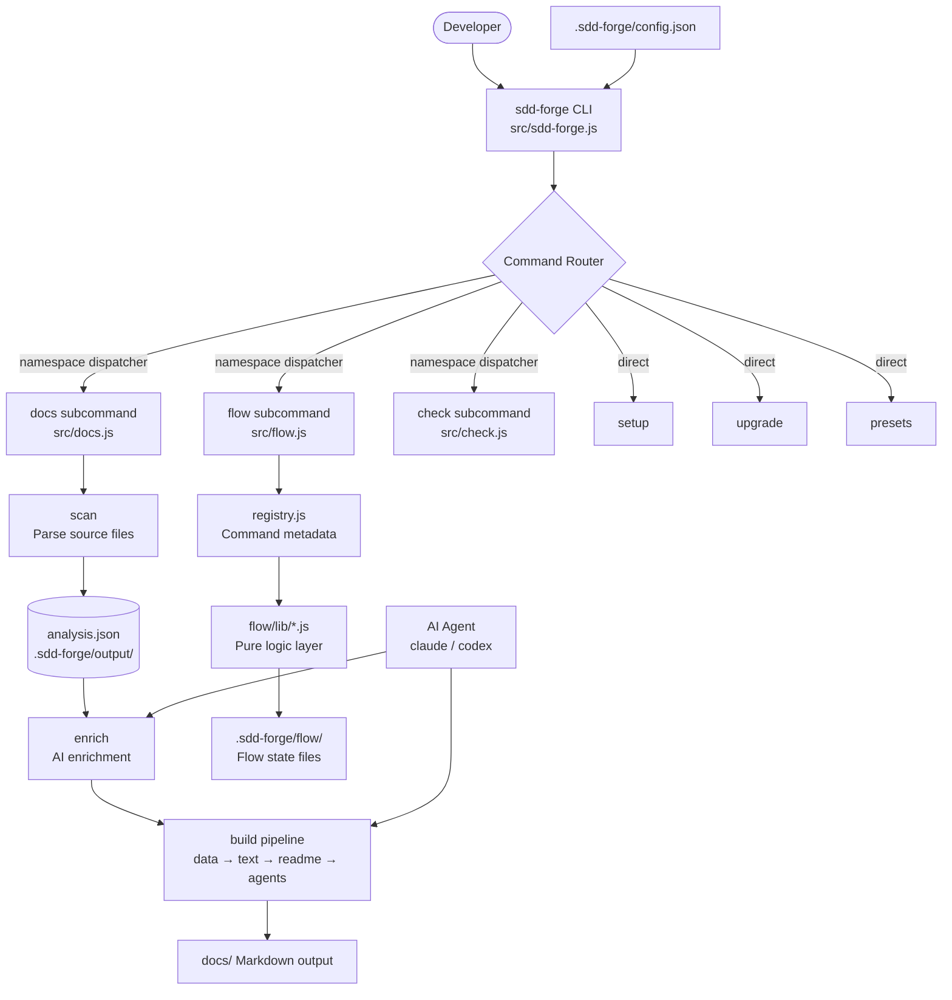
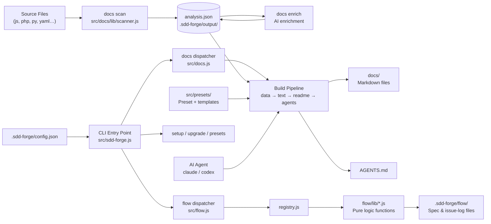

<!-- {{data("base.docs.langSwitcher", {labels: "relative"})}} -->
[日本語](ja/overview.md) | **English**
<!-- {{/data}} -->

# Tool Overview and Architecture

## Description

<!-- {{text({prompt: "Write a 1-2 sentence overview of this chapter. Include the tool's purpose, the problem it solves, and its primary use cases."})}} -->

This chapter introduces `sdd-forge`, a CLI tool for Spec-Driven Development that automates technical documentation generation from source code analysis. It covers the tool's purpose, the workflow problem it addresses, and the primary use cases of source scanning, AI-assisted doc generation, and development lifecycle management.
<!-- {{/text}} -->

## Content

### Purpose

<!-- {{text({prompt: "Describe the problem this CLI tool solves and its target users. Derive the purpose from package.json and README."})}} -->

Engineering teams frequently struggle to keep technical documentation accurate as codebases evolve. `sdd-forge` addresses this by analyzing source code directly and driving a structured pipeline that produces and updates Markdown documentation automatically — without manual authoring of boilerplate content.

Target users are software developers and engineering teams who adopt a Spec-Driven Development workflow. The tool is especially suited to teams that want AI coding assistants to operate with accurate, always-current project context, since `sdd-forge` generates the `AGENTS.md` file that provides that context automatically.

Primary use cases include:

- Bootstrapping a full documentation set from an existing codebase with minimal configuration
- Keeping `docs/` in sync with source code changes through a repeatable pipeline
- Managing SDD flow steps (spec creation, implementation tracking, finalization) via the `flow` subcommand
- Generating a project-context file (`AGENTS.md`) consumed by AI coding assistants such as Claude Code
<!-- {{/text}} -->

### Architecture Overview

<!-- {{text({prompt: "Generate a mermaid flowchart showing the tool's overall architecture. Include the dispatch structure from entry point to subcommands and the main processing flow (input → processing → output). Output only the mermaid code block.", mode: "deep"})}} -->


<!-- {{/text}} -->

### Key Concepts

<!-- {{text({prompt: "Explain the key concepts and terminology needed to understand this tool in table format. Extract the main concepts from source code."})}} -->

| Concept | Description |
|---|---|
| **SDD (Spec-Driven Development)** | A development methodology where specifications are written before code and kept synchronized with implementation through automated tooling. |
| **Docs Pipeline** | The ordered sequence of commands — `scan → enrich → init → data → text → readme → agents` — that transforms source code into structured Markdown documentation. |
| **Directive** | A `{{data}}` or `{{text}}` marker embedded in a chapter template. During the build, `{{data}}` is replaced by structured data from a DataSource, and `{{text}}` is replaced by AI-generated prose. |
| **Preset** | A named configuration profile stored in `src/presets/` (e.g., `hono`, `nextjs`, `laravel`) that defines the chapter layout, scan patterns, and DataSources for a given project type. Presets support single-parent inheritance. |
| **DataSource** | A class that reads `analysis.json` (or scans files directly via the `Scannable` mixin) and exposes structured data consumed by `{{data}}` directives. |
| **Analysis** | The JSON snapshot of source-code structure produced by `docs scan` and stored in `.sdd-forge/output/analysis.json`. All downstream pipeline steps read from this file. |
| **Flow** | The SDD workflow engine (`flow prepare`, `flow run`, `flow get`, `flow set`) that manages the lifecycle of a development request from spec through finalization. |
| **AGENTS.md / CLAUDE.md** | The AI-context file produced by `docs agents` that gives AI coding assistants project-specific knowledge. `CLAUDE.md` is typically a symbolic link to `AGENTS.md`. |
| **Agent Provider** | A configured AI backend (e.g., `claude`, `codex`) declared in `.sdd-forge/config.json` under `agent.providers`. The tool substitutes `{{PROMPT}}` into the provider's command args at runtime. |
<!-- {{/text}} -->

### Typical Usage Flow

<!-- {{text({prompt: "Describe the typical steps from installation to first output in step format. Derive the steps from help output and command definitions in the source code."})}} -->

**Step 1 — Install**

Install `sdd-forge` globally or as a project dev dependency:

```sh
npm install -g sdd-forge
# or
pnpm add -D sdd-forge
```

Node.js 18 or later is required.

**Step 2 — Initialize the project**

Run `sdd-forge setup` in your project root. This creates `.sdd-forge/config.json`, prompts you to select a preset that matches your project type (e.g., `hono`, `nextjs`, `laravel`), and configures your preferred AI agent provider.

**Step 3 — Scan source code**

Run `sdd-forge docs scan` to analyze the project's source files. The output is saved to `.sdd-forge/output/analysis.json`.

**Step 4 — Enrich the analysis**

Run `sdd-forge docs enrich` to send the raw analysis to the configured AI agent, which adds role summaries and natural-language descriptions to each entry.

**Step 5 — Build documentation**

Run `sdd-forge docs build` to execute the full downstream pipeline: `data → text → readme → agents`. This populates the `docs/` directory with Markdown files and generates or updates `AGENTS.md`.

**Step 6 — Review output**

Inspect the Markdown files in `docs/` and verify that `AGENTS.md` accurately reflects the project structure. Content outside `{{data}}` and `{{text}}` directives can be edited freely without being overwritten on the next build.
<!-- {{/text}} -->

# System Overview

<!-- {{data("monorepo.monorepo.apps", {labels: "overview", ignoreError: true})}} -->
<!-- {{/data}} -->

<!-- {{text({prompt: "Write a 1-2 sentence overview of this project."})}} -->

`sdd-forge` is a CLI tool that automates technical documentation generation by analyzing source code and driving a structured AI-assisted pipeline. It provides the scaffolding for Spec-Driven Development, keeping documentation and AI-assistant context continuously synchronized with the codebase.
<!-- {{/text}} -->


## Description

<!-- {{text({prompt: "Write a 1-2 sentence overview of this chapter. Include the project's architecture and whether it integrates with external systems."})}} -->

This chapter describes the internal architecture of `sdd-forge` as a self-contained Node.js CLI with no external runtime dependencies. It covers the two-tier command dispatch model, the docs and flow processing layers, and the AI agent integration that powers content generation.
<!-- {{/text}} -->

## Content
### Architecture Diagram

<!-- {{text({prompt: "Generate a mermaid flowchart showing the project architecture. Include data flows between major components. Output only the mermaid code block."})}} -->


<!-- {{/text}} -->
### Component Responsibilities

<!-- {{text({prompt: "Describe the major components with their location, responsibilities, and I/O in table format.", mode: "deep"})}} -->

| Component | Location | Responsibility | Input / Output |
|---|---|---|---|
| **CLI Entry Point** | `src/sdd-forge.js` | Parses argv, loads config, routes to namespace dispatchers or direct command scripts | `process.argv` → subcommand handler |
| **Docs Dispatcher** | `src/docs.js` | Routes `docs <subcommand>` to individual command scripts in `src/docs/commands/` | Subcommand name + args → pipeline step |
| **Flow Dispatcher** | `src/flow.js` | Routes `flow <subcommand>` through `registry.js` to logic handlers | Subcommand name + args → flow state mutation |
| **Scanner & Language Handlers** | `src/docs/lib/scanner.js`, `src/docs/lib/lang-factory.js`, `src/docs/lib/*.js` | Parses source files by language (JS, PHP, Python, YAML) to extract structural metadata | Source files → raw analysis entries |
| **Flow Logic Layer** | `src/flow/lib/*.js` | Pure functions implementing each flow action (run, get, set for status, steps, metrics, issues) | Input objects → result objects or thrown Errors |
| **Flow Registry** | `src/flow/registry.js` | Single source of truth for flow command definitions: args, help text, hooks | — (static configuration) |
| **Agent Integration** | `src/lib/agent.js` | Sends prompts to a configured AI provider via child process, substituting `{{PROMPT}}` in command args | Prompt string + provider config → AI-generated text |
| **Preset System** | `src/presets/` | Defines per-framework chapter layouts, scan patterns, and DataSource classes via single-parent inheritance | `preset.json` + parent chain → resolved docs structure |
| **Config Module** | `src/lib/config.js`, `src/lib/types.js` | Loads and validates `.sdd-forge/config.json`; reports all errors before throwing | Raw JSON → validated `SddConfig` object |
| **DataSource / Scannable** | `src/presets/*/data/`, `src/docs/lib/` | Reads `analysis.json` or scans files directly; exposes structured data consumed by `{{data}}` directives | `analysis.json` → table/list data for templates |
<!-- {{/text}} -->
### External Integrations

<!-- {{text({prompt: "If there are external system integrations, describe their purpose and connection method in table format."})}} -->

| System | Purpose | Connection Method |
|---|---|---|
| **AI Agent — Claude** | Generates enriched summaries (`docs enrich`) and writes natural-language documentation sections (`docs text`) | Configured as a provider under `agent.providers.claude` in `.sdd-forge/config.json`; invoked as a child process with `{{PROMPT}}` substituted into the command arguments |
| **AI Agent — Codex** | Alternative AI backend for the same enrichment and text-generation tasks | Configured identically under `agent.providers.codex`; provider key is detected automatically from the command string via `detectProviderKey()` |

All AI communication is handled locally through child-process invocation. No network calls are made by `sdd-forge` itself; the configured agent binary is responsible for API communication.
<!-- {{/text}} -->
### Environment Differences

<!-- {{text({prompt: "Describe the configuration differences across environments (local/staging/production)."})}} -->

`sdd-forge` is a local CLI tool and does not distinguish between staging and production deployment environments. All configuration is stored in a single file — `.sdd-forge/config.json` — at the project root.

The following settings in that file can be adjusted to reflect different working contexts:

| Setting | Purpose | Typical variation |
|---|---|---|
| `agent.default` | Selects which AI provider to use for enrichment and text generation | May point to a lighter model during local iteration and a more capable model for final builds |
| `agent.providers` | Defines command, args, and timeout for each provider | Provider command paths may differ between developer machines |
| `docs.languages` | Controls which language variants of docs are generated | A single language locally; multiple languages in a CI/documentation publishing step |
| `logs.enabled` / `logs.dir` | Enables agent prompt logging and sets the output directory | Disabled locally, enabled in automated pipeline runs for auditing |

Beyond these settings, behavior is identical regardless of where the tool is run. There is no concept of environment-specific config files or environment variable overrides at this time.
<!-- {{/text}} -->

---

<!-- {{data("base.docs.nav")}} -->
[Technology Stack and Operations →](stack_and_ops.md)
<!-- {{/data}} -->
