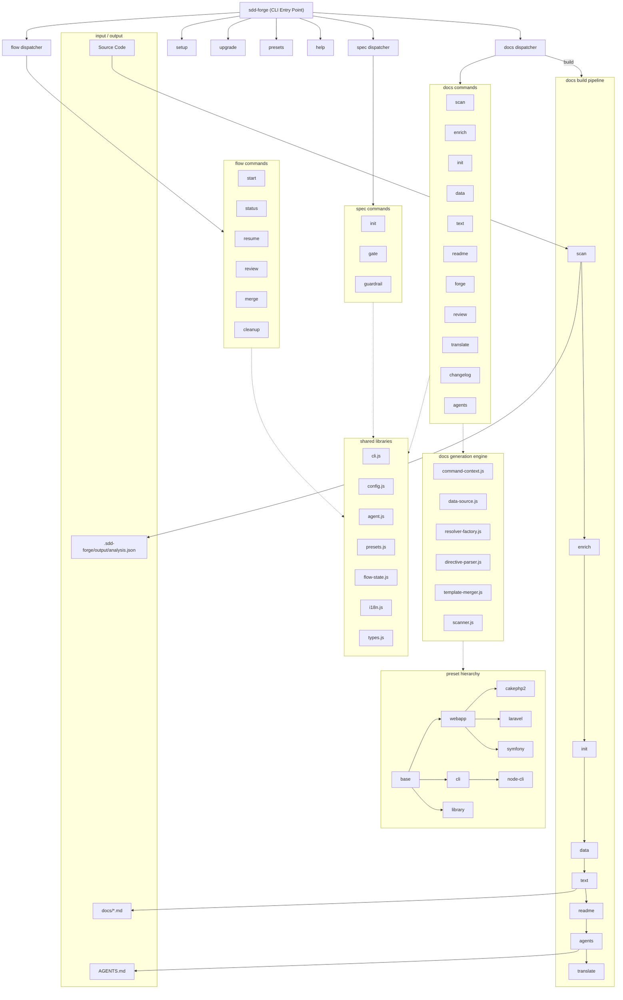

# 01. Tool Overview and Architecture

## Description

<!-- {{text: Write a 1-2 sentence overview of this chapter. Include the tool's purpose, the problem it solves, and its primary use cases.}} -->

This chapter introduces sdd-forge, a zero-dependency Node.js CLI tool that automates project documentation generation through source code analysis and AI-assisted content creation. It covers the tool's architecture, key concepts, and the typical workflow from setup to first output.

<!-- {{/text}} -->

## Content

### Purpose

<!-- {{text: Describe the problem this CLI tool solves and its target users. Derive the purpose from package.json and README.}} -->

Maintaining accurate, up-to-date project documentation is a persistent challenge for development teams. Documentation often drifts out of sync with the codebase, becomes incomplete, or requires significant manual effort to keep current. sdd-forge addresses this problem by providing automated documentation generation driven directly from source code analysis.

The tool targets developers and teams who want to:

- **Generate structured documentation automatically** from their codebase, reducing the manual effort of writing and maintaining project docs.
- **Adopt Spec-Driven Development (SDD)**, a workflow where feature specifications are written and validated before implementation begins, ensuring design alignment throughout the development cycle.
- **Support multiple frameworks and languages** through a preset system that provides framework-aware analysis for PHP (CakePHP, Laravel, Symfony), Node.js, and web application projects.

sdd-forge requires no external dependencies beyond Node.js (≥18.0.0) built-in modules, keeping the installation lightweight and the supply chain minimal.

<!-- {{/text}} -->

### Architecture Overview

<!-- {{text[mode=deep]: Generate a mermaid flowchart showing the tool's overall architecture. Include the dispatch structure from entry point to subcommands and the main processing flow (input → processing → output). Output only the mermaid code block.}} -->



<!-- {{/text}} -->

### Key Concepts

<!-- {{text: Explain the key concepts and terminology needed to understand this tool in table format. Extract the main concepts from source code.}} -->

| Concept | Description |
|---|---|
| **Preset** | A configuration profile tailored to a specific framework or project type (e.g., `symfony`, `cakephp2`, `node-cli`). Presets form an inheritance hierarchy rooted at `base`, defining chapter order, scan rules, templates, and DataSource modules. |
| **Chapter** | A single Markdown file within `docs/` representing one section of the generated documentation. Chapter order is defined by the `chapters` array in `preset.json` or overridden in `config.json`. |
| **`{{data}}` directive** | A template marker in chapter files that resolves to structured data (tables, lists) at generation time. Resolved by DataSource classes (e.g., `{{data: entities.columns("Entity|Column|Type")}}`) . |
| **`{{text}}` directive** | A template marker that triggers AI-generated prose. The directive contains a prompt instruction, and the AI fills in the content within the directive boundaries, preserving the document structure. |
| **DataSource** | A class that implements `match()` for file filtering and resolver methods for `{{data}}` directives. Presets provide framework-specific DataSources (e.g., `EntitiesSource` for Symfony Doctrine entities). |
| **Enrichment** | An AI-powered analysis pass (`enrich` command) that augments raw scan results with role classifications, summaries, and chapter assignments for each source file. |
| **SDD Flow** | The Spec-Driven Development workflow managed by `flow` commands: start (create spec) → gate (validate spec) → implement → review → merge → cleanup. |
| **Build Pipeline** | The automated sequence `scan → enrich → init → data → text → readme → agents → translate` executed by `docs build`, producing a complete documentation set in one pass. |
| **Template Merger** | The engine that resolves template inheritance across the preset chain using `@extends`, `@block`, and `@endblock` markers, allowing child presets to override specific sections. |
| **Agent** | An external AI tool (e.g., Claude Code) invoked for content generation tasks such as `enrich` and `text`. Configured via `config.agent` with support for multiple providers and per-command overrides. |

<!-- {{/text}} -->

### Typical Usage Flow

<!-- {{text: Describe the typical steps from installation to first output in step format. Derive the steps from help output and command definitions in the source code.}} -->

1. **Install sdd-forge** — Install the package globally via npm:
   ```
   npm install -g sdd-forge
   ```

2. **Initialize the project** — Run `sdd-forge setup` in your project root. This creates the `.sdd-forge/` directory, generates `config.json` with your project type (preset), language, and agent settings, and scaffolds the initial `docs/` directory with chapter templates.

3. **Scan the source code** — Run `sdd-forge docs scan` to perform static analysis of your codebase. The tool discovers files based on preset-defined scan rules and outputs structured analysis data to `.sdd-forge/output/analysis.json`.

4. **Enrich the analysis** — Run `sdd-forge docs enrich` to invoke the AI agent, which classifies each file's role, generates summaries, and assigns chapter mappings. The enriched output is stored in `.sdd-forge/output/analysis.enriched.json`.

5. **Generate documentation** — Run `sdd-forge docs build` to execute the full pipeline in one command. This sequentially runs `scan → enrich → init → data → text → readme → agents`, resolving all `{{data}}` and `{{text}}` directives in the chapter templates to produce complete Markdown files under `docs/`.

6. **Review and iterate** — Run `sdd-forge docs review` to have the AI evaluate the generated documentation for accuracy and completeness. Make adjustments to directive prompts or DataSource overrides as needed, then re-run individual commands (e.g., `sdd-forge docs text`) to regenerate specific sections.

7. **Translate (optional)** — If your configuration includes multiple languages, run `sdd-forge docs translate` to generate translated versions of the documentation under language-specific subdirectories (e.g., `docs/ja/`).

<!-- {{/text}} -->
