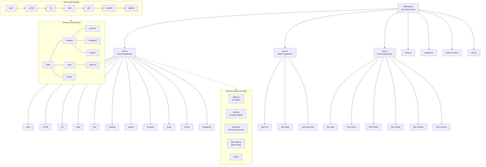

# 01. Tool Overview and Architecture

## Description

<!-- {{text: Write a 1-2 sentence overview of this chapter. Include the tool's purpose, the problem it solves, and its primary use cases.}} -->

This chapter introduces sdd-forge, a zero-dependency Node.js CLI tool that automates project documentation generation through source code analysis. It covers the tool's architecture, key concepts, and the typical workflow from setup to producing structured, maintainable documentation.

<!-- {{/text}} -->

## Content

### Purpose

<!-- {{text: Describe the problem this CLI tool solves and its target users. Derive the purpose from package.json and README.}} -->

Maintaining accurate project documentation is a persistent challenge — documents drift out of sync with the codebase, and manually updating them is time-consuming and error-prone. sdd-forge addresses this by scanning source code, extracting structural information (controllers, models, entities, migrations, etc.), and generating organized documentation automatically.

The tool targets development teams that follow a Spec-Driven Development (SDD) workflow. It is especially useful for projects built with frameworks such as CakePHP 2.x, Symfony, Laravel, and Node.js-based stacks, where preset-based analysis modules understand framework-specific conventions out of the box.

sdd-forge runs entirely on Node.js built-in modules with zero external dependencies, making it lightweight and easy to integrate into any Node.js >=18 environment.

<!-- {{/text}} -->

### Architecture Overview

<!-- {{text[mode=deep]: Generate a mermaid flowchart showing the tool's overall architecture. Include the dispatch structure from entry point to subcommands and the main processing flow (input → processing → output). Output only the mermaid code block.}} -->



<!-- {{/text}} -->

### Key Concepts

<!-- {{text: Explain the key concepts and terminology needed to understand this tool in table format. Extract the main concepts from source code.}} -->

| Concept | Description |
|---|---|
| **Preset** | A framework-specific configuration and analysis package (e.g., `symfony`, `cakephp2`, `node-cli`). Presets define scan modules, DataSources, and template chapters. They follow a `parent` chain for inheritance (e.g., `symfony` → `webapp` → `base`). |
| **DataSource** | A class that scans source files matching a specific category (controllers, entities, models, migrations) and exposes resolve methods callable from `{{data}}` directives in templates. |
| **Directive** | A marker embedded in documentation templates. `{{data: source.method("labels")}}` inserts dynamically generated tables; `{{text: instruction}}` marks zones where AI-generated prose is placed. |
| **Chapter** | A single Markdown file within `docs/` representing one section of the generated documentation. Chapter ordering is defined by the `chapters` array in `preset.json`. |
| **Enrichment** | The `enrich` pipeline step where AI analyzes the full scan output and annotates each entry with role, summary, detail, and chapter classification. |
| **SDD Flow** | The Spec-Driven Development workflow managed by `flow` commands: `start` → `status` → `review` → `merge` → `cleanup`. It tracks planning, implementation, and finalization state. |
| **Build Pipeline** | The sequential documentation generation process: `scan → enrich → init → data → text → readme → agents`, optionally followed by `translate`. |
| **analysis.json** | The structured scan output stored in `.sdd-forge/output/`. It contains all extracted source code metadata and serves as the input for subsequent pipeline stages. |

<!-- {{/text}} -->

### Typical Usage Flow

<!-- {{text: Describe the typical steps from installation to first output in step format. Derive the steps from help output and command definitions in the source code.}} -->

1. **Install sdd-forge** — Install the package globally via npm:
   ```
   npm install -g sdd-forge
   ```

2. **Run setup** — Navigate to your project root and run `sdd-forge setup`. This creates the `.sdd-forge/` configuration directory, generates a `config.json` from the example template, and sets up `AGENTS.md` with a `CLAUDE.md` symlink.

3. **Configure the project** — Edit `.sdd-forge/config.json` to set your project's `lang`, `type`, documentation languages, and agent provider settings. Select a preset matching your framework (e.g., `symfony`, `cakephp2`, `node-cli`).

4. **Generate documentation** — Run the full build pipeline with a single command:
   ```
   sdd-forge docs build
   ```
   This executes the pipeline in sequence: `scan` (extract source metadata) → `enrich` (AI-annotated analysis) → `init` (scaffold chapter files) → `data` (resolve `{{data}}` directives) → `text` (generate `{{text}}` prose) → `readme` (produce README) → `agents` (update AGENTS.md).

5. **Review the output** — Inspect the generated `docs/` directory. Each chapter file contains structured documentation derived from your source code. Run `sdd-forge docs review` to get an AI-powered quality check of the generated content.

6. **Iterate** — As your codebase evolves, re-run `sdd-forge docs build` to regenerate documentation. Only changed files are re-analyzed during incremental updates.

<!-- {{/text}} -->
