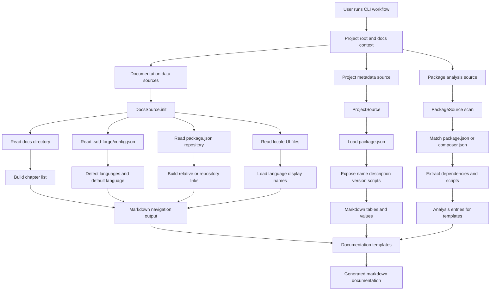

<!-- {{data("base.docs.langSwitcher", {labels: "relative"})}} -->
**English** | [日本語](ja/overview.md)
<!-- {{/data}} -->

# Tool Overview and Architecture

## Description

<!-- {{text({prompt: "Write a 1-2 sentence overview of this chapter. Include the tool's purpose, the problem it solves, and its primary use cases."})}} -->

This chapter introduces a CLI tool that combines source-code-based documentation generation with a Spec-Driven Development workflow. It helps teams keep project documentation, navigation, and package metadata connected to the codebase and is used to generate docs, expose project information, and organize development flow.
<!-- {{/text}} -->

## Content

### Purpose

<!-- {{text({prompt: "Describe the problem this CLI tool solves and its target users. Derive the purpose from package.json and README."})}} -->

This CLI tool is intended for projects that need documentation generated from source analysis and a structured Spec-Driven Development workflow.

Based on the available project context, it targets developers and maintainers who need to:
- generate documentation content from analyzed source code and project metadata
- build navigation such as chapter lists, language switchers, and previous/next links
- surface package information such as project name, version, and scripts in documentation
- work with a documented development process centered on specifications and generated docs
<!-- {{/text}} -->

### Architecture Overview

<!-- {{text({prompt: "Generate a mermaid flowchart showing the tool's overall architecture. Include the dispatch structure from entry point to subcommands and the main processing flow (input → processing → output). Output only the mermaid code block.", mode: "deep"})}} -->

<!-- {{/text}} -->

### Key Concepts

<!-- {{text({prompt: "Explain the key concepts and terminology needed to understand this tool in table format. Extract the main concepts from source code."})}} -->

| Concept | Meaning |
| --- | --- |
| DataSource | A provider that resolves values or markdown fragments for documentation templates. |
| DocsSource | A documentation-specific data source that generates language switchers, chapter tables, and previous/next navigation links. |
| ProjectSource | A data source that reads `package.json` and exposes project-level metadata such as name, description, version, and scripts. |
| PackageSource | A scan-based source that parses `package.json` or `composer.json` and records dependencies and scripts as analysis data. |
| Analysis entry | A structured record produced during scanning and then consumed by documentation templates. |
| Chapter list | An ordered set of documentation files used to build overview tables and navigation between chapters. |
| Language switcher | A generated set of links that lets readers move between localized versions of the same document. |
| Relative vs. absolute links | Two link modes used by docs generation: local relative paths or repository `blob/main` URLs. |
| Template directive | A placeholder such as `{{data}}` or `{{text}}` that inserts generated content into markdown files. |
| Markdown table output | A formatted table generated from structured project or documentation data, such as scripts or chapter summaries. |
<!-- {{/text}} -->

### Typical Usage Flow

<!-- {{text({prompt: "Describe the typical steps from installation to first output in step format. Derive the steps from help output and command definitions in the source code."})}} -->

1. Prepare a project that contains a documentation directory, package metadata, and the CLI configuration used by the tool.
2. Ensure the project metadata is available in `package.json`, because the tool reads values such as repository URL, name, description, version, and scripts from it.
3. Configure documentation settings in `.sdd-forge/config.json` when the project uses multiple languages, so language detection and switcher generation can work.
4. Place chapter files in the docs directory so the tool can discover them, extract titles and descriptions, and build navigation.
5. Run the documentation generation workflow so template directives can call the data sources and resolve markdown content.
6. Review the generated output, which can include chapter tables, language switchers, previous/next links, and package script tables.
<!-- {{/text}} -->

---

<!-- {{data("base.docs.nav")}} -->
[Technology Stack and Operations →](stack_and_ops.md)
<!-- {{/data}} -->
