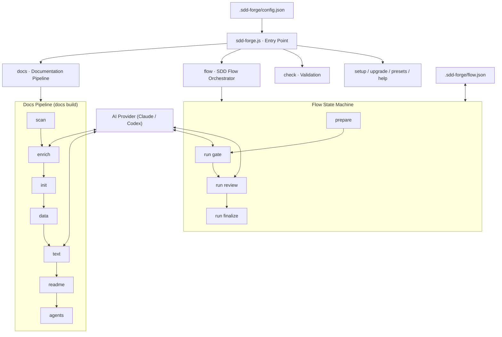
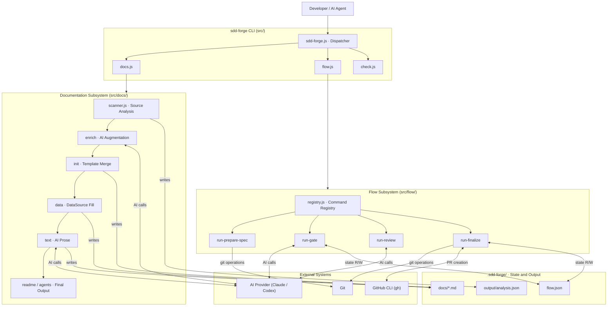

<!-- {{data("base.docs.langSwitcher", {labels: "relative"})}} -->
[日本語](ja/overview.md) | **English**
<!-- {{/data}} -->

# Tool Overview and Architecture

## Description

<!-- {{text({prompt: "Write a 1-2 sentence overview of this chapter. Include the tool's purpose, the problem it solves, and its primary use cases."})}} -->

This chapter introduces sdd-forge, a CLI tool that automates technical documentation generation through source code analysis and orchestrates a spec-driven development workflow for teams using AI coding agents. It covers the tool's design rationale, core architecture, essential concepts, and the typical steps to produce your first documentation output.
<!-- {{/text}} -->

## Content

### Purpose

<!-- {{text({prompt: "Describe the problem this CLI tool solves and its target users. Derive the purpose from package.json and README."})}} -->

Development teams working with AI coding agents face two recurring challenges: technical documentation drifts out of sync with source code over time, and AI-assisted feature work lacks a structured, auditable process. sdd-forge addresses both. It statically analyses a project's source files — extracting file structure, classes, methods, configuration keys, and dependencies — and uses AI agents to generate and automatically refresh documentation stored in `docs/`. In parallel, it provides a deterministic SDD flow orchestrator that guides feature development through three phases: plan, implement, and finalize. Gate checks and flow state management are handled deterministically, while AI contributes to spec drafting, code review, and prose generation within clearly defined boundaries.

The primary users are individual developers and teams who already use AI coding agents such as Claude Code or Codex and want a reproducible, spec-first development workflow backed by documentation that stays current with the codebase. The tool is distributed as a global npm package, requires Node.js 18 or later, and carries no external npm dependencies — it relies solely on Node.js built-in modules.
<!-- {{/text}} -->

### Architecture Overview

<!-- {{text({prompt: "Generate a mermaid flowchart showing the tool's overall architecture. Include the dispatch structure from entry point to subcommands and the main processing flow (input → processing → output). Output only the mermaid code block.", mode: "deep"})}} -->


<!-- {{/text}} -->

### Key Concepts

<!-- {{text({prompt: "Explain the key concepts and terminology needed to understand this tool in table format. Extract the main concepts from source code."})}} -->

| Concept | Description |
|---------|-------------|
| **Preset** | A named configuration bundle (e.g., `node-cli`, `hono`, `laravel`) that defines source scan patterns, documentation chapters, and DataSources for a specific framework or project type. Presets form inheritance chains rooted at `base`. |
| **analysis.json** | The central artifact produced by `docs scan`. Stores extracted metadata about source files, exports, classes, methods, configuration keys, and dependencies. All downstream pipeline stages consume this file. |
| **DataSource** | A module that resolves `{{data}}` directives in documentation templates by querying `analysis.json` and returning structured markdown tables or lists, without requiring an AI call. |
| **`{{text}}` directive** | A placeholder in a documentation template replaced with AI-generated prose. Each directive carries a `prompt` instruction that guides the AI agent. |
| **`{{data}}` directive** | A placeholder replaced with structured data extracted from `analysis.json` by a matching DataSource. |
| **Spec** | A markdown file (`spec.md`) created at the start of an SDD flow that defines requirements, a design approach, and a test plan. The spec must pass gate validation before implementation can begin. |
| **Flow state** | Persisted in `.sdd-forge/flow.json`. Tracks the current step, feature branch refs, per-requirement status, metrics, notes, and autoApprove mode for an active flow. |
| **Guardrail** | A project-defined rule evaluated by `flow run gate` before a phase transition is allowed. Rules are stored in `.sdd-forge/guardrail.json`. |
| **Agent provider** | A configured AI binary (Claude, Codex, or any compatible tool) invoked by `lib/agent.js` via `child_process.spawn`. Providers are declared under `agent.providers` in `config.json`. |
| **Agent profile** | A named mapping from command-prefix patterns to provider identifiers, enabling different AI models to be routed to different pipeline stages. |
| **Issue-log** | An append-only record in `.sdd-forge/issue-log.json` that captures problems, redo events, and guardrail violations during a flow, used for retrospectives and flow metrics. |
<!-- {{/text}} -->

### Typical Usage Flow

<!-- {{text({prompt: "Describe the typical steps from installation to first output in step format. Derive the steps from help output and command definitions in the source code."})}} -->

**Step 1 — Install the package**

Install sdd-forge globally using npm. Node.js 18 or later is required.
```
npm install -g sdd-forge
```

**Step 2 — Run the setup wizard**

From your project root, run the interactive setup command. It prompts for your project type (preset name), AI agent, and documentation languages, then writes `.sdd-forge/config.json`.
```
sdd-forge setup
```

**Step 3 — Build documentation**

Run the full documentation pipeline to produce your first output.
```
sdd-forge docs build
```
This executes scan → enrich → init → data → text → readme → agents in sequence. On the first run it creates all chapter files under `docs/`, generates `README.md`, and writes an `AGENTS.md` context file for AI agents.

**Step 4 — Review the output**

Open the `docs/` directory to inspect the generated chapters. Each chapter corresponds to an entry in the `chapters` array of `config.json`. Run `sdd-forge check freshness` at any time to verify documentation currency.

**Step 5 — Start a feature flow (optional)**

To begin a spec-driven feature, run:
```
sdd-forge flow prepare --request "Brief description of the change"
```
This creates a feature branch, initialises a `spec.md`, and sets the flow state to the first step.

**Step 6 — Progress through the flow phases**

Use `flow run gate` to validate the spec, `flow run review` for AI code review, and `flow run finalize --mode all` to commit, merge, sync documentation, and clean up the branch.
<!-- {{/text}} -->

# System Overview

<!-- {{data("monorepo.monorepo.apps", {labels: "overview", ignoreError: true})}} -->
<!-- {{/data}} -->

<!-- {{text({prompt: "Write a 1-2 sentence overview of this project."})}} -->

sdd-forge is a Node.js CLI tool that generates and maintains technical documentation from source code analysis and orchestrates a spec-driven development workflow for teams working alongside AI coding agents.
<!-- {{/text}} -->


## Description

<!-- {{text({prompt: "Write a 1-2 sentence overview of this chapter. Include the project's architecture and whether it integrates with external systems."})}} -->

This chapter describes the internal architecture of sdd-forge, covering how its three primary subsystems — the documentation pipeline, the SDD flow orchestrator, and the validation layer — are structured and how data flows between them. The tool integrates with external AI agent providers (Claude and Codex) for content generation and optionally with the GitHub CLI for pull request management.
<!-- {{/text}} -->

## Content
### Architecture Diagram

<!-- {{text({prompt: "Generate a mermaid flowchart showing the project architecture. Include data flows between major components. Output only the mermaid code block."})}} -->


<!-- {{/text}} -->
### Component Responsibilities

<!-- {{text({prompt: "Describe the major components with their location, responsibilities, and I/O in table format.", mode: "deep"})}} -->

| Component | Location | Responsibilities | Input | Output |
|-----------|----------|-----------------|-------|--------|
| CLI Dispatcher | `src/sdd-forge.js` | Routes top-level subcommands to subsystem dispatchers; initialises the logger and config | CLI arguments, environment variables | Delegates to appropriate dispatcher |
| Docs Dispatcher | `src/docs.js` | Routes `docs` subcommands; orchestrates the `docs build` pipeline with progress tracking | CLI arguments, `config.json` | Invokes pipeline stages in sequence |
| Flow Dispatcher | `src/flow.js` | Routes `flow` subcommands; resolves worktree context; loads flow state | CLI arguments, `flow.json` | JSON envelope responses |
| Flow Registry | `src/flow/registry.js` | Single source of truth for all flow command definitions, pre/post hooks, and step management | Command identifier | Loaded command module with metadata |
| Scanner | `src/docs/lib/scanner.js` | Traverses source files matching `scan.include` globs; extracts structural metadata including exports, classes, methods, config keys, and dependencies | Source files, preset scan config | `output/analysis.json` |
| Agent Library | `src/lib/agent.js` | Spawns AI provider processes via `child_process.spawn`; handles prompt injection, JSON output parsing, timeout, retry logic, and JSONL logging | Prompt text, provider config | AI-generated text or parsed JSON |
| Config Loader | `src/lib/config.js` | Reads and validates `.sdd-forge/config.json`; applies defaults; enforces required fields at startup | `config.json` on disk | Validated config object |
| Flow State | `src/lib/flow-state.js` | Reads and writes `flow.json`; manages step, requirement, metric, and note mutations | Flow mutation requests | Updated `flow.json` |
| Preset Loader | `src/lib/presets.js` | Discovers presets by type name; resolves the full inheritance chain from `src/presets/` | `type` field from config | Merged preset object with scan patterns and chapter definitions |
| i18n System | `src/lib/i18n.js` | Three-layer locale resolution with domain namespaces; loads string resources from `src/locale/` | Message key, `lang` config value | Localized string |
| Guardrail Engine | `src/lib/guardrail.js` | Loads rules from `guardrail.json`; evaluates conditions per flow phase | Phase identifier, current flow state | Pass/fail result with descriptive reasons |
| DataSource Base | `src/docs/lib/data-source.js` | Base class for `{{data}}` directive resolvers; invoked during the `docs data` stage | DataSource identifier, `analysis.json` | Structured markdown table or list |
<!-- {{/text}} -->
### External Integrations

<!-- {{text({prompt: "If there are external system integrations, describe their purpose and connection method in table format."})}} -->

| System | Purpose | Connection Method | Configuration |
|--------|---------|-------------------|---------------|
| Claude CLI (`claude`) | AI content generation for documentation prose, spec drafting, code review, and flow gate evaluation | `child_process.spawn` with `stdio: ["ignore", "pipe", "pipe"]`; prompt passed via `--prompt` flag; JSON output via `--output-format json` | Defined under `agent.providers` in `config.json`; supports `--model`, `--system-prompt`, and `--output-format` flags |
| Codex CLI (`codex`) | Alternative AI provider for documentation and flow tasks | `child_process.spawn`; prompt passed as a positional argument | Defined as `codex/gpt-5.4` or `codex/gpt-5.3` under `agent.providers` in `config.json` |
| GitHub CLI (`gh`) | Fetch GitHub issues into the flow context; create pull requests during `flow run finalize` | `child_process.spawn` invoking the `gh` binary; requires a pre-authenticated session | Enabled with `commands.gh: "enable"` in `config.json`; `gh` must be installed and authenticated independently |
| Git | Branch creation, worktree management, commits, and merges throughout the flow lifecycle | `child_process.spawn` invoking the `git` binary via `src/lib/git-helpers.js` | Uses the project's existing Git configuration; `flow.merge` sets the merge strategy; `flow.push.remote` sets the push target |
<!-- {{/text}} -->
### Environment Differences

<!-- {{text({prompt: "Describe the configuration differences across environments (local/staging/production)."})}} -->

sdd-forge does not define named deployment environments. All configuration lives in a single `.sdd-forge/config.json` at the project root. The settings that most commonly differ across operating contexts are described below.

**AI provider and model selection** (`agent.default`, `agent.profiles`) is the most significant variable. A developer workstation typically uses `claude/sonnet` for interactive speed. A CI pipeline that runs only deterministic stages (`docs scan`, `docs data`) requires no AI provider at all. The `SDD_FORGE_PROFILE` environment variable overrides `agent.useProfile` without modifying `config.json`, making it practical to apply different provider routing in CI without changing committed files.

**Concurrency** (`agent.concurrency`, default `5`) should be reduced in environments with strict API rate limits — such as shared CI accounts — and may be increased on workstations with higher-tier API access.

**Logging** (`logs.enabled`) is typically set to `true` in team environments for audit trails and left disabled during individual local use to avoid accumulating JSONL files under `.tmp/logs/`.

**GitHub CLI integration** (`commands.gh: "enable"`) is active only where the `gh` binary is installed and authenticated — typically developer workstations and CI runners with repository write access.

**Multi-language generation mode** (`docs.mode`) controls whether secondary-language documentation is produced by translating from the primary output (`"translate"`) or generated independently per language (`"generate"`). The `"generate"` mode incurs higher AI costs and is typically reserved for major release documentation runs.
<!-- {{/text}} -->

---

<!-- {{data("base.docs.nav")}} -->
[Technology Stack and Operations →](stack_and_ops.md)
<!-- {{/data}} -->
