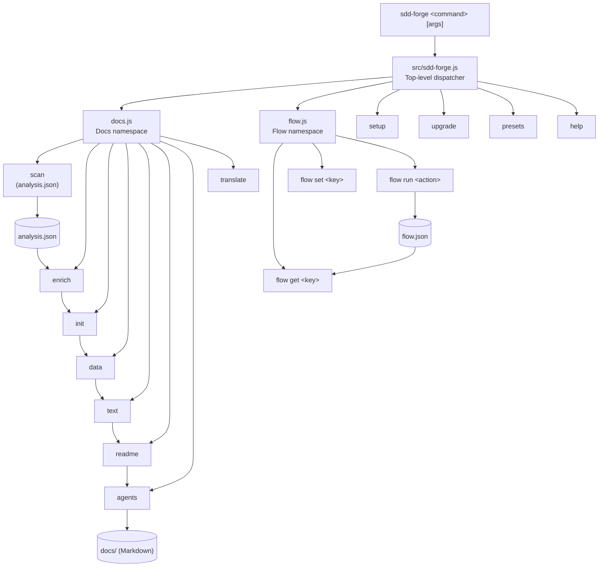

<!-- {{data("base.docs.langSwitcher", {labels: "relative"})}} -->
[日本語](ja/overview.md) | **English**
<!-- {{/data}} -->

# Tool Overview and Architecture

## Description

<!-- {{text({prompt: "Write a 1-2 sentence overview of this chapter. Include the tool's purpose, the problem it solves, and its primary use cases."})}} -->

This chapter introduces `sdd-forge`, a CLI tool that automates documentation generation from source code analysis and orchestrates Spec-Driven Development (SDD) workflows. It covers the tool's core purpose, architectural design, key concepts, and the typical path from installation to first output.
## Content

### Purpose

<!-- {{text({prompt: "Describe the problem this CLI tool solves and its target users. Derive the purpose from package.json and README."})}} -->
<!-- {{/text}} -->
<!-- {{text({prompt: "Describe the problem this CLI tool solves and its target users. Derive the purpose from package.json and README."})}} -->

Software projects frequently suffer from documentation that drifts out of sync with the codebase as features evolve. `sdd-forge` addresses this by treating documentation as a first-class artifact generated directly from static source-code analysis — not written by hand.

The tool targets development teams using AI coding agents and follows a **Spec-Driven Development** model: requirements are captured in a machine-verifiable spec before any code is written, and documentation is regenerated automatically whenever the source changes.

**Primary use cases include:**

- Generating and maintaining structured Markdown documentation from source code
- Enforcing a plan → implement → finalize flow with gate checks at each phase
- Providing Claude Code skills that embed flow orchestration directly into the editor
- Running AI-assisted text enrichment (summaries, prose) while keeping structural decisions deterministic

The package has no external runtime dependencies, requiring only Node.js ≥ 18, and publishes as the `sdd-forge` npm package.

### Key Concepts

<!-- {{text({prompt: "Explain the key concepts and terminology needed to understand this tool in table format. Extract the main concepts from source code."})}} -->
<!-- {{text({prompt: "Generate a mermaid flowchart showing the tool's overall architecture. Include the dispatch structure from entry point to subcommands and the main processing flow (input → processing → output). Output only the mermaid code block.", mode: "deep"})}} -->


<!-- {{/text}} -->
### External Integrations

<!-- {{text({prompt: "If there are external system integrations, describe their purpose and connection method in table format."})}} -->
<!-- {{text({prompt: "Explain the key concepts and terminology needed to understand this tool in table format. Extract the main concepts from source code."})}} -->

| Concept | Description |
|---|---|
| **SDD (Spec-Driven Development)** | A development workflow where a machine-verifiable specification is agreed upon before implementation begins. `sdd-forge` enforces the plan → implement → finalize phases. |
| **Flow** | The active SDD lifecycle managed by `sdd-forge flow`. State (current step, request, notes) persists in `flow.json` so it survives token compaction. |
| **Docs Pipeline** | The sequential chain `scan → enrich → init → data → text → readme → agents → [translate]` that produces structured Markdown documentation from source code. |
| **Preset** | A framework-specific bundle of scan patterns, DataSource classes, and Markdown templates. Presets resolve through a `parent` inheritance chain (e.g., `node-cli` → `cli` → `base`). |
| **`{{data}}` directive** | A template placeholder replaced with structured data extracted by a DataSource class during the `docs data` step. |
| **`{{text}}` directive** | A template placeholder replaced with AI-generated prose during the `docs text` step, driven by an inline `prompt` string. |
| **Gate** | A deterministic check run at phase boundaries (e.g., spec gate, impl gate) that blocks progression if requirements are not met. |
| **Skill** | A Claude Code slash command (e.g., `/sdd-forge.flow-plan`) that embeds multi-step flow orchestration directly into the editor session. |
| **Analysis JSON** | The `analysis.json` file generated by `sdd-forge scan` containing structured metadata about source files, functions, routes, and other code entities. |
| **AutoApprove** | A mode (`flow set auto on`) that allows the `/sdd-forge.flow-auto` skill to execute flow phases without pausing for confirmation at each gate. |
| **Preset Inheritance** | The `parent` field in `preset.json` allows a child preset to extend a parent, inheriting scan rules and templates while selectively overriding blocks. |

<!-- {{text({prompt: "If there are external system integrations, describe their purpose and connection method in table format."})}} -->

`sdd-forge` has no hard external service dependencies at runtime. Its only external integration point is the configured **AI agent**, called as a child process during the `enrich`, `text`, and flow-assist steps.

| Integration | Purpose | Connection Method |
|---|---|---|
| **AI Agent (Claude Code)** | Generates enriched summaries, fills `{{text}}` directives with prose, assists spec drafting and code review | Spawned as a child process via the command defined in `config.agent.providers[profile]`; communicates through stdin/stdout, optionally with `--output-format json` |
| **Git** | Branch management, commit creation, merge operations during flow finalize steps | Executed via Node.js `child_process` using standard `git` CLI commands available on `PATH` |
| **npm registry** | Package distribution (`sdd-forge` is published as an npm package) | `npm publish` — only relevant during release; not involved in normal operation |

All other operations (file parsing, template rendering, directive replacement, gate checks) run entirely within the Node.js process with no network calls.

<!-- {{text({prompt: "Describe the typical steps from installation to first output in step format. Derive the steps from help output and command definitions in the source code."})}} -->

**1. Install the package globally**

```bash
npm install -g sdd-forge
```

**2. Run setup in your project root**

```bash
sdd-forge setup
```

This creates `.sdd-forge/config.json`, installs Claude Code skills under `.claude/skills/`, and generates the initial `AGENTS.md` / `CLAUDE.md` symlink.

**3. Configure your project**

Edit `.sdd-forge/config.json` to set `lang`, `type` (preset identifier), `docs.languages`, and `agent.providers` to match your AI agent setup.

**4. Scan your source code**

```bash
sdd-forge docs scan
```

This performs static analysis and writes `.sdd-forge/output/analysis.json`.

**5. Enrich the analysis with AI summaries**

```bash
sdd-forge docs enrich
```

An AI agent annotates each code entity with role, summary, and chapter assignment.

**6. Initialise documentation templates**

```bash
sdd-forge docs init
```

Preset templates are resolved through the inheritance chain and placed into the `docs/` directory.

**7. Run the full build**

```bash
sdd-forge docs build
```

Executes the remaining pipeline steps (`data → text → readme → agents`), filling every `{{data}}` and `{{text}}` directive and producing final Markdown in `docs/`.

**8. Review the output**

Open `docs/en/overview.md` (or your configured default language) to see the generated documentation.
