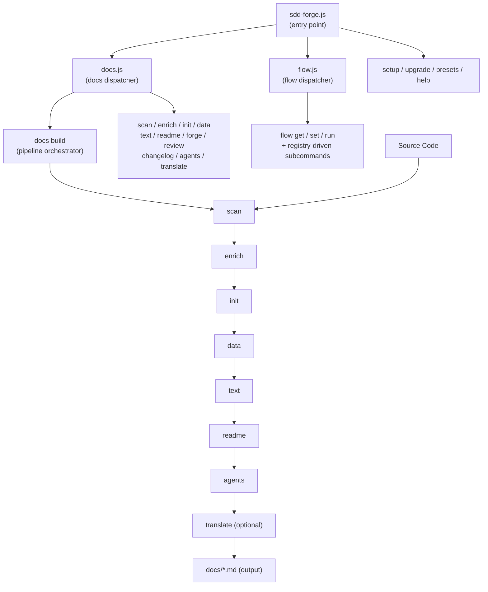

<!-- {{data("base.docs.langSwitcher", {labels: "relative"})}} -->
**English** | [日本語](ja/overview.md)
<!-- {{/data}} -->

# Tool Overview and Architecture

## Description

<!-- {{text({prompt: "Write a 1-2 sentence overview of this chapter. Include the tool's purpose, the problem it solves, and its primary use cases."})}} -->

This chapter provides an introduction to sdd-forge — a CLI tool that automates technical documentation generation through static source code analysis and orchestrates a Spec-Driven Development (SDD) workflow. It covers the tool's purpose, three-level command architecture, core concepts, and the typical sequence from installation through producing your first documentation output.
<!-- {{/text}} -->

## Content

### Purpose

<!-- {{text({prompt: "Describe the problem this CLI tool solves and its target users. Derive the purpose from package.json and README."})}} -->

Technical documentation has a well-known tendency to fall out of sync with the code it describes. As a codebase evolves, hand-maintained documents require constant, repetitive updates — a process that is both error-prone and costly in time and effort. sdd-forge addresses this by deriving documentation directly from source code analysis, so content reflects the actual state of the project rather than what someone remembered to write down.

The tool is aimed at software developers and development teams who want structured, maintainable documentation without manual repetition. It is especially suited to teams working with AI coding agents, where clear, machine-readable specifications and up-to-date architecture documents are prerequisites for reliable AI-assisted development. By combining automated doc generation with a spec-first development workflow, sdd-forge keeps design intent, implementation, and documentation aligned throughout the entire feature lifecycle.
<!-- {{/text}} -->

### Architecture Overview

<!-- {{text({prompt: "Generate a mermaid flowchart showing the tool's overall architecture. Include the dispatch structure from entry point to subcommands and the main processing flow (input → processing → output). Output only the mermaid code block.", mode: "deep"})}} -->


<!-- {{/text}} -->

### Key Concepts

<!-- {{text({prompt: "Explain the key concepts and terminology needed to understand this tool in table format. Extract the main concepts from source code."})}} -->

| Concept | Description |
|---|---|
| **Preset** | A configuration template that defines the documentation structure for a specific project type (e.g., `node-cli`, `laravel`, `base`). Presets inherit from a parent chain starting at `base`. |
| **Directive** | A special marker in documentation templates — either `{{data}}` or `{{text}}` — that marks a region for auto-generated content. Content inside a directive is overwritten on each build; content outside is preserved. |
| **Chapter** | A single documentation file (e.g., `overview.md`) representing one section of the generated docs. Chapter order is defined in `preset.json`'s `chapters` array and can be overridden per project in `config.json`. |
| **analysis.json** | The structured metadata file produced by `docs scan`, capturing roles, summaries, and classifications for each source file. Stored in `.sdd-forge/output/`. |
| **enrich** | A pipeline step where AI annotates each analysis entry with role, summary, and chapter classification using the full project context. |
| **SDD Flow** | The Spec-Driven Development workflow managed by the `flow` subcommand. It guides a feature through three phases: plan (spec + gate + tests), implement (code + review), and merge (docs + commit + merge). |
| **Spec** | A structured specification document created before implementation begins. It defines acceptance criteria and acts as a gate that must pass before coding proceeds. |
| **docs build** | A pipeline orchestrator command that runs the full sequence — scan → enrich → init → data → text → readme → agents — in a single step with progress tracking. |
<!-- {{/text}} -->

### Typical Usage Flow

<!-- {{text({prompt: "Describe the typical steps from installation to first output in step format. Derive the steps from help output and command definitions in the source code."})}} -->

**1. Install the package globally**

```sh
npm install -g sdd-forge
```

Node.js 18 or later is required. sdd-forge has no external runtime dependencies.

**2. Initialize your project**

Run `sdd-forge setup` in your project root. This creates the `.sdd-forge/` configuration directory, generates `AGENTS.md` (the AI context file), and creates a `CLAUDE.md` symlink for use with Claude-based agents.

**3. Scan your source code**

Run `sdd-forge docs scan` to statically analyze your project. This produces `analysis.json` in `.sdd-forge/output/`, capturing file roles, module relationships, and structural metadata.

**4. Run the full build pipeline**

Run `sdd-forge docs build` to execute the complete documentation pipeline in sequence: scan → enrich → init → data → text → readme → agents. On first run this also scaffolds the chapter files under your configured `docs/` directory.

**5. Review the generated documentation**

Open the files in your `docs/` directory. Each chapter corresponds to an entry in the preset's `chapters` array. Content inside `{{data}}` and `{{text}}` directives is auto-generated; you can add your own content outside these markers without it being overwritten.

**6. Start a development flow (optional)**

When beginning a new feature, run `sdd-forge flow run start` to enter the SDD workflow. This guides the feature through specification, gating, implementation, and documentation in a structured sequence.
<!-- {{/text}} -->

---

<!-- {{data("base.docs.nav")}} -->
[Technology Stack and Operations →](stack_and_ops.md)
<!-- {{/data}} -->
