# 01. Tool Overview and Architecture

## Description

<!-- {{text: Write a 1-2 sentence overview of this chapter. Include the tool's purpose, the problem it solves, and its primary use cases.}} -->
This chapter introduces `sdd-forge`, a CLI tool that automates technical documentation generation by analysing your source code and driving a Spec-Driven Development (SDD) workflow. It covers the tool's purpose, its three-layer dispatch architecture, the core concepts you need to understand before using it, and a step-by-step guide to getting started.
<!-- {{/text}} -->

## Content

### Purpose

<!-- {{text: Describe the problem this CLI tool solves and its target users. Derive the purpose from package.json and README.}} -->
Engineering teams frequently struggle to keep technical documentation accurate as codebases evolve. Documentation written by hand diverges from the source code, becomes stale, and imposes a sustained maintenance burden on developers.

`sdd-forge` addresses this problem by treating the source code itself as the authoritative input for documentation. It statically analyses the project, enriches the resulting data with AI-generated descriptions, and resolves structured directives inside Markdown templates to produce up-to-date `docs/` content automatically.

Beyond documentation, the tool enforces a **Spec-Driven Development** discipline: every feature or fix begins with a machine-validated specification (`spec` / `gate`), passes through a defined implementation flow, and ends with a documentation refresh (`forge` / `review`). This closes the loop between design intent, implementation, and written documentation.

The primary users are software developers and team leads who want reliable, maintainable project documentation without the overhead of writing and updating it manually. The tool requires Node.js ≥ 18.0.0 and has no external runtime dependencies.
<!-- {{/text}} -->

### Architecture Overview

```mermaid
flowchart TD
    CLI["sdd-forge (entry point)\nsrc/sdd-forge.js"]

    CLI -->|"build / scan / init / data\ntext / forge / review / readme\nagents / changelog / translate\nsnapshot / setup / upgrade"| DOCS["docs dispatcher\nsrc/docs.js"]
    CLI -->|"spec / gate"| SPEC["spec dispatcher\nsrc/spec.js"]
    CLI -->|"flow"| FLOW["flow\nsrc/flow.js"]
    CLI -->|"help / -h"| HELP["help\nsrc/help.js"]
    CLI -->|"presets"| PRESETS["presets-cmd\nsrc/presets-cmd.js"]

    DOCS -->|"build"| PIPELINE["Build Pipeline"]
    DOCS -->|"individual command"| CMD["docs/commands/*.js"]

    PIPELINE --> S1["scan\n(source → analysis.json)"]
    S1 --> S2["enrich\n(AI: roles & summaries)"]
    S2 --> S3["init\n(templates → docs/)"]
    S3 --> S4["data\n(resolve &#123;&#123;data&#125;&#125; directives)"]
    S4 --> S5["text\n(resolve &#123;&#123;text&#125;&#125; directives via AI)"]
    S5 --> S6["readme\n(generate README.md)"]
    S6 --> S7["agents\n(update AGENTS.md)"]
    S7 -->|"multi-lang config"| S8["translate\n(generate language variants)"]

    SPEC --> INIT["specs/commands/init.js\n(create spec + branch)"]
    SPEC --> GATE["specs/commands/gate.js\n(pre / post gate check)"]

    SRC["Source Code"] --> S1
    S5 --> OUT["docs/ (Markdown output)"]
```

<!-- {{text[mode=deep]: Generate a mermaid flowchart showing the tool's overall architecture. Include the dispatch structure from entry point to subcommands and the main processing flow (input → processing → output). Output only the mermaid code block.}} -->

<!-- {{/text}} -->

### Key Concepts

<!-- {{text: Explain the key concepts and terminology needed to understand this tool in table format. Extract the main concepts from source code.}} -->
| Concept | Description |
|---|---|
| **analysis.json** | Structured JSON produced by `sdd-forge scan`. It captures the project's file inventory, module roles, and code relationships and acts as the sole input for all downstream documentation steps. |
| **`{{data}}` directive** | A Markdown placeholder resolved by `sdd-forge data`. It is replaced with structured data extracted directly from `analysis.json` (e.g., tables of commands, file lists). |
| **`{{text}}` directive** | A Markdown placeholder resolved by `sdd-forge text`. It contains a natural-language instruction that an AI agent fulfils, generating prose inside a fixed structural boundary defined by the template. |
| **Preset** | A bundle of chapter templates and a `preset.json` manifest that defines the documentation structure for a given project type (e.g., `cli/node-cli`, `webapp/laravel`). Presets are discovered automatically. |
| **CommandContext** | A shared context object (`resolveCommandContext()`) that every command receives. It holds the working root, source root, parsed config, resolved language, docs directory, and AI agent settings. |
| **SDD flow** | The Spec-Driven Development cycle enforced by the tool: `spec → gate (pre) → implement → gate (post) → forge → review`. No implementation starts before a gate PASS. |
| **spec / gate** | `sdd-forge spec` initialises a feature branch and a `spec.md` file. `sdd-forge gate` validates the spec against a checklist before implementation (pre-phase) and after (post-phase). |
| **forge** | `sdd-forge forge` runs an iterative AI improvement loop over `docs/` to align documentation with the current source code after implementation changes. |
| **enrich** | `sdd-forge enrich` sends the full `analysis.json` to an AI agent, which annotates each entry with a role summary and chapter classification, feeding richer context into subsequent `text` generation. |
| **Agent** | An AI back-end configuration entry in `.sdd-forge/config.json`. The `resolveAgent()` function selects the correct model and endpoint for `text`, `enrich`, `forge`, and `review` commands. |
<!-- {{/text}} -->

### Typical Usage Flow

<!-- {{text: Describe the typical steps from installation to first output in step format. Derive the steps from help output and command definitions in the source code.}} -->
**Step 1 — Install the package**

Install `sdd-forge` globally from npm so the `sdd-forge` binary is available on your `PATH`:

```bash
npm install -g sdd-forge
```

**Step 2 — Register your project**

Run `setup` inside your project's repository root. This creates a `.sdd-forge/config.json` file and registers the project for use with the CLI:

```bash
sdd-forge setup
```

**Step 3 — Configure an AI agent**

Open `.sdd-forge/config.json` and set `defaultAgent` to the name of an agent entry you have defined (e.g., a Claude or compatible model). The `text` and `enrich` steps require an agent to be configured.

**Step 4 — Run a full documentation build**

Execute the one-command build pipeline, which runs `scan → enrich → init → data → text → readme → agents` in sequence:

```bash
sdd-forge build --agent <agent-name>
```

Generated documentation is written to the `docs/` directory at the project root.

**Step 5 — Review and refine**

After the build, run `review` to check documentation quality. If issues are found, run `forge` with a description of recent changes to iterate and improve:

```bash
sdd-forge review
sdd-forge forge --prompt "Added authentication module"
```

**Step 6 — Start a feature with the SDD flow**

For any new feature or bug fix, initialise a spec before writing code:

```bash
sdd-forge spec --title "Add export command"
sdd-forge gate --spec specs/001-add-export-command/spec.md
```

Implement only after the gate reports PASS, then close the cycle with `forge` and `review`.
<!-- {{/text}} -->
