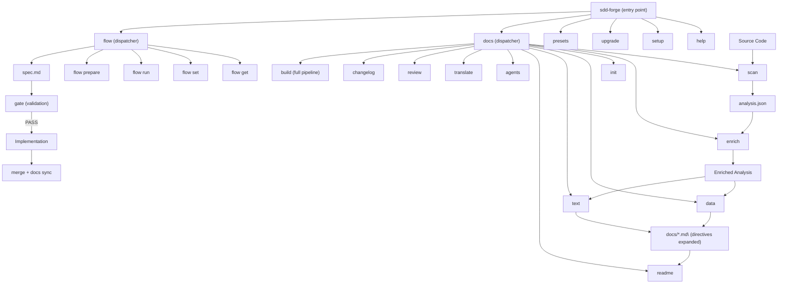

<!-- {{data("base.docs.langSwitcher", {labels: "relative"})}} -->
**English** | [日本語](ja/overview.md)
<!-- {{/data}} -->

# Tool Overview and Architecture

## Description

<!-- {{text({prompt: "Write a 1-2 sentence overview of this chapter. Include the tool's purpose, the problem it solves, and its primary use cases."})}} -->

This chapter introduces sdd-forge — a CLI tool that automates documentation generation through source code analysis and enforces a Spec-Driven Development workflow for AI-assisted projects. It covers the tool's purpose, the problems it solves, its overall architecture, and the key concepts and workflow steps needed to get started.
<!-- {{/text}} -->

## Content

### Purpose

<!-- {{text({prompt: "Describe the problem this CLI tool solves and its target users. Derive the purpose from package.json and README."})}} -->

sdd-forge addresses a recurring challenge in AI-assisted development: documentation drifting out of sync with source code, AI agents lacking project context, and the absence of a structured review gate before implementation begins. Without a disciplined workflow, AI coding agents tend to produce code that diverges from intended design or requires repeated correction cycles.

The tool targets individual developers and teams who use AI agents (such as Claude or GPT-4) to write or modify code. It provides two complementary capabilities: first, a documentation pipeline that analyzes source code and generates up-to-date reference documentation; second, a Spec-Driven Development flow that enforces a plan-gate-implement-merge cycle, keeping AI within well-defined boundaries at every phase.

Primary use cases include bootstrapping and maintaining project documentation, running deterministic gate checks before coding begins, iterating on feature specifications collaboratively with an AI agent, and synchronizing documentation automatically at the point of merge.
<!-- {{/text}} -->

### Architecture Overview

<!-- {{text({prompt: "Generate a mermaid flowchart showing the tool's overall architecture. Include the dispatch structure from entry point to subcommands and the main processing flow (input → processing → output). Output only the mermaid code block.", mode: "deep"})}} -->


<!-- {{/text}} -->

### Key Concepts

<!-- {{text({prompt: "Explain the key concepts and terminology needed to understand this tool in table format. Extract the main concepts from source code."})}} -->

| Concept | Description |
|---|---|
| **Preset** | A named project-type configuration (e.g., `nextjs`, `laravel`, `node-cli`) that defines scan rules, DataSource classes, and documentation templates. Presets form an inheritance chain, allowing shared behavior to flow from `base` through framework-specific layers. |
| **Analysis** | Structured data extracted from source code by the `scan` command and stored in `.sdd-forge/analysis.json`. Downstream commands (`enrich`, `data`, `text`) consume this file rather than re-reading source directly. |
| **Enrich** | A processing phase where an AI agent annotates each analysis entry with a summary, chapter assignment, and role description — converting raw structural data into contextually meaningful metadata. |
| **DataSource** | A pluggable class that extracts a specific category of data (e.g., modules, routes, configuration) from source code during scanning, and exposes that data for use in documentation templates. |
| **Directive** | A template placeholder that marks where dynamic content should be inserted. `{{data(...)}}` is expanded deterministically from analysis data; `{{text(...)}}` is filled by AI-generated prose. |
| **Spec** | A structured feature specification document (`spec.md`) created in a `specs/NNN/` directory during the planning phase. The spec is the authoritative description of intent that the gate and implementation phases are validated against. |
| **Gate** | A deterministic validation checkpoint at the end of the planning phase. It checks that all spec items are resolved and that the design satisfies defined guardrails. AI cannot proceed to implementation until the gate returns PASS. |
| **Guardrail** | A project-specific design principle declared in configuration and checked automatically during the gate phase to prevent spec decisions from violating architectural constraints. |
| **Flow State** | The record of the current SDD workflow's progress, persisted in `.sdd-forge/flow.json` and referenced via `.sdd-forge/.active-flow`. This allows development to resume after AI context compression. |
| **Worktree** | An isolated git worktree used to run a flow on a separate branch without disturbing the main working directory, enabling parallel feature development. |
| **Template** | Markdown files containing directive placeholders; they support inheritance (``) and block overrides (``) so preset-specific chapters can extend a shared base without duplicating structure. |
<!-- {{/text}} -->

### Typical Usage Flow

<!-- {{text({prompt: "Describe the typical steps from installation to first output in step format. Derive the steps from help output and command definitions in the source code."})}} -->

**Step 1 — Install the package globally**

```bash
npm install -g sdd-forge
```

Node.js 18 or later is required. The package has no external runtime dependencies.

**Step 2 — Run setup in your project root**

```bash
sdd-forge setup
```

The interactive wizard asks you to select a project type (preset) and configure your AI agent. It creates `.sdd-forge/config.json` and generates an initial `AGENTS.md` file.

**Step 3 — Scan your source code**

```bash
sdd-forge docs scan
```

This analyzes the project according to the selected preset's rules and writes structured output to `.sdd-forge/analysis.json`.

**Step 4 — Enrich the analysis with AI annotations**

```bash
sdd-forge docs enrich
```

The AI agent reviews the full analysis in one pass and annotates each entry with a summary, role, and chapter assignment.

**Step 5 — Build documentation**

```bash
sdd-forge docs build
```

This runs the complete pipeline — `init`, `data`, `text`, `readme`, `agents`, and `translate` — producing up-to-date documentation in the `docs/` directory and a generated `README.md`.

After these steps, `docs/` contains structured reference documentation derived directly from your source code and ready for ongoing maintenance using `sdd-forge docs build` after future code changes.
<!-- {{/text}} -->

---

<!-- {{data("base.docs.nav")}} -->
[Technology Stack and Operations →](stack_and_ops.md)
<!-- {{/data}} -->
