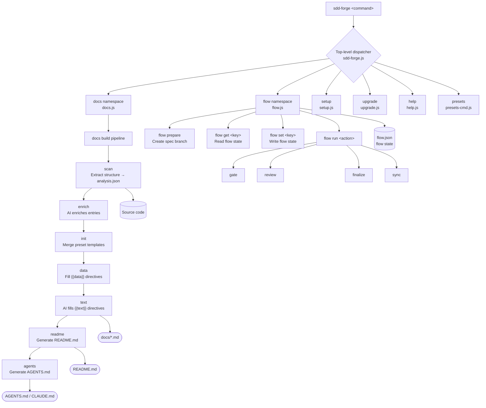

<!-- {{data("base.docs.langSwitcher", {labels: "relative"})}} -->
**English** | [日本語](ja/overview.md)
<!-- {{/data}} -->

# Tool Overview and Architecture

## Description

<!-- {{text({prompt: "Write a 1-2 sentence overview of this chapter. Include the tool's purpose, the problem it solves, and its primary use cases."})}} -->

This chapter introduces sdd-forge — a CLI tool that automates documentation generation through source code analysis and orchestrates a Spec-Driven Development workflow for teams working with AI coding agents. It covers the tool's core purpose, its three-phase flow architecture, and the key concepts needed to start using it effectively.
<!-- {{/text}} -->

## Content

### Purpose

<!-- {{text({prompt: "Describe the problem this CLI tool solves and its target users. Derive the purpose from package.json and README."})}} -->

Software projects that rely on AI coding assistants face a recurring problem: AI agents lack a reliable, always-current map of the codebase. Developers must either spend tokens re-explaining architecture on every session or accept that the AI operates with an incomplete picture, leading to drift between design intent and implementation.

sdd-forge solves this by treating documentation as a first-class artifact that is generated directly from source code rather than written by hand. It scans the project, enriches the analysis with AI-supplied summaries, and produces structured Markdown docs that serve as a shared context layer for both humans and agents.

Beyond documentation, sdd-forge provides a Spec-Driven Development (SDD) workflow that structures feature work into three phases — **plan**, **implement**, and **merge** — each gated by automated checks. This keeps AI-assisted development predictable and auditable.

**Target users** are individual developers and teams who:
- Use AI agents (particularly Claude Code) for day-to-day coding assistance
- Work on projects where documentation frequently falls behind the source code
- Want a repeatable, low-ceremony process for shipping AI-assisted features safely
<!-- {{/text}} -->

### Architecture Overview

<!-- {{text({prompt: "Generate a mermaid flowchart showing the tool's overall architecture. Include the dispatch structure from entry point to subcommands and the main processing flow (input → processing → output). Output only the mermaid code block.", mode: "deep"})}} -->


<!-- {{/text}} -->

### Key Concepts

<!-- {{text({prompt: "Explain the key concepts and terminology needed to understand this tool in table format. Extract the main concepts from source code."})}} -->

| Concept | Description |
|---|---|
| **Preset** | A bundled configuration for a specific framework or project type (e.g., `cli`, `laravel`, `drizzle`). Presets define what to scan, how to extract data, and which documentation templates to use. They form an inheritance chain — a project preset extends a base preset. |
| **SDD (Spec-Driven Development)** | A three-phase development workflow (plan → implement → merge) where a formal spec is written and gated before any code changes are made. sdd-forge orchestrates this flow and enforces the gate checks. |
| **analysis.json** | The machine-readable output of `docs scan`. It captures the project's structure — files, functions, classes, routes, configs — and is the data source for all subsequent documentation steps. |
| **Directive** | A special marker embedded in Markdown templates. `{{data(...)}}` is replaced with structured data from analysis; `{{text(...)}}` is replaced with AI-generated prose. Content inside directives is overwritten on each build; content outside is preserved. |
| **Flow state** | The runtime context of an active SDD flow, persisted in `flow.json`. Tracks the current step, the original request, linked issues, review notes, and per-phase metrics. |
| **Enrich** | An optional pipeline step where an AI agent reads the raw analysis and annotates each entry with a role, summary, and chapter classification, improving the quality of generated documentation. |
| **AGENTS.md** | A project-specific knowledge file generated by sdd-forge and read by AI agents at session start. It gives the agent an up-to-date map of the codebase without requiring manual maintenance. |
| **`docs build` pipeline** | The full documentation generation sequence: `scan → enrich → init → data → text → readme → agents`. Each step can also be run individually. |
| **Worktree** | A Git worktree created by `flow prepare` to isolate spec-branch changes from the main working tree, enabling concurrent flows without interfering with ongoing work. |
<!-- {{/text}} -->

### Typical Usage Flow

<!-- {{text({prompt: "Describe the typical steps from installation to first output in step format. Derive the steps from help output and command definitions in the source code."})}} -->

**Step 1 — Install the package**

Install sdd-forge globally from npm:

```bash
npm install -g sdd-forge
```

**Step 2 — Run the setup wizard**

From your project root, run the interactive setup command. It detects your project type, selects a matching preset, and writes `.sdd-forge/config.json`:

```bash
sdd-forge setup
```

Setup prompts for: language preference, project preset (`cli`, `laravel`, `drizzle`, etc.), and the AI agent to use for text generation.

**Step 3 — Build the documentation**

Run the full documentation pipeline. This scans your source code, enriches the analysis, merges templates, and produces docs in the `docs/` directory along with a project `README.md` and `AGENTS.md`:

```bash
sdd-forge docs build
```

**Step 4 — Review the output**

Open `docs/` to read the generated documentation. `AGENTS.md` (and its symlink `CLAUDE.md`) is ready for AI agent sessions. `README.md` reflects the current state of the codebase.

**Step 5 — Keep docs in sync**

Re-run `sdd-forge docs build` whenever the codebase changes significantly, or use the SDD flow (`sdd-forge flow prepare`) to automatically sync documentation as part of the merge process.
<!-- {{/text}} -->

---

<!-- {{data("base.docs.nav")}} -->
[Technology Stack and Operations →](stack_and_ops.md)
<!-- {{/data}} -->
