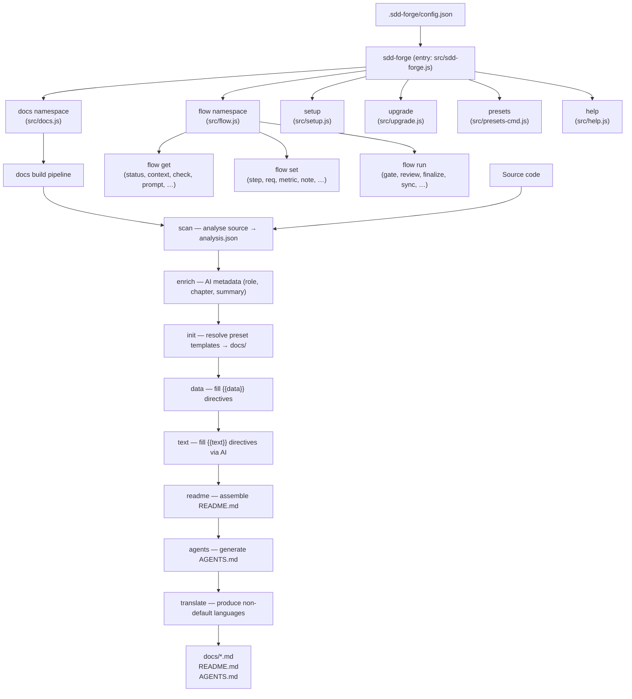

<!-- {{data("base.docs.langSwitcher", {labels: "relative"})}} -->
**English** | [日本語](ja/overview.md)
<!-- {{/data}} -->

# Tool Overview and Architecture

## Description

<!-- {{text({prompt: "Write a 1-2 sentence overview of this chapter. Include the tool's purpose, the problem it solves, and its primary use cases."})}} -->

This chapter introduces sdd-forge, a CLI tool that automates technical documentation generation through static source-code analysis and AI-assisted prose generation. It also covers the tool's Spec-Driven Development (SDD) workflow, which structures AI-assisted coding into repeatable plan, implement, and finalize phases.
<!-- {{/text}} -->

## Content

### Purpose

<!-- {{text({prompt: "Describe the problem this CLI tool solves and its target users. Derive the purpose from package.json and README."})}} -->

Keeping technical documentation in sync with a rapidly evolving codebase is a time-consuming, error-prone task. Developers must manually translate code structure into readable prose, and documentation quickly drifts out of date as the code changes. sdd-forge addresses this by scanning source files statically, extracting structured analysis data, and injecting that data into predefined templates—then using an AI agent to generate human-readable prose only within clearly bounded directive blocks.

The tool targets software engineers and development teams who use AI coding assistants (such as Claude Code) and want reliable, structured documentation without writing it by hand. It is particularly suited to projects where documentation quality is treated as a first-class concern alongside test coverage and code review.
<!-- {{/text}} -->

### Architecture Overview

<!-- {{text({prompt: "Generate a mermaid flowchart showing the tool's overall architecture. Include the dispatch structure from entry point to subcommands and the main processing flow (input → processing → output). Output only the mermaid code block.", mode: "deep"})}} -->


<!-- {{/text}} -->

### Key Concepts

<!-- {{text({prompt: "Explain the key concepts and terminology needed to understand this tool in table format. Extract the main concepts from source code."})}} -->

| Concept | Description |
|---|---|
| **Preset** | A named project-type profile (e.g. `node-cli`, `laravel`) that bundles scan parsers, DataSource classes, and chapter templates. Presets form an inheritance chain via a `parent` field in `preset.json`. |
| **`analysis.json`** | The structured output of `docs scan`. Contains categorised entries for files, functions, routes, and other source artefacts, stored in `.sdd-forge/output/`. |
| **Enrich** | An AI-assisted post-processing step that annotates each `analysis.json` entry with a role, prose summary, and chapter assignment before templates are populated. |
| **Directive** | A template marker embedded in a `.md` file. `{{data(…)}}` is replaced with structured analysis data; `{{text(…)}}` is replaced with AI-generated prose. Content between directive tags is regenerated on each build; content outside is preserved. |
| **DataSource** | A JavaScript class that transforms `analysis.json` entries into the structured values consumed by `{{data}}` directives. Each preset provides its own DataSource implementations. |
| **SDD Flow** | The three-phase development workflow enforced by the `flow` namespace: *plan* (spec creation and gate check), *implement* (coding and review), and *finalize* (commit, merge, doc sync, cleanup). |
| **`flow.json`** | A per-branch state file (`.sdd-forge/flow.json`) that records the active SDD flow's step progress, requirements, metrics, and notes. |
| **Guardrail** | A set of rules validated by `flow run gate` that prevents implementation from starting until the specification meets quality criteria. |
| **Agent** | An external AI process (e.g. `claude`) invoked by sdd-forge to generate or review text. Configured via `agent.default` and `agent.providers` in `config.json`. |
<!-- {{/text}} -->

### Typical Usage Flow

<!-- {{text({prompt: "Describe the typical steps from installation to first output in step format. Derive the steps from help output and command definitions in the source code."})}} -->

**1. Install the package globally**

```bash
npm install -g sdd-forge
```

**2. Register your project**

Run the following from your project root. The wizard prompts for project type (preset), operating language, and AI agent settings, then writes `.sdd-forge/config.json`.

```bash
sdd-forge setup
```

**3. Scan the source code**

Analyse the codebase and produce `.sdd-forge/output/analysis.json`.

```bash
sdd-forge docs scan
```

**4. Initialise documentation templates**

Resolve the preset inheritance chain and write the chapter template files into `docs/`.

```bash
sdd-forge docs init
```

**5. Run the full build pipeline**

Execute all remaining steps (enrich → data → text → readme → agents) in one command. An AI agent must be available for the `text` step.

```bash
sdd-forge docs build
```

After the build completes, the `docs/` directory contains populated chapter files and `README.md` is regenerated from them. Subsequent runs detect changed source files and update only the affected sections.
<!-- {{/text}} -->

---

<!-- {{data("base.docs.nav")}} -->
[Technology Stack and Operations →](stack_and_ops.md)
<!-- {{/data}} -->
