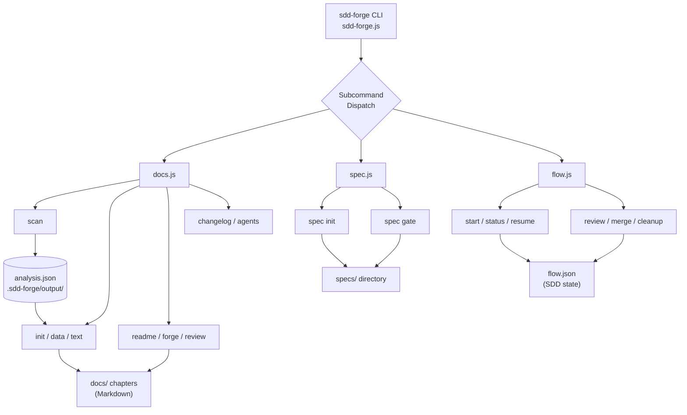

<!-- {{data("base.docs.langSwitcher", {labels: "relative"})}} -->
**English** | [日本語](ja/overview.md)
<!-- {{/data}} -->

# Tool Overview and Architecture

## Description

<!-- {{text({prompt: "Write a 1-2 sentence overview of this chapter. Include the tool's purpose, the problem it solves, and its primary use cases."})}} -->

This chapter introduces sdd-forge, a CLI tool that automates project documentation generation through source code analysis and provides a structured Spec-Driven Development (SDD) workflow. It covers the tool's core purpose, high-level architecture, key concepts, and the steps required to go from installation to your first generated output.
<!-- {{/text}} -->

## Content

### Purpose

<!-- {{text({prompt: "Describe the problem this CLI tool solves and its target users. Derive the purpose from package.json and README."})}} -->

Software teams routinely face documentation that falls out of sync with the codebase as features are added and refactored. sdd-forge addresses this by scanning source code to produce a structured analysis, then using AI-driven text generation to fill documentation chapters with accurate, up-to-date content — removing the need for manual prose maintenance.

The tool is aimed at developers and teams who want documentation that stays honest to the code, as well as teams adopting Spec-Driven Development, where a living specification document must guide and constrain every implementation decision. sdd-forge handles both concerns: it generates human-readable documentation from the codebase, and it manages the SDD lifecycle from spec creation through implementation gate-checks and merge.
<!-- {{/text}} -->

### Architecture Overview

<!-- {{text({prompt: "Generate a mermaid flowchart showing the tool's overall architecture. Include the dispatch structure from entry point to subcommands and the main processing flow (input → processing → output). Output only the mermaid code block.", mode: "deep"})}} -->

<!-- {{/text}} -->

### Key Concepts

<!-- {{text({prompt: "Explain the key concepts and terminology needed to understand this tool in table format. Extract the main concepts from source code."})}} -->

| Concept | Description |
|---|---|
| **Preset** | A named configuration template (e.g., `node-cli`, `laravel`) that defines how source code is scanned and how documentation chapters are structured. Presets support inheritance through a `parent` chain. |
| **Directive** | A template instruction embedded in a chapter file. `{{data}}` inserts structured data; `{{text}}` triggers AI-driven prose generation. Content inside a directive is overwritten on each build; content outside is preserved. |
| **Analysis** | The structured representation of a project's source code produced by `sdd-forge scan` and stored as `analysis.json` in `.sdd-forge/output/`. It feeds all subsequent documentation steps. |
| **Enrich** | A pipeline step that passes the scanned analysis to AI to assign each entry a role, summary, and chapter classification, providing richer context before text generation. |
| **Chapter** | An individual Markdown file within `docs/` representing one section of the project documentation. Chapter order is declared in the `chapters` array of `preset.json`. |
| **SDD Flow** | The Spec-Driven Development lifecycle managed by `sdd-forge flow`. It tracks a task from specification through implementation and merge, persisting state in `flow.json`. |
| **Spec** | A structured specification document created by `sdd-forge spec init`. It captures requirements and design decisions that guide implementation and are checked by the gate step. |
| **Gate** | A quality-check step (`sdd-forge gate`) that verifies alignment between the current spec and the implementation before a flow advances to merge. |
<!-- {{/text}} -->

### Typical Usage Flow

<!-- {{text({prompt: "Describe the typical steps from installation to first output in step format. Derive the steps from help output and command definitions in the source code."})}} -->

1. **Install the CLI** — Run `npm install -g sdd-forge` to make the `sdd-forge` command available globally.
2. **Run setup** — Execute `sdd-forge setup` inside your project root. This creates the `.sdd-forge/` configuration directory, generates `AGENTS.md` with project context, and creates a `CLAUDE.md` symbolic link.
3. **Scan the source code** — Run `sdd-forge scan` to analyze the codebase. The result is written to `.sdd-forge/output/analysis.json`.
4. **Initialize documentation** — Run `sdd-forge init` to create the `docs/` directory and populate chapter files according to the preset's structure, with `{{data}}` and `{{text}}` directives in place.
5. **Build documentation** — Run `sdd-forge build` to execute the full generation pipeline (`data` → `text` → `readme`), filling all directives with generated content.
6. **Review and update** — Use `sdd-forge review` to assess content quality. As the codebase evolves, re-run `sdd-forge scan` followed by `sdd-forge build` to keep documentation synchronized.
<!-- {{/text}} -->

---

<!-- {{data("base.docs.nav")}} -->
[Technology Stack and Operations →](stack_and_ops.md)
<!-- {{/data}} -->
