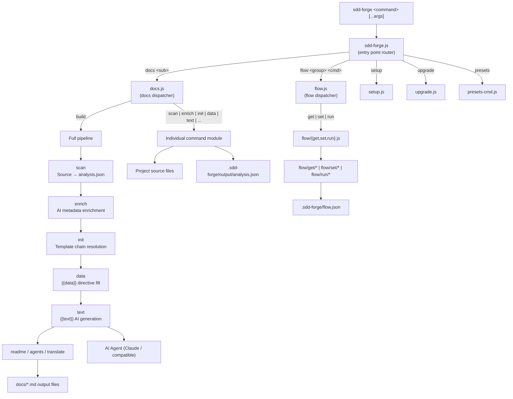

<!-- {{data("base.docs.langSwitcher", {labels: "relative"})}} -->
**English** | [日本語](ja/overview.md)
<!-- {{/data}} -->

# Tool Overview and Architecture

## Description

<!-- {{text({prompt: "Write a 1-2 sentence overview of this chapter. Include the tool's purpose, the problem it solves, and its primary use cases."})}} -->

This chapter introduces sdd-forge — a CLI tool for automated documentation generation driven by source code analysis — and describes its architecture, core concepts, and typical usage flow.
<!-- {{/text}} -->

## Content

### Purpose

<!-- {{text({prompt: "Describe the problem this CLI tool solves and its target users. Derive the purpose from package.json and README."})}} -->

Maintaining up-to-date technical documentation is a persistent challenge in software projects: handwritten docs drift from the codebase, AI-generated content lacks structure, and repeated manual editing wastes developer time.

sdd-forge addresses this by analysing your source code automatically, enriching the raw scan data with AI-generated summaries, and rendering structured markdown documents through a template-and-directive system. The result is documentation that stays consistent with the code without requiring manual rewrites after every change.

The tool is designed for development teams who maintain living documentation alongside their codebase — whether that is a user guide, a developer reference, or an API specification. It is equally useful for individual developers who want to bootstrap project documentation quickly and keep it accurate over time.

Beyond document generation, sdd-forge includes a Spec-Driven Development (SDD) workflow that guides feature requests from specification through implementation, review, and final merge, all tracked in a persistent flow state.
<!-- {{/text}} -->

### Architecture Overview

<!-- {{text({prompt: "Generate a mermaid flowchart showing the tool's overall architecture. Include the dispatch structure from entry point to subcommands and the main processing flow (input → processing → output). Output only the mermaid code block.", mode: "deep"})}} -->


<!-- {{/text}} -->

### Key Concepts

<!-- {{text({prompt: "Explain the key concepts and terminology needed to understand this tool in table format. Extract the main concepts from source code."})}} -->

| Concept | Description |
|---|---|
| **Preset** | A self-contained template bundle for a specific framework or stack (e.g., `nextjs`, `laravel`, `node-cli`). Each preset contains scan patterns, DataSource classes, and chapter templates. Presets form a single-parent inheritance chain (e.g., `base → webapp → js-webapp → nextjs`). |
| **Directive** | Template syntax embedded in markdown files. `{{data(...)}}` is replaced with structured table output from a DataSource; `{{text(...)}}` is replaced with AI-generated prose. Content inside directive blocks is overwritten on each build; content outside is preserved. |
| **DataSource** | A class that reads `analysis.json` and exposes formatter methods (e.g., `list()`, `tables()`) called by `{{data}}` directives to produce markdown tables. |
| **Chapter** | A single markdown file representing one section of the generated documentation (e.g., `overview.md`, `stack_and_ops.md`). Chapter order is defined in `preset.json` and can be overridden per project in `config.json`. |
| **Analysis / AnalysisEntry** | The structured JSON output of `docs scan`. It captures classes, methods, files, schemas, and other entities extracted from source code. Each entry can be further annotated by the `enrich` step with AI-generated summaries and chapter classifications. |
| **Enrich** | An AI-powered pipeline step that reads the raw analysis and adds role descriptions, summaries, and chapter assignments to each entry, giving the `text` step richer context to work from. |
| **Flow / flow.json** | The persistent state file for an active Spec-Driven Development workflow. It tracks the current step, branch, worktree, requirements, issues, and notes across the plan → gate → impl → finalize → sync lifecycle. |
| **Spec** | A YAML document generated at the start of an SDD flow. It records the feature request, test plan, implementation notes, and step statuses, serving as the single source of truth for a development task. |
| **Config (.sdd-forge/config.json)** | The project-level configuration file created by `sdd-forge setup`. It specifies the preset type, output languages, AI agent settings, and optional style guidance (purpose, tone). |
<!-- {{/text}} -->

### Typical Usage Flow

<!-- {{text({prompt: "Describe the typical steps from installation to first output in step format. Derive the steps from help output and command definitions in the source code."})}} -->

**1. Install the package**

```bash
npm install -g sdd-forge
```

**2. Run the interactive setup wizard in your project root**

```bash
sdd-forge setup
```

The wizard prompts you to choose a preset type (e.g., `nextjs`, `laravel`, `node-cli`), set the documentation language, configure an AI agent, and select a documentation purpose and tone. It writes `.sdd-forge/config.json` and deploys the skill templates.

**3. Scan your source code**

```bash
sdd-forge docs scan
```

This analyses your project files and writes structured data to `.sdd-forge/output/analysis.json`.

**4. Enrich the scan data with AI**

```bash
sdd-forge docs enrich
```

The AI agent reads the raw analysis and annotates each entry with summaries and chapter classifications.

**5. Initialise documentation templates**

```bash
sdd-forge docs init
```

This resolves the preset inheritance chain and writes the chapter template files into `docs/`.

**6. Fill directives and generate output**

```bash
sdd-forge docs data
sdd-forge docs text
```

`docs data` replaces all `{{data}}` directives with structured tables. `docs text` calls the AI agent to replace all `{{text}}` directives with generated prose.

**7. (Optional) Run the full pipeline in one command**

```bash
sdd-forge docs build
```

This executes all of the above steps in sequence, producing the complete documentation set in `docs/`.
<!-- {{/text}} -->

---

<!-- {{data("base.docs.nav")}} -->
[Technology Stack and Operations →](stack_and_ops.md)
<!-- {{/data}} -->
