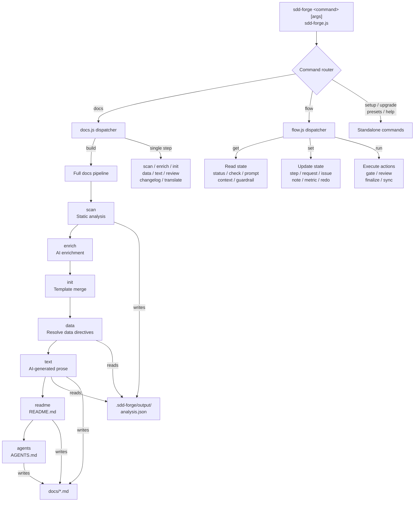

<!-- {{data("base.docs.langSwitcher", {labels: "relative"})}} -->
**English** | [日本語](ja/overview.md)
<!-- {{/data}} -->

# Tool Overview and Architecture

## Description

<!-- {{text({prompt: "Write a 1-2 sentence overview of this chapter. Include the tool's purpose, the problem it solves, and its primary use cases."})}} -->

This chapter introduces sdd-forge, a Node.js CLI tool that automates project documentation by combining static source code analysis with AI-generated prose, while also providing a structured Spec-Driven Development (SDD) workflow that guides teams from initial specification through implementation, review, and merge.
<!-- {{/text}} -->

## Content

### Purpose

<!-- {{text({prompt: "Describe the problem this CLI tool solves and its target users. Derive the purpose from package.json and README."})}} -->

Documentation that drifts out of sync with the codebase is a persistent problem in software projects — it erodes team knowledge, slows onboarding, and grows harder to maintain with every refactor. sdd-forge addresses this by performing static analysis on a project's source files to produce a structured `analysis.json` snapshot, then using an AI agent to enrich that data with summaries, chapter classifications, and role assignments. The enriched analysis drives template-based generation of a `docs/` directory, where `{{data}}` directives are filled with deterministic structured output and `{{text}}` directives are filled with AI-written prose.

Beyond documentation, the tool provides a Spec-Driven Development workflow aimed at development teams who want a reproducible, auditable path from feature request to merged code. The SDD flow manages a persistent state file (`flow.json`) that tracks progress across planning, implementation, and post-merge sync phases. Primary users are individual developers and small teams working on Node.js, PHP, or edge-computing projects who want both living documentation and a disciplined development process without introducing external dependencies into their toolchain.
<!-- {{/text}} -->

### Architecture Overview

<!-- {{text({prompt: "Generate a mermaid flowchart showing the tool's overall architecture. Include the dispatch structure from entry point to subcommands and the main processing flow (input → processing → output). Output only the mermaid code block.", mode: "deep"})}} -->


<!-- {{/text}} -->

### Key Concepts

<!-- {{text({prompt: "Explain the key concepts and terminology needed to understand this tool in table format. Extract the main concepts from source code."})}} -->

| Term | Description |
|------|-------------|
| **Preset** | A named configuration bundle (e.g., `hono`, `laravel`, `node-cli`) that packages scan rules, DataSource classes, and chapter templates for a specific framework or project type. Presets form a single-inheritance chain rooted at `base`. |
| **`analysis.json`** | The JSON file written to `.sdd-forge/output/` by `docs scan`. It contains structured entries for each analyzed source file, including extracted symbols, file metadata, and — after enrichment — AI-assigned `summary`, `detail`, `chapter`, `role`, and `keywords` fields. |
| **`{{data}}` directive** | A template placeholder replaced with structured data derived from `analysis.json` via a DataSource method call. Output is deterministic and requires no AI invocation. |
| **`{{text}}` directive** | A template placeholder replaced with AI-generated prose. The directive carries a `prompt` string and an optional `mode` parameter that controls how much source context is provided to the AI. |
| **DataSource** | A JavaScript class defined in a preset's `data/` directory. Its methods are called by `{{data}}` directives and return tables or lists built from the analysis entries. |
| **Enrich** | The pipeline step (`docs enrich`) in which an AI agent reads the full analysis and annotates every entry with structured metadata, enabling downstream steps to classify content into chapters automatically. |
| **SDD Flow** | The Spec-Driven Development workflow tracked in `.sdd-forge/flow.json`. It advances through four phases — plan, implement, finalize, sync — with per-step statuses of `pending`, `in_progress`, `done`, or `skipped`. |
| **Spec** | A structured markdown document produced during the `plan` phase, capturing the request, approach, requirements, and test plan before any implementation begins. |
| **`docs/`** | The output directory holding all chapter markdown files. Content inside `{{data}}` and `{{text}}` blocks is overwritten on each build; content written outside those blocks is preserved. |
| **Agent** | An AI provider (currently Claude) used for enrichment, text generation, and flow actions. Configured in `.sdd-forge/config.json` under the `agent` key. |
<!-- {{/text}} -->

### Typical Usage Flow

<!-- {{text({prompt: "Describe the typical steps from installation to first output in step format. Derive the steps from help output and command definitions in the source code."})}} -->

**Step 1 — Install the package globally**

```
npm install -g sdd-forge
```

**Step 2 — Register your project**

From your project root, run `sdd-forge setup`. The interactive wizard asks for the project type (preset), documentation language, and AI agent configuration, then writes `.sdd-forge/config.json`.

**Step 3 — Run a full documentation build**

Execute `sdd-forge docs build` to run the complete pipeline in sequence:

1. `scan` — Parses source files and writes `.sdd-forge/output/analysis.json`
2. `enrich` — AI agent annotates each analysis entry with summary, role, and chapter
3. `init` — Merges preset templates into the `docs/` directory
4. `data` — Resolves all `{{data}}` directives using DataSource methods
5. `text` — Resolves all `{{text}}` directives with AI-generated prose
6. `readme` — Generates or updates `README.md` from the docs content
7. `agents` — Generates `AGENTS.md` for AI agent context

**Step 4 — Review the output**

Open the `docs/` directory. Each chapter file contains both auto-generated blocks (inside `{{data}}` and `{{text}}` delimiters) and any manually authored content written outside those blocks, which is preserved across rebuilds.

**Step 5 — Keep documentation current**

Re-run `sdd-forge docs build` after significant code changes. For faster incremental updates, run `sdd-forge docs scan` followed only by the affected downstream steps.

**Step 6 — (Optional) Use the SDD workflow**

For feature development, use `sdd-forge flow` commands to manage a spec-driven cycle. Run `sdd-forge flow get status` at any time to see the current phase and step progress.
<!-- {{/text}} -->

---

<!-- {{data("base.docs.nav")}} -->
[Technology Stack and Operations →](stack_and_ops.md)
<!-- {{/data}} -->
