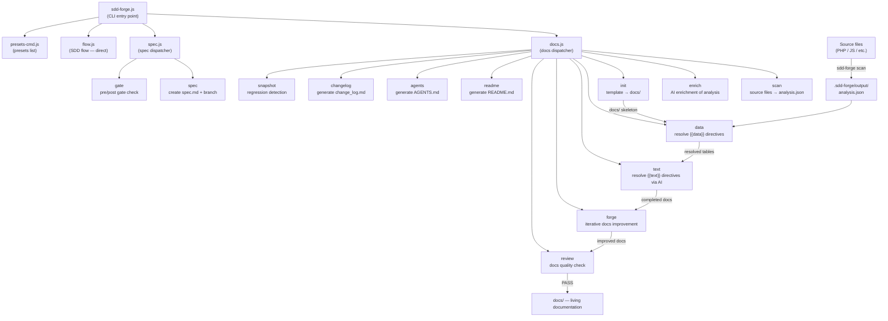

# 01. Tool Overview and Architecture

## Description

<!-- {{text: Write a 1-2 sentence overview of this chapter. Include the tool's purpose, the problem it solves, and its primary use cases.}} -->

This chapter introduces `sdd-forge`, a CLI tool that automates documentation generation from source code analysis and provides a Spec-Driven Development (SDD) workflow. It covers the tool's core purpose, three-layer dispatch architecture, fundamental concepts, and the typical steps to get from installation to working documentation.
<!-- {{/text}} -->

## Content

### Purpose

<!-- {{text: Describe the problem this CLI tool solves and its target users. Derive the purpose from package.json and README.}} -->

Software projects frequently suffer from documentation that drifts out of sync with the codebase — written once and quickly forgotten as the code evolves. `sdd-forge` addresses this by generating structured documentation directly from static analysis of source files, ensuring that docs remain grounded in the actual implementation rather than in memory or guesswork.

The tool is aimed at developers and teams who maintain non-trivial codebases — particularly PHP web applications built on frameworks such as CakePHP, Laravel, or Symfony — where keeping architecture documentation up to date would otherwise require significant manual effort. By scanning controllers, models, entities, migrations, and other source artifacts, `sdd-forge` produces accurate Markdown documentation without requiring developers to describe what already exists in code.

Beyond documentation generation, `sdd-forge` enforces a Spec-Driven Development discipline: every new feature or fix begins with a machine-checkable specification that must pass a gate check before implementation starts. This creates a traceable path from requirement to merged code, reducing ambiguity and unplanned scope changes.
<!-- {{/text}} -->

### Architecture Overview

<!-- {{text[mode=deep]: Generate a mermaid flowchart showing the tool's overall architecture. Include the dispatch structure from entry point to subcommands and the main processing flow (input → processing → output). Output only the mermaid code block.}} -->


<!-- {{/text}} -->

### Key Concepts

<!-- {{text: Explain the key concepts and terminology needed to understand this tool in table format. Extract the main concepts from source code.}} -->

| Concept | Description |
|---|---|
| `analysis.json` | The central artifact produced by `sdd-forge scan`. Contains structured data extracted from source files — classes, methods, relations, columns, and file metadata — consumed by all downstream commands. |
| `{{data}}` directive | A template placeholder resolved by `sdd-forge data`. It calls a named DataSource method (e.g. `controllers.list(...)`) and replaces the directive block with a generated Markdown table derived from `analysis.json`. |
| `{{text}}` directive | A template placeholder resolved by `sdd-forge text`. An AI agent reads the surrounding context and the analysis data, then fills the block with descriptive prose. The directive frame is preserved across regenerations; only the body content is replaced. |
| DataSource | A class that pairs a `scan()` method — which extracts structured data from source files — with resolve methods that format that data as Markdown output. Each preset supplies DataSources tailored to its framework's conventions. |
| Preset | A self-contained bundle consisting of DataSources, document chapter templates, and a `preset.json` manifest targeting a specific framework or project type (e.g. `node-cli`, `symfony`, `cakephp2`). Presets are discovered automatically at runtime. |
| `docs/` | The generated documentation directory. Its chapter structure is defined by the preset's `chapters` array and populated through the `data` and `text` resolution passes. |
| `spec.md` | A structured specification file created by `sdd-forge spec --title`. It drives the SDD workflow and is validated by `sdd-forge gate` both before implementation begins and after it is complete. |
| Gate check | A validation step (`sdd-forge gate`) that confirms the specification is complete, all open questions are resolved, and — in post-implementation mode — that the actual changes align with the stated requirements. Implementation is blocked until the pre-gate passes. |
| Forge | The iterative documentation improvement loop (`sdd-forge forge`). An AI agent compares the current `docs/` content against the source and rewrites sections to improve accuracy, completeness, and consistency. |
| SDD flow | The end-to-end Spec-Driven Development process enforced by this tool: `spec → gate → implement → forge → review`. Supported by the `/sdd-flow-start` and `/sdd-flow-close` skills for guided execution. |
<!-- {{/text}} -->

### Typical Usage Flow

<!-- {{text: Describe the typical steps from installation to first output in step format. Derive the steps from help output and command definitions in the source code.}} -->

**Step 1 — Install the package**

```bash
npm install -g sdd-forge
```

**Step 2 — Register your project**

Run `sdd-forge setup` from the project root. This creates `.sdd-forge/config.json`, selects the appropriate preset for your framework, and generates the initial `AGENTS.md` that provides project context to AI agents.

**Step 3 — Run the full build pipeline**

```bash
sdd-forge build
```

This executes the complete pipeline in sequence — `scan → enrich → init → data → text → readme → agents` — and produces a fully populated `docs/` directory on the first run.

**Step 4 — Review the generated documentation**

Open the `docs/` directory and inspect the generated Markdown chapters. Run `sdd-forge review` to perform an automated quality check and identify any sections that need improvement.

**Step 5 — Refine with forge**

```bash
sdd-forge forge --prompt "Improve the database schema overview"
```

Use `sdd-forge forge` to iteratively improve specific sections, then re-run `sdd-forge review` until all checks pass.

**Step 6 — Start new features with the SDD workflow**

```bash
sdd-forge spec --title "add-export-command"
sdd-forge gate --spec specs/NNN-add-export-command/spec.md
```

Create a specification before writing any code, pass the pre-gate check, implement the feature, then close the cycle with `sdd-forge forge` and `sdd-forge review` to keep the documentation current.
<!-- {{/text}} -->
