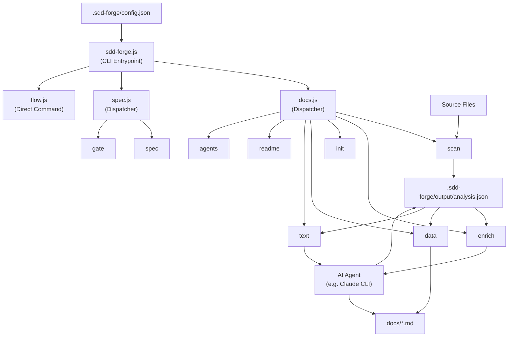

# 01. System Overview

## Description

<!-- {{text: Write a 1-2 sentence overview of this chapter. Include the project's architecture and whether it integrates with external systems.}} -->

This chapter provides a high-level overview of sdd-forge, a Node.js CLI tool that automates documentation generation through Spec-Driven Development. It describes the three-layer command dispatch architecture, the AI-assisted build pipeline, and the external AI agent integration used to enrich source analysis and generate structured project documentation.
<!-- {{/text}} -->

## Content

### Architecture Diagram

<!-- {{text: Generate a mermaid flowchart showing the project architecture. Include data flows between major components. Output only the mermaid code block.}} -->

<!-- {{/text}} -->

### Component Responsibilities

<!-- {{text[mode=deep]: Describe the major components with their location, responsibilities, and I/O in table format.}} -->

| Component | Location | Responsibilities | Input | Output |
|---|---|---|---|---|
| CLI Entrypoint | `src/sdd-forge.js` | Top-level subcommand routing; resolves project context via `--project` flag or `projects.json`; sets `SDD_SOURCE_ROOT` / `SDD_WORK_ROOT` env vars | CLI arguments, `.sdd-forge/projects.json` | Delegates to docs.js, spec.js, flow.js, or help.js |
| docs Dispatcher | `src/docs.js` | Routes all documentation-related subcommands (`build`, `scan`, `enrich`, `init`, `data`, `text`, `readme`, `forge`, `review`, `changelog`, `agents`, `snapshot`, etc.) | Subcommand name + args | Delegates to `src/docs/commands/*.js` |
| spec Dispatcher | `src/spec.js` | Routes `spec` and `gate` subcommands | Subcommand name + args | Delegates to `src/specs/commands/*.js` |
| flow | `src/flow.js` | Automates the full SDD workflow end-to-end (DIRECT_COMMAND — no sub-routing) | Flow request string, spec path | Orchestrated SDD step execution |
| scan | `src/docs/commands/scan.js` | Walks source files; extracts module/method/route/config structure using language-specific analyzers | Source files under configured scan paths | `.sdd-forge/output/analysis.json` |
| enrich | `src/docs/commands/enrich.js` | Batch-invokes AI to annotate each analysis entry with `summary`, `detail`, `chapter`, and `role` fields; skips already-enriched entries for resumability | `analysis.json` | Updated `analysis.json` with enrichment fields |
| init | `src/docs/commands/init.js` | Initialises `docs/` from preset templates, applying `@extends` / `@block` template inheritance | Preset templates, `config.json` | Scaffold `docs/*.md` files with directives |
| data | `src/docs/commands/data.js` | Resolves `{{data}}` directives by querying DataSource classes loaded from the active preset | `analysis.json`, doc files with `{{data}}` directives | Updated `docs/*.md` with resolved tables and lists |
| text | `src/docs/commands/text.js` | Resolves `{{text}}` directives by invoking the configured AI agent with source-aware prompts | Doc files with `{{text}}` directives, `analysis.json`, source files | Updated `docs/*.md` with AI-generated prose |
| forge | `src/docs/commands/forge.js` | Iteratively improves existing `docs/*.md` content by re-running AI generation over changed sections | `docs/*.md`, `analysis.json`, change prompt | Refined `docs/*.md` |
| review | `src/docs/commands/review.js` | Checks documentation quality against a checklist; parses AI output into a structured PASS/FAIL report | `docs/*.md`, review checklist template | Review result (pass/fail per criterion) |
| gate | `src/specs/commands/gate.js` | Validates a spec file for completeness before (pre) or after (post) implementation | `specs/NNN-xxx/spec.md` | Gate PASS/FAIL report with unresolved items |
| agent | `src/lib/agent.js` | Wraps AI CLI subprocess invocation synchronously (`execFileSync`) or asynchronously (`spawn`); injects prompts via `{{PROMPT}}` placeholder | Prompt string, agent config from `config.json` | AI-generated text string |
| config | `src/lib/config.js` | Loads and validates `.sdd-forge/config.json`; provides path helpers for all `.sdd-forge/` resources | `.sdd-forge/config.json`, `.sdd-forge/context.json` | Validated config object, resolved file paths |
| presets | `src/lib/presets.js` | Auto-discovers `preset.json` files under `src/presets/`; exposes `PRESETS` constant and lookup helpers | `src/presets/**/preset.json` | Preset registry used by init, data, and scan |
| flow-state | `src/lib/flow-state.js` | Persists SDD workflow progress (current spec path, branch names, worktree state) to `.sdd-forge/current-spec` | JSON state object | `.sdd-forge/current-spec` file |
<!-- {{/text}} -->

### External Integrations

<!-- {{text: If there are external system integrations, describe their purpose and connection method in table format.}} -->

sdd-forge has no runtime dependencies on external services or networks beyond the local filesystem. The sole external integration point is an AI agent CLI (typically Claude CLI), which is invoked as a subprocess by several commands.

| Integration | Commands That Use It | Purpose | Connection Method |
|---|---|---|---|
| AI Agent CLI (e.g., Claude CLI) | `enrich`, `text`, `forge`, `review`, `agents` | Generates and refines documentation prose; annotates analysis entries with semantic metadata | Spawned as a child process via `child_process.spawn` (async) or `execFileSync` (sync); prompt text injected via `{{PROMPT}}` placeholder in the configured `args` array |

The agent binary, its arguments, and timeout values are fully defined in `.sdd-forge/config.json` under the `providers` and `defaultAgent` fields, making the integration agent-agnostic at the tool level.
<!-- {{/text}} -->

### Environment Differences

<!-- {{text: Describe the configuration differences across environments (local/staging/production).}} -->

sdd-forge is a developer CLI tool and does not follow a traditional local/staging/production deployment model. Configuration differences are managed per-project through `.sdd-forge/config.json` and environment variables.

| Aspect | Interactive Developer Use | CI / Automated Pipelines |
|---|---|---|
| Project resolution | `--project <name>` flag or `default` entry in `projects.json` | `SDD_SOURCE_ROOT` and `SDD_WORK_ROOT` environment variables |
| AI agent | Configured agent CLI must be installed and authenticated on the local machine | Same requirement; the CI environment must have the agent CLI available in `PATH` |
| Timeouts | Default values apply: 120 s (standard), 180 s (mid), 300 s (long) | Can be extended via `limits.designTimeoutMs` in `config.json` for slower CI runners |
| Output language | Controlled by `output.languages` and `output.default` in `config.json` | No difference; same config file is used |
| Concurrency | Defaults to 5 parallel file operations (`limits.concurrency`) | Can be tuned down in resource-constrained environments |
| Worktree mode | Supported interactively via `sdd-forge spec` or `EnterWorktree` | Supported; worktree path tracked in `.sdd-forge/current-spec` |
<!-- {{/text}} -->
