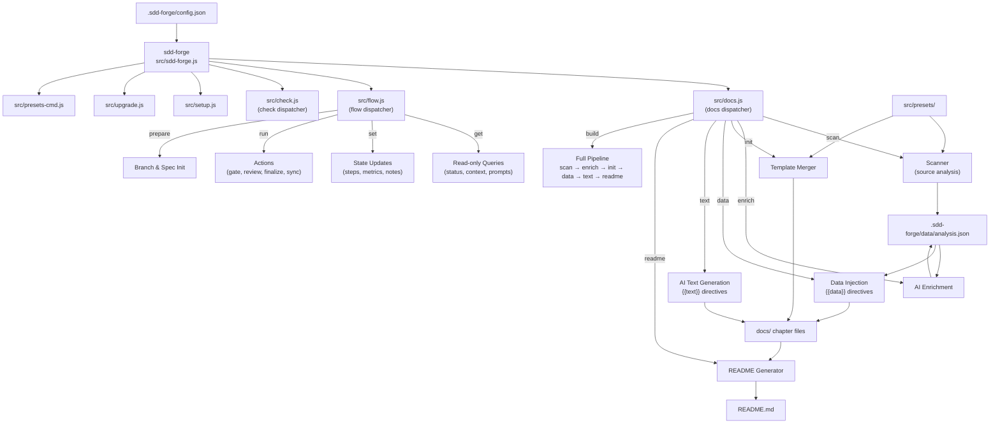
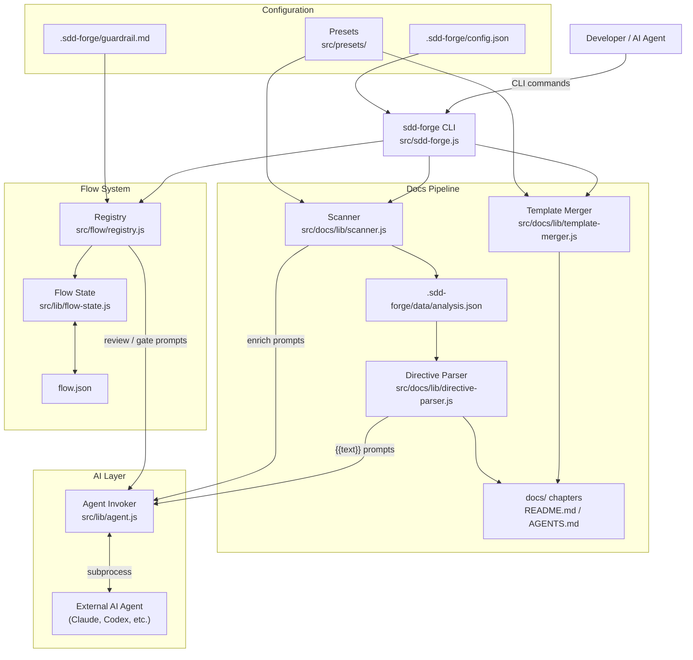

<!-- {{data("base.docs.langSwitcher", {labels: "relative"})}} -->
[日本語](ja/overview.md) | **English**
<!-- {{/data}} -->

# Tool Overview and Architecture

## Description

<!-- {{text({prompt: "Write a 1-2 sentence overview of this chapter. Include the tool's purpose, the problem it solves, and its primary use cases."})}} -->

This chapter covers sdd-forge, a CLI tool that automates project documentation by analysing source code and manages a Spec-Driven Development workflow for teams working with AI coding agents. It explains the tool's purpose, architectural dispatch structure, core concepts, and the typical steps to produce your first generated documentation.
<!-- {{/text}} -->

## Content

### Purpose

<!-- {{text({prompt: "Describe the problem this CLI tool solves and its target users. Derive the purpose from package.json and README."})}} -->

Software teams using AI coding agents face two recurring problems: documentation that drifts out of sync with the codebase, and development cycles that lack a structured spec-first discipline. sdd-forge solves both by combining static code analysis with AI-assisted documentation generation and a three-phase workflow (plan → implement → finalize) that keeps agents within defined architectural boundaries.

The primary users are developers and engineering teams who want their `docs/` directory and `README.md` generated and updated automatically from source code, and who want their AI coding agents to follow a reproducible, guardrail-enforced development process. The tool requires no external npm dependencies and runs on Node.js 18 or later.
<!-- {{/text}} -->

### Architecture Overview

<!-- {{text({prompt: "Generate a mermaid flowchart showing the tool's overall architecture. Include the dispatch structure from entry point to subcommands and the main processing flow (input → processing → output). Output only the mermaid code block.", mode: "deep"})}} -->


<!-- {{/text}} -->

### Key Concepts

<!-- {{text({prompt: "Explain the key concepts and terminology needed to understand this tool in table format. Extract the main concepts from source code."})}} -->

| Term | Description |
|---|---|
| **Preset** | A named package under `src/presets/` containing scan settings, DataSources, and templates for a specific framework (e.g., `hono`, `nextjs`, `laravel`). Presets inherit from a parent via a `parent` field, forming an inheritance chain. |
| **DataSource** | A module paired with each scan category that reads `analysis.json` and renders structured markdown content (tables, lists) for insertion via `{{data}}` directives. |
| **Directive** | A template marker — `{{data(...)}}` or `{{text(...)}}` — embedded in docs files. Content between directive tags is automatically overwritten on each pipeline run. |
| **SDD Flow** | A three-phase development workflow (plan → implement → finalize) enforced by `flow` subcommands, providing spec validation, guardrail checks, and context-preserving state across sessions. |
| **analysis.json** | The structured output of `docs scan`, stored at `.sdd-forge/data/analysis.json`. Contains parsed data about source files, classes, methods, dependencies, and configuration. |
| **Template** | A Markdown document using `` and `` syntax to compose chapter files. Templates are resolved through the preset inheritance chain during `docs init`. |
| **Guardrail** | Design principles stored in `.sdd-forge/guardrail.md` that are validated during `flow run gate` to prevent implementation from deviating from the agreed architecture. |
| **flow.json** | A per-task state file created by `flow prepare` that tracks the active spec, step statuses, linked requirements, metrics, and notes for a single development task. |
| **Language Handler** | A parser module in `src/docs/lib/lang/` that processes a specific source language (JavaScript, PHP, Python, YAML) to extract classes, methods, imports, and exports for the scanner. |
<!-- {{/text}} -->

### Typical Usage Flow

<!-- {{text({prompt: "Describe the typical steps from installation to first output in step format. Derive the steps from help output and command definitions in the source code."})}} -->

**Step 1 — Install the package globally**

```
npm install -g sdd-forge
```

**Step 2 — Run the setup wizard in your project directory**

```
cd /your/project
sdd-forge setup
```

The interactive wizard prompts for project name, framework type (preset such as `node-cli`, `hono`, or `nextjs`), default language, and AI agent. It writes `.sdd-forge/config.json` on completion.

**Step 3 — Generate documentation**

```
sdd-forge docs build
```

This runs the full pipeline: `scan → enrich → init → data → text → readme`. Source files are analysed, templates are merged from the selected preset, `{{data}}` directives are filled with analysis tables, `{{text}}` directives are filled with AI-generated prose, and `README.md` is written.

**Step 4 — Review the output**

The `docs/` directory now contains structured chapter files and `README.md` is updated. Use `sdd-forge check freshness` to verify the docs are current with the source at any time.

**Step 5 — Begin a development task with the SDD flow (optional)**

```
sdd-forge flow prepare
```

This creates a branch or worktree and initialises `flow.json` to track the task through plan, implement, and finalize phases with spec validation and guardrail checks.
<!-- {{/text}} -->

# System Overview

<!-- {{data("monorepo.monorepo.apps", {labels: "overview", ignoreError: true})}} -->
<!-- {{/data}} -->

<!-- {{text({prompt: "Write a 1-2 sentence overview of this project."})}} -->

sdd-forge is a Node.js CLI tool that automates documentation generation through static code analysis and provides a Spec-Driven Development workflow for teams using AI coding agents. It requires no external npm dependencies and runs on Node.js 18 or later.
<!-- {{/text}} -->


## Description

<!-- {{text({prompt: "Write a 1-2 sentence overview of this chapter. Include the project's architecture and whether it integrates with external systems."})}} -->

This chapter describes the internal component structure of sdd-forge, the data flow between its major subsystems, and its integration with external AI agents. It covers the architectural layout of the scanner, template engine, docs pipeline, and flow manager, along with the optional GitHub integration used during the finalize phase.
<!-- {{/text}} -->

## Content
### Architecture Diagram

<!-- {{text({prompt: "Generate a mermaid flowchart showing the project architecture. Include data flows between major components. Output only the mermaid code block."})}} -->


<!-- {{/text}} -->
### Component Responsibilities

<!-- {{text({prompt: "Describe the major components with their location, responsibilities, and I/O in table format.", mode: "deep"})}} -->

| Component | Location | Responsibilities | Input | Output |
|---|---|---|---|---|
| CLI Dispatcher | `src/sdd-forge.js` | Parses top-level arguments; routes to namespace dispatchers or standalone commands; initialises logger and config | CLI arguments, environment variables | Delegates to subcommand handlers |
| Docs Dispatcher | `src/docs.js` | Routes `docs` subcommands to individual pipeline step modules | CLI arguments | Delegates to `src/docs/commands/` |
| Flow Dispatcher | `src/flow.js` | Routes `flow` subcommands (get / set / run / prepare) using registry metadata and hooks | CLI arguments | Delegates to `src/flow/lib/` |
| Scanner | `src/docs/lib/scanner.js` | Collects source files via preset include/exclude patterns; invokes language handlers to parse each file | Source file tree, preset scan config | `analysis.json` |
| Template Merger | `src/docs/lib/template-merger.js` | Resolves preset inheritance chain; merges templates via `` and `` directives | Preset template files | Merged `docs/` chapter files |
| Directive Parser | `src/docs/lib/directive-parser.js` | Finds and executes `{{data(...)}}` and `{{text(...)}}` directives in docs files | `docs/` files, `analysis.json` | Updated docs files with injected content |
| DataSources | `src/presets/*/data/` | Read analysis categories and render structured markdown tables for `{{data}}` directives | `analysis.json` entries | Markdown tables |
| Agent Invoker | `src/lib/agent.js` | Invokes the configured AI agent CLI with prompts; normalises response formats across providers | Prompt text, config | Generated text or parsed JSON |
| Flow State | `src/lib/flow-state.js` | Reads and writes `flow.json`; tracks steps, requirements, and metrics | `flow.json` | Updated flow state; JSON envelopes for agent consumption |
| Flow Registry | `src/flow/registry.js` | Single source of truth for all flow command definitions including args, help text, and step hooks | — | Command metadata consumed by the flow dispatcher |
| Preset Resolver | `src/lib/presets.js` | Discovers available presets and resolves the full inheritance chain from the configured `type` | Config `type` field | Ordered array of resolved preset objects |
| Config | `src/lib/config.js` | Reads, validates, and writes `.sdd-forge/config.json` | File system | Config object available to all commands |
<!-- {{/text}} -->
### External Integrations

<!-- {{text({prompt: "If there are external system integrations, describe their purpose and connection method in table format."})}} -->

| Integration | Purpose | Connection Method |
|---|---|---|
| **AI Agent — Claude** | Generates documentation prose for `{{text}}` directives, enriches `analysis.json` with file summaries during `docs enrich`, and performs spec and code review during `flow run gate` and `flow run review` | Invoked as a subprocess via `src/lib/agent.js`; provider settings are read from `config.agent.providers.claude` in `.sdd-forge/config.json` |
| **AI Agent — Codex / other** | Alternative AI provider for the same documentation generation and flow review tasks | Configured via `config.agent.default` and `config.agent.providers`; `agent.js` normalises response formats across providers |
| **GitHub (`gh` CLI)** | Fetches issue content for `flow get issue`; used in `flow run finalize` for pull request creation and branch merge | Accessed through the `gh` CLI tool installed on the system PATH; enabled only when `config.commands.gh` is set to `enable` and `gh` is available |
<!-- {{/text}} -->
### Environment Differences

<!-- {{text({prompt: "Describe the configuration differences across environments (local/staging/production)."})}} -->

sdd-forge does not define separate local, staging, or production environment tiers. All runtime behaviour is controlled by a single `.sdd-forge/config.json` file per project, and there are no built-in environment-specific configuration files.

The values most likely to differ between developer machines or execution contexts are:

- **`agent.default` and `agent.providers`** — specifies which AI agent CLI (`claude`, `codex`, etc.) is installed and available in the local environment.
- **`SDD_SOURCE_ROOT` / `SDD_WORK_ROOT`** — environment variables that override the default source root and work directory paths; useful in CI pipelines or non-standard directory layouts.
- **`commands.gh`** — set to `enable` only when the `gh` CLI is installed; controls whether GitHub integration is active during the finalize flow.
- **`concurrency`** — controls the number of files processed in parallel during scanning; may be reduced on memory-constrained machines.

No staging or production mode exists in the tool itself; it operates entirely on the local file system and delegates AI tasks to locally installed agent CLI tools.
<!-- {{/text}} -->

---

<!-- {{data("base.docs.nav")}} -->
[Technology Stack and Operations →](stack_and_ops.md)
<!-- {{/data}} -->
