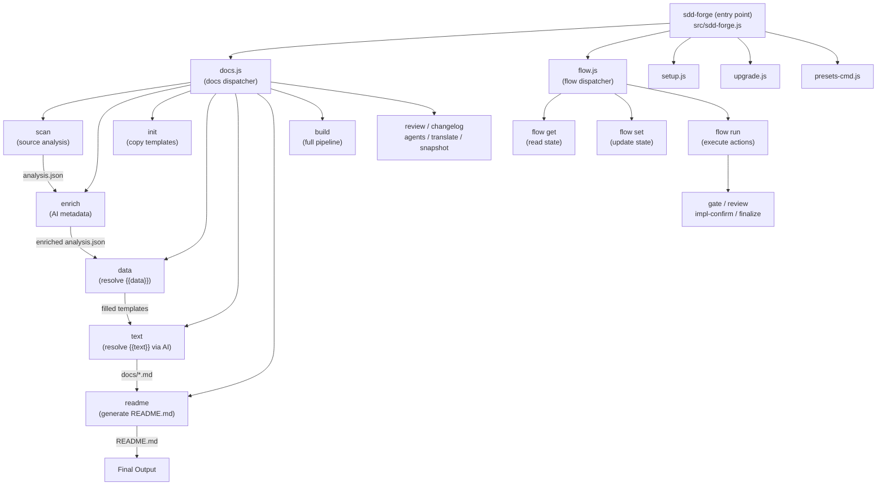

<!-- {{data("base.docs.langSwitcher", {labels: "relative"})}} -->
**English** | [日本語](ja/overview.md)
<!-- {{/data}} -->

# Tool Overview and Architecture

## Description

<!-- {{text({prompt: "Write a 1-2 sentence overview of this chapter. Include the tool's purpose, the problem it solves, and its primary use cases."})}} -->

This chapter introduces sdd-forge — a zero-dependency Node.js CLI that automates documentation generation through source code analysis and AI-assisted content rendering, while enforcing a structured Spec-Driven Development (SDD) workflow for teams building software with AI coding agents.
<!-- {{/text}} -->

## Content

### Purpose

<!-- {{text({prompt: "Describe the problem this CLI tool solves and its target users. Derive the purpose from package.json and README."})}} -->

Software teams working with AI coding agents face a recurring problem: documentation drifts from the codebase, specification discipline breaks down mid-feature, and the feedback loop between human intent and machine execution becomes fragile. sdd-forge addresses this by combining two tightly integrated capabilities.

First, it performs static analysis of a project's source code and feeds the results into Markdown templates that contain `{{data}}` and `{{text}}` directives. `{{data}}` directives are resolved immediately from the analysis output; `{{text}}` directives are resolved by an AI agent that generates accurate, grounded prose from the extracted data. This keeps documentation synchronized with the actual code structure without manual effort.

Second, it enforces a three-phase Spec-Driven Development flow — **plan → implement → merge** — that gates AI coding activity behind a confirmed specification. The spec captures the request, scope, clarifications, and test design before any code is written, and the merge phase automatically syncs documentation and validates implementation completeness before the branch is closed.

The primary target users are developers and AI coding agents (such as Claude) working on projects that require both rigorous feature discipline and up-to-date technical documentation.
<!-- {{/text}} -->

### Architecture Overview

<!-- {{text({prompt: "Generate a mermaid flowchart showing the tool's overall architecture. Include the dispatch structure from entry point to subcommands and the main processing flow (input → processing → output). Output only the mermaid code block.", mode: "deep"})}} -->


<!-- {{/text}} -->

### Key Concepts

<!-- {{text({prompt: "Explain the key concepts and terminology needed to understand this tool in table format. Extract the main concepts from source code."})}} -->

| Concept | Description |
|---|---|
| **Preset** | A project framework profile (e.g., `laravel`, `node-cli`, `nextjs`) defined in `src/presets/<key>/preset.json`. Presets form inheritance chains (e.g., `base → webapp → node-cli`) and carry scan parsers, DataSource classes, chapter templates, and chapter ordering. |
| **Directive** | A template processing instruction embedded in a Markdown comment. `{{data("source.method")}}` fills in statically resolved tables; `{{text({prompt: "..."})}}` triggers AI content generation. Content between the opening and closing tag is replaced on each build. |
| **Chapter** | A single Markdown file within the `docs/` directory (e.g., `overview.md`, `stack_and_ops.md`). The list and order of chapters is defined in `preset.json`'s `chapters` array and can be overridden per project in `config.json`. |
| **Analysis** | Structured metadata extracted from source code by `docs scan`, stored in `.sdd-forge/output/analysis.json`. It groups entries by category (e.g., `modules`, `routes`, `classes`, `config`) and is the primary data source for `{{data}}` directives. |
| **Enrich** | An AI processing step (`docs enrich`) that reads `analysis.json` and adds `summary`, `detail`, `chapter`, and `role` fields to each entry. Enriched data is used by `{{text}}` directives to produce grounded prose. |
| **Spec** | A feature specification document (`specs/NNN-<slug>/spec.md`) created at the start of a flow. It records the goal, scope, clarifications (Q&A), confirmed user requirements, and test design. It acts as the single source of truth during implementation. |
| **Flow** | The three-phase Spec-Driven Development workflow: **plan** (spec creation and gate validation), **implement** (coding and review), and **merge** (doc sync, commit, and branch cleanup). State is tracked in `.sdd-forge/flow.json`. |
| **DataSource** | A JavaScript class inside a preset's `data/` directory that reads `analysis.json` entries and exposes them as typed, renderable objects for `{{data}}` directives. |
| **Gate** | A validation step (`flow run gate`) that checks whether the spec is complete, all required clarifications are answered, and guardrail conditions are met before implementation proceeds. |
<!-- {{/text}} -->

### Typical Usage Flow

<!-- {{text({prompt: "Describe the typical steps from installation to first output in step format. Derive the steps from help output and command definitions in the source code."})}} -->

**1. Install the package**

```bash
npm install -g sdd-forge
```

**2. Register your project**

Run the interactive setup wizard from your project root. It creates `.sdd-forge/config.json` and generates an `AGENTS.md` file used by AI coding agents.

```bash
sdd-forge setup
```

**3. Analyze your source code**

Scan the project and produce `.sdd-forge/output/analysis.json`.

```bash
sdd-forge docs scan
```

**4. Enrich the analysis with AI metadata**

This step adds summaries, roles, and chapter assignments to each analysis entry, improving the quality of generated documentation.

```bash
sdd-forge docs enrich
```

**5. Initialize documentation templates**

Copy the preset's chapter templates into `docs/` for the first time.

```bash
sdd-forge docs init
```

**6. Build the full documentation**

Resolve all `{{data}}` and `{{text}}` directives and regenerate `README.md`. This is equivalent to running scan → enrich → init → data → text → readme → agents in sequence.

```bash
sdd-forge docs build
```

After this step, `docs/` contains fully rendered Markdown chapters and `README.md` reflects the current state of your codebase. On subsequent runs, `docs build` performs incremental updates based on source changes.
<!-- {{/text}} -->

---

<!-- {{data("base.docs.nav")}} -->
[Technology Stack and Operations →](stack_and_ops.md)
<!-- {{/data}} -->
