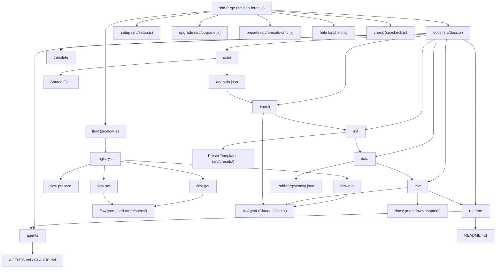
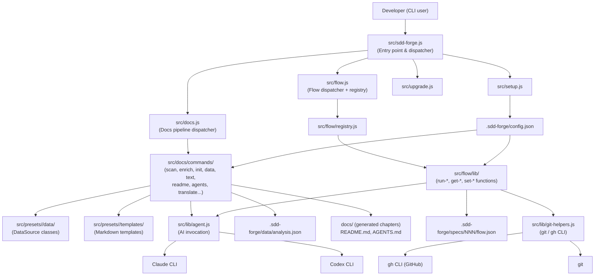

<!-- {{data("base.docs.langSwitcher", {labels: "relative"})}} -->
[日本語](ja/overview.md) | **English**
<!-- {{/data}} -->

# Tool Overview and Architecture

## Description

<!-- {{text({prompt: "Write a 1-2 sentence overview of this chapter. Include the tool's purpose, the problem it solves, and its primary use cases."})}} -->

This chapter introduces `sdd-forge`, a CLI tool that automates documentation generation through source code analysis and guides development teams through a structured Spec-Driven Development (SDD) workflow. It covers the tool's core purpose, the problem it solves for teams maintaining living documentation, and its primary use cases across documentation pipelines and feature lifecycle management.
<!-- {{/text}} -->

## Content

### Purpose

<!-- {{text({prompt: "Describe the problem this CLI tool solves and its target users. Derive the purpose from package.json and README."})}} -->

Software projects frequently suffer from documentation that drifts out of sync with the actual codebase — a problem that grows worse as teams scale and release velocity increases. `sdd-forge` addresses this by analyzing source code directly and generating structured, AI-enriched documentation automatically, removing the need for manual upkeep.

The tool targets developers and engineering teams who want documentation that reflects the true state of their codebase at any point in time. It is particularly suited for teams adopting a spec-first development culture, where every feature begins with a written specification that guides implementation and is later reconciled with generated docs.

Key use cases include:

- **Automated doc generation**: Running the full pipeline (`scan → enrich → init → data → text → readme → agents`) to produce up-to-date documentation from source code without manual editing.
- **Spec-Driven Development (SDD) workflow**: Managing a feature from specification through implementation, code review, merge, and documentation sync using the `flow` subcommands.
- **Multi-language documentation**: Generating documentation in multiple languages (e.g., English and Japanese) using either translation or independent generation modes.
- **AI-assisted enrichment**: Leveraging Claude or Codex to enrich analysis entries with summaries, generate prose sections, and conduct automated code review.
- **Framework-aware presets**: Applying one of 35+ built-in presets (Node.js CLI, Next.js, Symfony, etc.) to tailor documentation structure and analysis patterns to the specific technology stack.
<!-- {{/text}} -->

### Architecture Overview

<!-- {{text({prompt: "Generate a mermaid flowchart showing the tool's overall architecture. Include the dispatch structure from entry point to subcommands and the main processing flow (input → processing → output). Output only the mermaid code block.", mode: "deep"})}} -->


<!-- {{/text}} -->

### Key Concepts

<!-- {{text({prompt: "Explain the key concepts and terminology needed to understand this tool in table format. Extract the main concepts from source code."})}} -->

| Concept | Description |
|---|---|
| **Preset** | A named, inheritable configuration bundle (e.g., `node-cli`, `nextjs`) that packages framework-specific scan patterns, DataSource classes, and chapter templates. Presets form a single-chain inheritance tree (e.g., `base → cli → node-cli`). |
| **DataSource** | A class that extracts structured data from `analysis.json` and renders it as markdown tables or lists within `{{data}}` directives. Scannable DataSources additionally implement `match()` and `parse()` to feed the scan pipeline. |
| **Directive** | A special marker embedded in markdown templates. `{{data("source.method")}}` injects structured analysis data; `{{text({prompt: "..."})}}` triggers AI-generated prose. Content between directive tags is overwritten on each build. |
| **analysis.json** | The central data file produced by the `scan` step. It contains structured entries (modules, routes, tables, controllers, etc.) extracted from source files, plus timestamps for scan, enrich, and generation phases. |
| **Pipeline** | The ordered sequence of docs commands: `scan → enrich → init → data → text → readme → agents → [translate]`. Each step consumes outputs from the previous step and can be run individually or as a full build via `docs build`. |
| **Flow** | The SDD workflow state machine managing a feature from specification to merge. State is persisted in `specs/NNN/flow.json` and tracks phases (plan, impl, finalize, sync) and individual steps within each phase. |
| **Spec** | A feature specification document (`specs/NNN/spec.md`) created at the start of a flow. It captures requirements, design decisions, and acceptance criteria and must pass a gate check before implementation begins. |
| **Enrich** | An AI-assisted step that annotates raw analysis entries with a `summary`, `chapter` assignment, and `role` classification, improving the quality of generated documentation. |
| **Envelope** | The standard JSON response format returned by `flow` commands: `{ok: true, data: {...}}` on success or `{ok: false, error: "..."}` on failure. |
| **AGENTS.md** | An AI agent constraint guide auto-generated from project metadata and SDD rules. It is symlinked as `CLAUDE.md` so Claude Code automatically loads it as project context. |
<!-- {{/text}} -->

### Typical Usage Flow

<!-- {{text({prompt: "Describe the typical steps from installation to first output in step format. Derive the steps from help output and command definitions in the source code."})}} -->

**Step 1 — Install the package globally**

```bash
npm install -g sdd-forge
```

Requires Node.js 18 or later. No additional dependencies are needed.

**Step 2 — Run the setup wizard in your project root**

```bash
sdd-forge setup
```

The interactive wizard prompts for project name, source path, preset type (e.g., `node-cli`, `nextjs`), output languages, and AI agent provider. It creates `.sdd-forge/config.json` and deploys skills to `.claude/skills/` or `.agents/skills/`.

For non-interactive environments, pass flags directly:

```bash
sdd-forge setup --type node-cli --agent claude --lang en
```

**Step 3 — Run the full documentation pipeline**

```bash
sdd-forge docs build
```

This executes all pipeline steps in sequence: `scan → enrich → init → data → text → readme → agents`. Output is written to the `docs/` directory, and `README.md` and `AGENTS.md` are updated in the project root.

**Step 4 — Review the generated output**

Open `docs/overview.md` (or the equivalent chapter for your preset) to verify the generated content. Individual pipeline steps can be re-run in isolation if adjustments are needed:

```bash
sdd-forge docs text   # regenerate only AI-written prose
sdd-forge docs readme # regenerate only README.md
```

**Step 5 — Start a Spec-Driven Development flow (optional)**

To manage a new feature with the SDD workflow:

```bash
sdd-forge flow prepare --title "Add user authentication"
```

This creates a spec file, a feature branch, and initializes the flow state. Use `sdd-forge flow get status` to check progress at any time.
<!-- {{/text}} -->

# System Overview

<!-- {{data("monorepo.monorepo.apps", {labels: "overview", ignoreError: true})}} -->
<!-- {{/data}} -->

<!-- {{text({prompt: "Write a 1-2 sentence overview of this project."})}} -->

`sdd-forge` is a CLI tool that combines automated, analysis-driven documentation generation with a structured Spec-Driven Development workflow, enabling engineering teams to keep their documentation continuously in sync with their source code.
<!-- {{/text}} -->


## Description

<!-- {{text({prompt: "Write a 1-2 sentence overview of this chapter. Include the project's architecture and whether it integrates with external systems."})}} -->

This chapter describes the architecture of the `sdd-forge` project itself — how its source modules are organized, how data flows through the documentation pipeline, and how it integrates with external AI agents (Claude and Codex) and the GitHub CLI to deliver its full feature set.
<!-- {{/text}} -->

## Content
### Architecture Diagram

<!-- {{text({prompt: "Generate a mermaid flowchart showing the project architecture. Include data flows between major components. Output only the mermaid code block."})}} -->


<!-- {{/text}} -->
### Component Responsibilities

<!-- {{text({prompt: "Describe the major components with their location, responsibilities, and I/O in table format.", mode: "deep"})}} -->

| Component | Location | Responsibility | Input / Output |
|---|---|---|---|
| **CLI entry point** | `src/sdd-forge.js` | Parses the top-level subcommand and dispatches to the appropriate module; handles `--version` and `--help` flags | argv → dispatched call |
| **Docs dispatcher** | `src/docs.js` | Routes `docs <step>` calls to individual pipeline command modules; orchestrates `docs build` as a sequential pipeline with a progress bar | subcommand + args → pipeline result |
| **Pipeline commands** | `src/docs/commands/` | One module per pipeline step (`scan.js`, `enrich.js`, `init.js`, `data.js`, `text.js`, `readme.js`, `agents.js`, `translate.js`, etc.) | config + previous step output → updated `docs/` or `analysis.json` |
| **DataSource base** | `src/docs/lib/data-source.js` | Provides `toMarkdownTable()`, description merging, and override loading for all DataSource subclasses | analysis entries → markdown strings |
| **Scannable mixin** | `src/docs/lib/scan-source.js` | Adds `match()` and `parse()` to a DataSource so it can participate in the scan pipeline | source file path → `AnalysisEntry` |
| **Directive parser** | `src/docs/lib/directive-parser.js` | Parses `{{data}}`, `{{text}}`, and `` directives from markdown templates | template string → directive AST |
| **Template merger** | `src/docs/lib/template-merger.js` | Resolves preset inheritance chains and merges block overrides into a final template | preset chain → merged template string |
| **Flow dispatcher** | `src/flow.js` | Routes `flow <group> <cmd>` calls via the registry; runs pre/post hooks and wraps results in the envelope format | subcommand + args → JSON envelope |
| **Flow registry** | `src/flow/registry.js` | Single source of truth for all flow command definitions (args, flags, options, help text) | — → command metadata |
| **Flow logic layer** | `src/flow/lib/` | Pure functions implementing each flow action (`run-prepare-spec.js`, `run-gate.js`, `run-finalize.js`, `get-status.js`, `set-step.js`, etc.) | flow.json + config → updated state or report |
| **Agent library** | `src/lib/agent.js` | Invokes AI agents (Claude, Codex) synchronously or asynchronously; handles stdin fallback for large prompts and parses JSON/NDJSON output | prompt string → generated text + token usage |
| **Config loader** | `src/lib/config.js` | Loads and validates `.sdd-forge/config.json`; provides typed access to all settings | config.json → validated config object |
| **Git helpers** | `src/lib/git-helpers.js` | Wraps `git` and `gh` CLI calls for branch management, commit inspection, worktree operations, and GitHub issue/PR interactions | shell commands → structured results |
| **Presets loader** | `src/lib/presets.js` | Auto-discovers built-in and project-local presets; resolves the full inheritance chain for a given type | preset name → ordered chain of preset configs |
| **i18n** | `src/lib/i18n.js` | Three-layer localization (domain, command, field) for CLI output messages | locale key → translated string |
| **Setup** | `src/setup.js` | Interactive (or non-interactive) wizard that creates `config.json` and deploys skill templates | user prompts → `.sdd-forge/config.json` + skill files |
| **Upgrade** | `src/upgrade.js` | Detects changed skill templates and updates only the modified files in `.claude/skills/` or `.agents/skills/` | template diffs → updated skill files |
<!-- {{/text}} -->
### External Integrations

<!-- {{text({prompt: "If there are external system integrations, describe their purpose and connection method in table format."})}} -->

| System | Purpose | Connection Method |
|---|---|---|
| **Claude CLI** | Generates prose for `{{text}}` directives, enriches analysis entries with summaries, performs AI-assisted code review during flow steps, and answers guardrail checks | Spawned as a child process via `src/lib/agent.js`; prompt passed via `--system-prompt` flag or stdin (for large prompts > 100 KB); output read as JSON from stdout using `--output-format json` |
| **Codex CLI (OpenAI)** | Alternative AI backend for the same enrichment, prose generation, and review tasks | Spawned via `codex exec` with model flags; output parsed as NDJSON, with token usage extracted from `turn.completed` events |
| **git** | Branch creation, worktree management, commit inspection, ahead/behind checks, and diff collection during flow steps | Shell-invoked through helpers in `src/lib/git-helpers.js` |
| **GitHub CLI (`gh`)** | Creating and merging pull requests, posting comments on issues, and checking PR status during the `finalize` and `sync` flow phases | Shell-invoked through `src/lib/git-helpers.js`; availability is checked at runtime via `isGhAvailable()` and gated by the `commands.gh` config field |
<!-- {{/text}} -->
### Environment Differences

<!-- {{text({prompt: "Describe the configuration differences across environments (local/staging/production)."})}} -->

`sdd-forge` is a local CLI tool with a single configuration file (`.sdd-forge/config.json`) and no server-side component, so there are no distinct deployment environments in the traditional sense. However, configuration values do affect runtime behavior in ways that correspond to different operational contexts.

| Aspect | Local / Development | CI / Automated | Production / Team Shared |
|---|---|---|---|
| **Agent provider** | `claude/sonnet` or `codex/gpt-5.4` invoked interactively | Same providers but run non-interactively; stdin is disabled so large prompts fall back to stdin pipe automatically | Same; team members share the same `agent.default` value in committed config |
| **`commands.gh`** | Set to `"enable"` when `gh` is authenticated locally | Set to `"enable"` in CI if `gh` is available with a token; set to `"disable"` to skip PR creation steps | Should match team's CI setup |
| **`concurrency`** | Default of 5; can be raised locally for faster builds | May be tuned down to avoid API rate limits in CI pipelines | Shared default in committed config |
| **`agent.timeout`** | Can be set generously (e.g., 300 s) for interactive use | Should match CI job timeout constraints | Team-agreed value committed to config |
| **`docs.mode`** | `"translate"` uses the default-language doc as source for other languages; `"generate"` writes each language independently | Both modes work in CI; `"translate"` is faster and cheaper | Committed choice based on team's localization workflow |
| **`experimental.workflow.enable`** | Enabled per developer preference after running `sdd-forge upgrade` | Typically disabled in CI (no task board needed) | Optional; opt-in per project |
| **Logging (`logs.enabled`)** | Optional; outputs JSONL to `.tmp/logs/` for debugging | Can be enabled to capture agent prompt logs for auditing | Typically disabled to avoid log accumulation |}
<!-- {{/text}} -->

---

<!-- {{data("base.docs.nav")}} -->
[Technology Stack and Operations →](stack_and_ops.md)
<!-- {{/data}} -->
