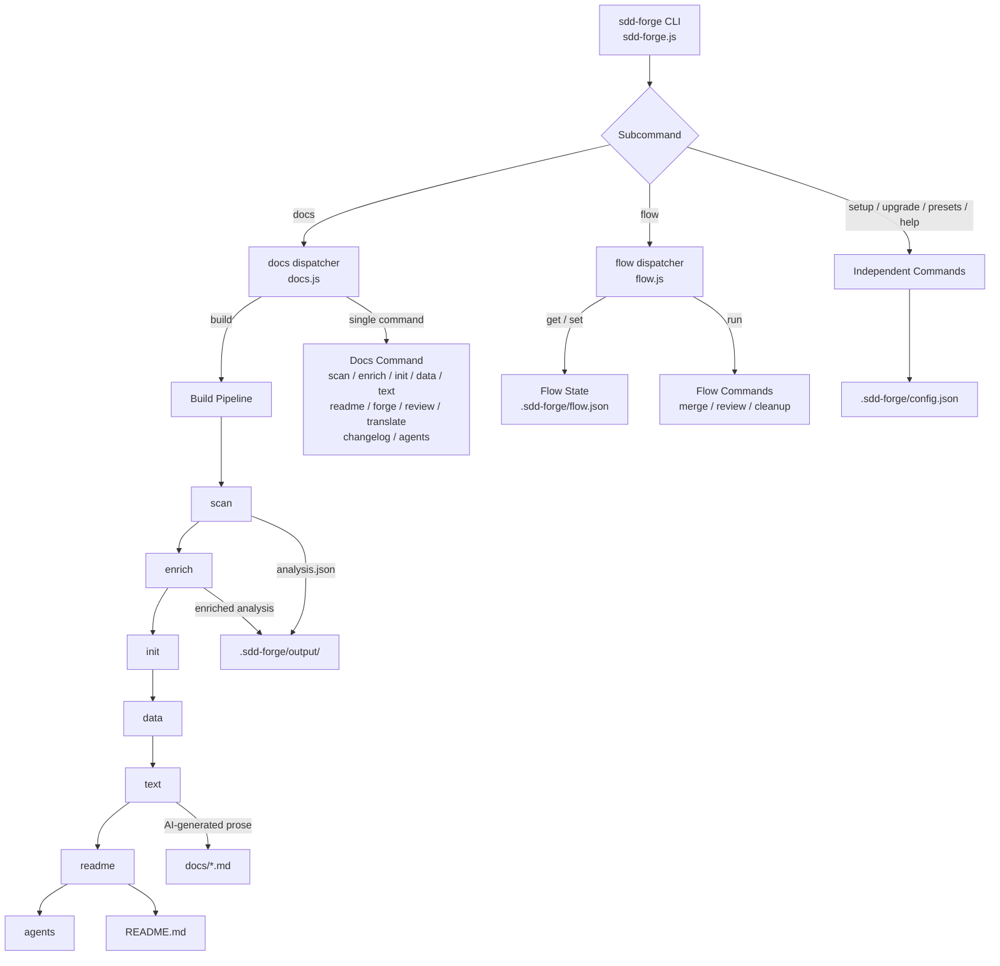

<!-- {{data("base.docs.langSwitcher", {labels: "relative"})}} -->
**English** | [日本語](ja/overview.md)
<!-- {{/data}} -->

# Tool Overview and Architecture

## Description

<!-- {{text({prompt: "Write a 1-2 sentence overview of this chapter. Include the tool's purpose, the problem it solves, and its primary use cases."})}} -->

This chapter introduces sdd-forge, a CLI tool that automates technical documentation generation through static source code analysis and orchestrates a Spec-Driven Development (SDD) workflow for AI-assisted coding. It is primarily used to produce and maintain structured project documentation and to manage the plan → implement → merge development lifecycle.
<!-- {{/text}} -->

## Content

### Purpose

<!-- {{text({prompt: "Describe the problem this CLI tool solves and its target users. Derive the purpose from package.json and README."})}} -->

Maintaining accurate technical documentation is a persistent challenge in software projects: manually written docs drift out of sync with the codebase, require repetitive effort to update, and consume significant context when passed to AI coding agents. sdd-forge addresses this by statically analyzing a project's source code and generating structured documentation from templates, ensuring that docs reflect the actual codebase rather than stale hand-written prose.

The tool also provides a structured Spec-Driven Development workflow that keeps AI coding agents in a controlled lane — specifying, validating, implementing, and merging in well-defined phases rather than making unconstrained changes. Target users are software developers who work with AI coding assistants (such as Claude Code) and want automated documentation and a repeatable, auditable development workflow. It requires only Node.js 18 or later and has no external dependencies.
<!-- {{/text}} -->

### Architecture Overview

<!-- {{text({prompt: "Generate a mermaid flowchart showing the tool's overall architecture. Include the dispatch structure from entry point to subcommands and the main processing flow (input → processing → output). Output only the mermaid code block.", mode: "deep"})}} -->


<!-- {{/text}} -->

### Key Concepts

<!-- {{text({prompt: "Explain the key concepts and terminology needed to understand this tool in table format. Extract the main concepts from source code."})}} -->

| Concept | Description |
|---|---|
| **SDD (Spec-Driven Development)** | A workflow in which a specification document is created and validated through a gate check before any implementation code is written. |
| **Preset** | A modular configuration bundle (in `src/presets/`) that defines how to scan, extract data, and generate documentation for a specific language or framework. Presets inherit from a parent chain (e.g., `base → node → node-cli`). |
| **Directive** | A template placeholder in a documentation file. `{{data: ...}}` injects structured data; `{{text: ...}}` triggers AI prose generation. Content inside a directive is overwritten on each build; content outside is preserved. |
| **Analysis** | The JSON file produced by `sdd-forge scan`, stored in `.sdd-forge/output/analysis.json`. It captures the project's file structure, classes, methods, configuration, and dependencies. |
| **Enrichment** | An AI-assisted pass (`sdd-forge enrich`) that annotates each entry in the analysis with a role summary and chapter classification, enabling more accurate documentation generation. |
| **Build Pipeline** | The sequential execution of docs commands: `scan → enrich → init → data → text → readme → agents`. Running `sdd-forge docs build` executes all steps in order. |
| **Chapter** | A named section of the generated documentation. Chapter ordering is defined in `preset.json` and can be overridden in the project's `config.json`. |
| **Gate** | A validation checkpoint in the SDD flow that checks whether a spec is complete and passes guardrail rules before allowing the implementation phase to begin. |
| **Flow State** | Persistent workflow state stored in `.sdd-forge/flow.json`, tracking the current SDD phase, step completion, and requirements so work can resume after interruption. |
<!-- {{/text}} -->

### Typical Usage Flow

<!-- {{text({prompt: "Describe the typical steps from installation to first output in step format. Derive the steps from help output and command definitions in the source code."})}} -->

**1. Install the tool**

Install sdd-forge globally via npm:

```bash
npm install -g sdd-forge
```

Node.js 18 or later is required. No additional dependencies are needed.

**2. Initialize project configuration**

Run the setup command from your project root. This creates `.sdd-forge/config.json`, which records the project language, type, preset, and documentation output settings:

```bash
sdd-forge setup
```

**3. Run the full documentation build**

Execute the build pipeline to scan the source code, enrich the analysis with AI annotations, initialize documentation templates, render data and text sections, and produce the final output files:

```bash
sdd-forge docs build
```

Generated documentation is written to the `docs/` directory and `README.md`.

**4. Review documentation quality**

Run the review command to check for missing sections, low-quality descriptions, or outdated content:

```bash
sdd-forge docs review
```

**5. (Optional) Start an SDD workflow for a new feature**

If you are using the Spec-Driven Development flow with an AI coding agent, initiate a new flow to begin the planning phase:

```bash
sdd-forge flow run start
```

Track progress with `sdd-forge flow get status` and finalize with `sdd-forge flow run merge`.
<!-- {{/text}} -->

---

<!-- {{data("base.docs.nav")}} -->
[Technology Stack and Operations →](stack_and_ops.md)
<!-- {{/data}} -->
