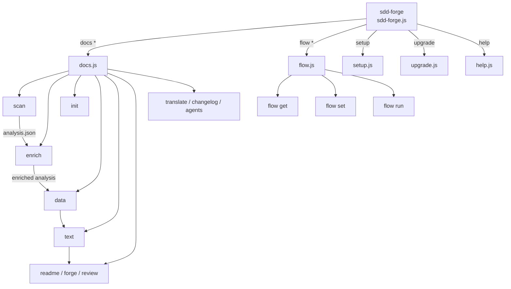

<!-- {{data("base.docs.langSwitcher", {labels: "relative"})}} -->
**English** | [日本語](ja/overview.md)
<!-- {{/data}} -->

# Tool Overview and Architecture

## Description

<!-- {{text({prompt: "Write a 1-2 sentence overview of this chapter. Include the tool's purpose, the problem it solves, and its primary use cases."})}} -->

sdd-forge is a CLI tool that automates documentation generation through source code analysis and provides a Spec-Driven Development (SDD) workflow for managing feature implementation with AI coding agents. It solves the problem of documentation drift by deriving structured content directly from static source analysis, and enforces a spec-first discipline that keeps AI assistance within well-defined boundaries.
<!-- {{/text}} -->

## Content

### Purpose

<!-- {{text({prompt: "Describe the problem this CLI tool solves and its target users. Derive the purpose from package.json and README."})}} -->

Software projects routinely suffer from documentation that falls out of sync with the codebase, making onboarding, maintenance, and collaboration increasingly difficult. sdd-forge addresses this by scanning source code to extract file structure, classes, methods, configuration, and dependencies, then generating documentation through a template-driven pipeline that can be refreshed automatically at merge time.

Beyond documentation, the tool enforces a three-phase Spec-Driven Development discipline — **plan**, **implement**, and **merge** — ensuring that specifications are written, gate-checked, and approved before any implementation begins. Deterministic commands handle source analysis, spec validation, and flow orchestration, while AI assistance operates within those well-defined boundaries.

Target users are development teams working on Node.js projects who want living documentation generated from their codebase and a structured workflow that keeps AI agents productive without letting them drift outside the intended scope.
<!-- {{/text}} -->

### Architecture Overview

<!-- {{text({prompt: "Generate a mermaid flowchart showing the tool's overall architecture. Include the dispatch structure from entry point to subcommands and the main processing flow (input → processing → output). Output only the mermaid code block.", mode: "deep"})}} -->


<!-- {{/text}} -->

### Key Concepts

<!-- {{text({prompt: "Explain the key concepts and terminology needed to understand this tool in table format. Extract the main concepts from source code."})}} -->

| Term | Description |
|------|-------------|
| **SDD (Spec-Driven Development)** | A three-phase workflow — plan, implement, merge — where specifications are written and gate-checked before implementation begins. |
| **Preset** | A reusable configuration bundle that defines document structure, scanner rules, and chapter layout for a given project type (e.g., `node-cli`, `laravel`, `cakephp2`). Presets support inheritance via a `parent` chain. |
| **Directive** | Template markers embedded in documentation files — `{{data}}` pulls structured data, `{{text}}` triggers AI text generation — replaced during the build pipeline. Content outside directives is preserved across rebuilds. |
| **analysis.json** | The intermediate output of `sdd-forge docs scan`, capturing structured metadata about source files, modules, classes, methods, and dependencies. Stored in `.sdd-forge/output/`. |
| **Enrichment** | An AI-assisted pass (`sdd-forge docs enrich`) that annotates each analysis entry with a role, summary, and chapter classification, feeding downstream text generation. |
| **Chapter** | A single Markdown file within `docs/` whose content is driven by directives. Chapter order is defined by the `chapters` array in `preset.json` and can be overridden in `config.json`. |
| **Flow** | The SDD workflow engine managing a feature's lifecycle through `flow get`, `flow set`, and `flow run` sub-commands. State is stored in `.sdd-forge/flow.json`. |
| **AGENTS.md** | A project-specific knowledge file generated by `sdd-forge docs agents`, read by AI coding agents to understand the codebase structure and constraints. `CLAUDE.md` is a symlink to this file. |
<!-- {{/text}} -->

### Typical Usage Flow

<!-- {{text({prompt: "Describe the typical steps from installation to first output in step format. Derive the steps from help output and command definitions in the source code."})}} -->

**1. Install the package**

```bash
npm install -g sdd-forge
```

**2. Initialize the project**

Run the setup command in your project root. This creates `.sdd-forge/config.json`, selects a preset matching your project type, and generates `AGENTS.md`.

```bash
sdd-forge setup
```

**3. Scan the source code**

Analyze the project to produce `analysis.json` in `.sdd-forge/output/`.

```bash
sdd-forge docs scan
```

**4. Enrich the analysis**

Run an AI-assisted enrichment pass to annotate each source entry with role, summary, and chapter classification.

```bash
sdd-forge docs enrich
```

**5. Build documentation**

Run the full documentation pipeline — `init`, `data`, `text`, and `readme` — generating Markdown files in `docs/`.

```bash
sdd-forge docs build
```

**6. Start a SDD flow (for new features)**

When beginning a new feature, start a spec-driven flow to draft and gate-check a specification before writing any code.

```bash
sdd-forge flow run start
```
<!-- {{/text}} -->

---

<!-- {{data("base.docs.nav")}} -->
[Technology Stack and Operations →](stack_and_ops.md)
<!-- {{/data}} -->
