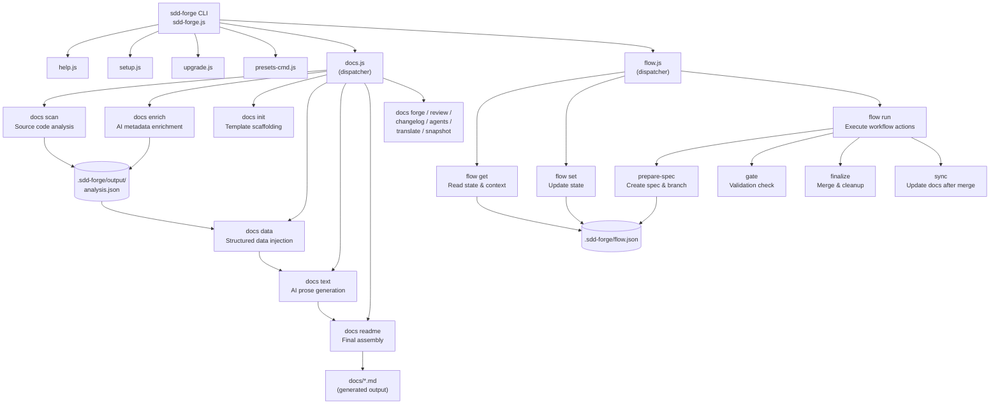

<!-- {{data("base.docs.langSwitcher", {labels: "relative"})}} -->
[日本語](ja/overview.md) | **English**
<!-- {{/data}} -->

# Tool Overview and Architecture

## Description

<!-- {{text({prompt: "Write a 1-2 sentence overview of this chapter. Include the tool's purpose, the problem it solves, and its primary use cases."})}} -->

This chapter introduces sdd-forge — a CLI tool for automated documentation generation and Spec-Driven Development (SDD) workflows. It covers the tool's purpose, the core problem it addresses, a high-level view of its architecture, and the key concepts you need before exploring individual commands.
<!-- {{/text}} -->

## Content

### Purpose

<!-- {{text({prompt: "Describe the problem this CLI tool solves and its target users. Derive the purpose from package.json and README."})}} -->

Development teams frequently struggle to keep technical documentation accurate and up to date as source code evolves. Writing and maintaining docs by hand is time-consuming, error-prone, and often deprioritized under delivery pressure.

sdd-forge addresses this by analyzing a project's source code and generating structured documentation automatically through a multi-stage pipeline: scan → enrich → init → data → text → readme. Each stage can be run independently or together via `sdd-forge docs build`. The AI-assisted enrichment and prose generation steps produce human-readable documentation that reflects the current state of the codebase, not a stale snapshot.

Beyond documentation, sdd-forge provides a Spec-Driven Development workflow (`sdd-forge flow`) that formalizes the path from a feature request to a merged, documented implementation. The flow system tracks requirements, phases, metrics, and validation gates so that teams can move quickly without losing traceability.

The primary users of sdd-forge are software development teams — particularly those building frameworks, libraries, or multi-layer applications — who want consistent, maintainable, and multilingual technical documentation without the overhead of maintaining it manually.
<!-- {{/text}} -->

### Architecture Overview

<!-- {{text({prompt: "Generate a mermaid flowchart showing the tool's overall architecture. Include the dispatch structure from entry point to subcommands and the main processing flow (input → processing → output). Output only the mermaid code block.", mode: "deep"})}} -->


<!-- {{/text}} -->

### Key Concepts

<!-- {{text({prompt: "Explain the key concepts and terminology needed to understand this tool in table format. Extract the main concepts from source code."})}} -->

| Concept | Description |
|---|---|
| **Preset** | A named, inheritable package of templates, data providers, and scanners tailored to a specific framework or project type (e.g., `laravel`, `nextjs`, `node-cli`). Presets form a parent-chain hierarchy; child presets override or extend parent definitions. |
| **DataSource** | A class within a preset that extracts structured data from source code (routes, modules, config, etc.) and exposes it for use in `{{data}}` directives. |
| **Directive** | A template instruction embedded in a Markdown file. `{{data(...)}}` injects structured data; `{{text(...)}}` marks a region for AI-generated prose. Content inside directives is replaced on every build; content outside directives is preserved. |
| **Pipeline** | The ordered sequence of documentation commands: `scan → enrich → init → data → text → readme`. Each step depends on the output of the previous one. `sdd-forge docs build` runs the full pipeline in a single call. |
| **analysis.json** | The intermediate artifact produced by `sdd-forge docs scan`. It contains a structured representation of source files, modules, routes, and other discovered elements, stored in `.sdd-forge/output/`. |
| **SDD (Spec-Driven Development)** | A development workflow enforced by the `flow` subsystem. Feature work progresses through formal phases — planning, implementation, and finalization — each with defined steps, validation gates, and metrics. |
| **Flow State** | A JSON file (`.sdd-forge/flow.json`) that persists the current SDD workflow: active spec, branch, phase, completed steps, requirement counts, and quality metrics. |
| **Gate** | A validation checkpoint in the SDD flow (`sdd-forge flow run gate`) that checks whether a spec meets defined requirements before implementation may proceed. |
| **Agent** | An AI provider configured in `.sdd-forge/config.json` under `agent`. sdd-forge invokes the agent for enrichment, text generation, review, and other AI-assisted steps. |
| **i18n / translate** | Built-in multilingual support. `sdd-forge docs translate` generates per-language copies of documentation (e.g., `docs/ja/`) from the primary language source. |
<!-- {{/text}} -->

### Typical Usage Flow

<!-- {{text({prompt: "Describe the typical steps from installation to first output in step format. Derive the steps from help output and command definitions in the source code."})}} -->

**1. Install the package**

```bash
npm install -g sdd-forge
```

**2. Initialize your project**

Run `sdd-forge setup` from the root of the target repository. The setup wizard prompts you to select a preset (e.g., `nextjs`, `laravel`, `node-cli`), configure the AI agent, and choose the output language. This creates a `.sdd-forge/config.json` file and generates an initial `AGENTS.md`.

**3. Scan the source code**

```bash
sdd-forge docs scan
```

This analyzes the repository and writes a structured `analysis.json` to `.sdd-forge/output/`. All subsequent documentation steps read from this file.

**4. Build the documentation**

```bash
sdd-forge docs build
```

This runs the full pipeline — enrich, init, data, text, readme — and produces Markdown files in the `docs/` directory. On first run the template files are scaffolded automatically before content is generated.

**5. Review the output**

Open the files in `docs/` (e.g., `docs/overview.md`, `docs/cli_commands.md`). Content inside `{{text}}` and `{{data}}` directives has been populated; anything you write outside those directives is preserved across future builds.

**6. (Optional) Start a Spec-Driven Development flow**

```bash
sdd-forge flow run prepare-spec "Your feature title"
```

This creates a spec file, a dedicated Git branch, and a worktree, then guides you through the plan → gate → implement → finalize cycle.
<!-- {{/text}} -->

---

<!-- {{data("base.docs.nav")}} -->
[Technology Stack and Operations →](stack_and_ops.md)
<!-- {{/data}} -->
