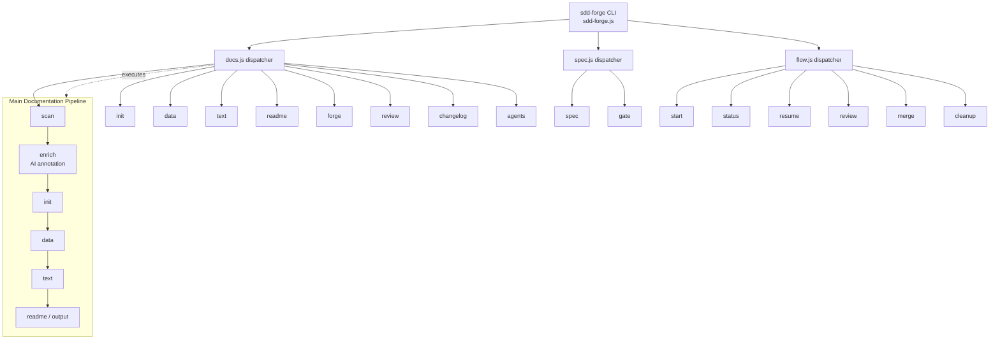

<!-- {{data("base.docs.langSwitcher", {labels: "relative"})}} -->
**English** | [日本語](ja/overview.md)
<!-- {{/data}} -->

# Tool Overview and Architecture

## Description

<!-- {{text({prompt: "Write a 1-2 sentence overview of this chapter. Include the tool's purpose, the problem it solves, and its primary use cases."})}} -->

This chapter provides a high-level introduction to sdd-forge — a CLI tool that automates technical documentation generation from source code analysis and guides development through a structured Spec-Driven Development (SDD) workflow. It covers the tool's purpose, architectural design, and the concepts needed to get started quickly.
<!-- {{/text}} -->

## Content

### Purpose

<!-- {{text({prompt: "Describe the problem this CLI tool solves and its target users. Derive the purpose from package.json and README."})}} -->

Maintaining accurate, up-to-date technical documentation is a persistent burden in software projects. As codebases evolve, hand-written docs fall out of sync, reviews consume tokens on repeated context-building, and there is no enforced connection between requirements and implementation.

sdd-forge addresses these problems by:

- **Automating documentation generation** — source code is scanned and analyzed, then structured markdown documents are produced from templates, eliminating manual writing for routine sections.
- **Enforcing a Spec-Driven Development cycle** — features are defined as specs before coding begins, and the tool gates implementation behind spec approval, keeping intent and code aligned.
- **Reducing LLM token waste** — enriched analysis summaries give AI agents the context they need without re-reading entire codebases on every interaction.

The primary target users are developers and small engineering teams working on Node.js projects who want living documentation without the overhead of maintaining it by hand.
<!-- {{/text}} -->

### Architecture Overview

<!-- {{text({prompt: "Generate a mermaid flowchart showing the tool's overall architecture. Include the dispatch structure from entry point to subcommands and the main processing flow (input → processing → output). Output only the mermaid code block.", mode: "deep"})}} -->


<!-- {{/text}} -->

### Key Concepts

<!-- {{text({prompt: "Explain the key concepts and terminology needed to understand this tool in table format. Extract the main concepts from source code."})}} -->

| Concept | Description |
|---|---|
| **Preset** | A configuration template (`preset.json`) that defines documentation structure, chapter order, and data sources for a given project type (e.g., `node-cli`, `js-webapp`). Presets support inheritance via a `parent` chain. |
| **Directive** | A marker embedded in a documentation template — either `{{data: ...}}` (structured data injection) or `{{text: ...}}` (AI-generated prose). Content inside directives is overwritten on each build; content outside is preserved. |
| **Chapter** | A single markdown file representing one section of the generated documentation. Chapter order is defined in the `chapters` array of `preset.json` and can be overridden per project in `config.json`. |
| **Analysis** | The JSON artifact produced by `sdd-forge scan`, containing metadata extracted from the project's source files. Stored in `.sdd-forge/output/analysis.json`. |
| **Enriched Analysis** | The AI-annotated form of the analysis, where each entry gains a `role`, `summary`, and chapter classification. Produced by the `enrich` stage and used by subsequent pipeline steps. |
| **DataSource** | A module that transforms analysis data into structured values consumed by `{{data}}` directives in templates. |
| **Spec** | A requirement document (stored in `specs/`) that describes a feature before implementation. The SDD gate command verifies alignment between spec and code. |
| **Flow** | The managed SDD lifecycle: `start` (create spec branch) → implement → `review` → `merge` → `cleanup`. Controlled by `flow.json` in the working root. |
| **SDD_SOURCE_ROOT / SDD_WORK_ROOT** | Environment variables used by `sdd-forge.js` to resolve the project being documented and the working directory for generated artefacts. |
<!-- {{/text}} -->

### Typical Usage Flow

<!-- {{text({prompt: "Describe the typical steps from installation to first output in step format. Derive the steps from help output and command definitions in the source code."})}} -->

**1. Install the package**

```bash
npm install -g sdd-forge
```

**2. Initialize your project**

Run the setup command from your project root. This generates `AGENTS.md`, creates the `.sdd-forge/` config directory, and produces a `CLAUDE.md` symlink:

```bash
cd your-project
sdd-forge setup
```

**3. Scan the source code**

Analyze the project and produce `analysis.json`:

```bash
sdd-forge scan
```

**4. Build the documentation**

Run the full pipeline (init → data → text → readme) in one step:

```bash
sdd-forge build
```

Generated markdown files appear in the `docs/` directory as defined by the active preset.

**5. Review and iterate**

Use `sdd-forge review` to check documentation quality, or re-run `sdd-forge build` after source changes to keep docs in sync. For feature development, start the SDD workflow with `sdd-forge flow start` before writing any code.
<!-- {{/text}} -->

---

<!-- {{data("base.docs.nav")}} -->
[Technology Stack and Operations →](stack_and_ops.md)
<!-- {{/data}} -->
