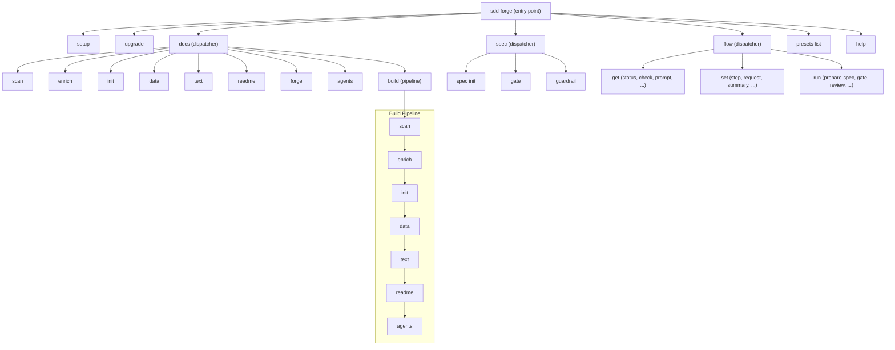

<!-- {{data("base.docs.langSwitcher", {labels: "relative"})}} -->
**English** | [日本語](ja/overview.md)
<!-- {{/data}} -->

# Tool Overview and Architecture

## Description

<!-- {{text({prompt: "Write a 1-2 sentence overview of this chapter. Include the tool's purpose, the problem it solves, and its primary use cases."})}} -->

sdd-forge is a CLI tool that automates technical documentation generation through source code analysis, solving the problem of documentation becoming outdated or inconsistent with the actual codebase. It supports Spec-Driven Development (SDD) workflows, enabling teams to maintain living documentation that stays synchronized with their source code.
<!-- {{/text}} -->

## Content

### Purpose

<!-- {{text({prompt: "Describe the problem this CLI tool solves and its target users. Derive the purpose from package.json and README."})}} -->

Software projects frequently suffer from documentation that drifts out of sync with the codebase. Manually maintaining technical docs is time-consuming, error-prone, and often deprioritized — leading to onboarding friction, knowledge silos, and unreliable references.

sdd-forge addresses this by analyzing source code directly and generating structured documentation automatically. The tool scans project files, enriches the analysis with AI-driven summaries and classifications, and produces well-organized Markdown documentation through a configurable template and preset system.

Target users include development teams that need to maintain up-to-date technical documentation, tech leads establishing documentation standards across projects, and organizations adopting Spec-Driven Development as part of their workflow. The tool requires no external dependencies beyond Node.js (≥ 18.0.0) and is distributed as a single npm package.
<!-- {{/text}} -->

### Architecture Overview

<!-- {{text({prompt: "Generate a mermaid flowchart showing the tool's overall architecture. Include the dispatch structure from entry point to subcommands and the main processing flow (input → processing → output). Output only the mermaid code block.", mode: "deep"})}} -->


<!-- {{/text}} -->

### Key Concepts

<!-- {{text({prompt: "Explain the key concepts and terminology needed to understand this tool in table format. Extract the main concepts from source code."})}} -->

| Concept | Description |
|---|---|
| **Preset** | A reusable configuration package that defines scan rules, chapter structure, data sources, and templates for a specific project type (e.g., `laravel`, `nextjs`). Presets form an inheritance chain via the `parent` field. |
| **Chapter** | A single Markdown file representing one section of the generated documentation. The list and order of chapters are defined in `preset.json`'s `chapters` array. |
| **Directive** | A special HTML comment embedded in templates that controls content generation. `{{data(...)}}` pulls structured data from analysis results; `{{text(...)}}` generates prose via AI. |
| **DataSource** | A class that either scans source files to produce analysis entries (Scannable DataSource) or reads existing analysis data to render Markdown output (Data-only DataSource). |
| **analysis.json** | The intermediate data file produced by `scan`, stored in `.sdd-forge/output/`. Contains categorized entries with file metadata, parsed structure, and (after enrichment) AI-generated summaries. |
| **Enrichment** | An AI-powered post-scan step that adds summaries, role classifications, and chapter assignments to each entry in `analysis.json`. |
| **Build Pipeline** | The full documentation generation sequence: `scan → enrich → init → data → text → readme → agents`. Executed by `docs build`. |
| **Flow** | The SDD workflow state machine that manages spec creation, gate checks, implementation, review, and merge steps. State is tracked in `flow.json`. |
<!-- {{/text}} -->

### Typical Usage Flow

<!-- {{text({prompt: "Describe the typical steps from installation to first output in step format. Derive the steps from help output and command definitions in the source code."})}} -->

1. **Install sdd-forge** globally via npm:
   ```
   npm install -g sdd-forge
   ```

2. **Run the setup wizard** in your project root:
   ```
   sdd-forge setup
   ```
   The interactive wizard prompts for your project name, source path, project type (preset), output languages, and documentation style. It creates the `.sdd-forge/` configuration directory and initial `config.json`.

3. **Generate documentation** by running the full build pipeline:
   ```
   sdd-forge docs build
   ```
   This executes the complete pipeline — `scan → enrich → init → data → text → readme → agents` — analyzing your source code and producing Markdown documentation in the `docs/` directory.

4. **Review the output** in the generated `docs/` folder. Each chapter file corresponds to a section defined by your preset, with AI-generated prose and structured data tables.

5. **Iterate and update** as your code evolves. Re-run `sdd-forge docs build` to regenerate documentation that reflects the latest source code changes. Individual pipeline stages (e.g., `sdd-forge docs scan`, `sdd-forge docs text`) can also be run independently for finer control.
<!-- {{/text}} -->

---

<!-- {{data("base.docs.nav")}} -->
[Technology Stack and Operations →](stack_and_ops.md)
<!-- {{/data}} -->
