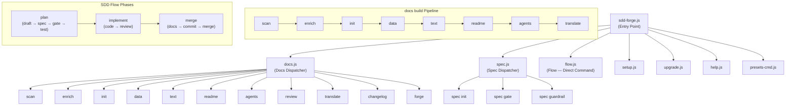

# Tool Overview and Architecture

## Description

<!-- {{text({prompt: "Write a 1-2 sentence overview of this chapter. Include the tool's purpose, the problem it solves, and its primary use cases."})}} -->

This chapter provides a high-level overview of sdd-forge, a CLI tool that combines source code analysis-based documentation generation with a Spec-Driven Development workflow. It covers the tool's purpose, architecture, key concepts, and the typical usage flow from installation to first output.

<!-- {{/text}} -->

## Content

### Purpose

<!-- {{text({prompt: "Describe the problem this CLI tool solves and its target users. Derive the purpose from package.json and README."})}} -->

sdd-forge addresses two persistent challenges in software development: documentation that drifts out of sync with source code, and unstructured feature development that leads to scope creep and miscommunication with AI coding agents.

For documentation, sdd-forge statically analyzes source code to extract file structure, classes, methods, configuration, and dependencies. The extracted data is injected into templates to produce structured documentation (`docs/`) and `README.md`. Because documentation is regenerated from the source, it stays accurate without manual maintenance.

For development workflow, sdd-forge provides a Spec-Driven Development (SDD) flow where every feature moves through three phases — plan, implement, and merge — with programmatic spec validation and guardrail checks at each gate. AI agents assist with spec drafting, code review, and prose generation, but deterministic commands control the overall flow.

The primary target users are development teams working with AI coding agents (such as Claude Code or Codex CLI) who need reliable project documentation and a structured process to keep AI-assisted development on track. It is also valuable for teams onboarding onto legacy codebases, where generating comprehensive docs from existing source code provides an immediate understanding of the system.

<!-- {{/text}} -->

### Architecture Overview

<!-- {{text({prompt: "Generate a mermaid flowchart showing the tool's overall architecture. Include the dispatch structure from entry point to subcommands and the main processing flow (input → processing → output). Output only the mermaid code block.", mode: "deep"})}} -->

<!-- {{/text}} -->

### Key Concepts

<!-- {{text({prompt: "Explain the key concepts and terminology needed to understand this tool in table format. Extract the main concepts from source code."})}} -->

| Concept | Description |
|---|---|
| **SDD Flow** | The Spec-Driven Development workflow consisting of three phases: plan, implement, and merge. Every feature passes through these phases in order. |
| **Preset** | A package of framework-specific scan settings, DataSources, and templates. Presets form an inheritance chain via the `parent` field (e.g., `base → webapp → php-webapp → laravel`). |
| **Analysis** | The structured data produced by the `scan` command, stored in `.sdd-forge/output/analysis.json`. Contains extracted file metadata, classes, methods, routes, and configuration. |
| **Enrich** | An AI-powered post-processing step that adds summary, chapter classification, and role metadata to each analysis entry. |
| **DataSource** | A class that reads analysis data and produces markdown tables for `{{data}}` directives in templates. May also include scan logic (Scannable DataSource). |
| **`{{data}}` Directive** | A template directive replaced with structured data (tables, lists) generated from analysis results by DataSource methods. |
| **`{{text}}` Directive** | A template directive replaced with AI-generated prose. The prompt and mode are specified in the directive; AI writes within the defined boundaries. |
| **Spec Gate** | Programmatic validation that checks a specification for unresolved items and missing approvals. Implementation cannot proceed until the gate passes. |
| **Guardrail** | Project-specific design principles checked against each spec to ensure compliance before implementation begins. |
| **Flow State** | Persistent state tracking the current SDD flow phase, requirements, and progress. Stored in `.sdd-forge/flow.json`, enabling resume after context compaction. |
| **Chapter** | A documentation file in `docs/` (e.g., `overview.md`, `cli_commands.md`). The order of chapters is defined by the `chapters` array in `preset.json`. |

<!-- {{/text}} -->

### Typical Usage Flow

<!-- {{text({prompt: "Describe the typical steps from installation to first output in step format. Derive the steps from help output and command definitions in the source code."})}} -->

1. **Install sdd-forge globally** — Run `npm install -g sdd-forge` to make the `sdd-forge` command available system-wide. Requires Node.js >= 18.0.0.

2. **Set up your project** — Navigate to your project root and run `sdd-forge setup`. The interactive wizard prompts you to select a project type (preset), operating language, and AI agent provider. This generates `.sdd-forge/config.json` and creates the necessary project scaffolding.

3. **Generate documentation** — Run `sdd-forge docs build` to execute the full documentation pipeline. The tool scans your source code, enriches the analysis with AI, initializes chapter templates, fills `{{data}}` directives with structured data, generates `{{text}}` content via AI, and produces `README.md` and `AGENTS.md`. Output is written to `docs/`.

4. **Review the generated docs** — Run `sdd-forge docs review` to check documentation quality and identify sections that may need attention.

5. **Start developing with the SDD flow** — When adding a new feature, start the SDD flow with `sdd-forge flow start` (or the `/sdd-forge.flow-plan` skill in Claude Code). Draft a spec, pass the spec gate, then implement and merge through the guided phases.

6. **Keep docs in sync** — Documentation is automatically refreshed during the merge phase of each SDD flow. You can also re-run `sdd-forge docs build` at any time to regenerate all documentation from the current source code.

<!-- {{/text}} -->

---

<!-- {{data("base.docs.nav")}} -->
[Technology Stack and Operations →](stack_and_ops.md)
<!-- {{/data}} -->
