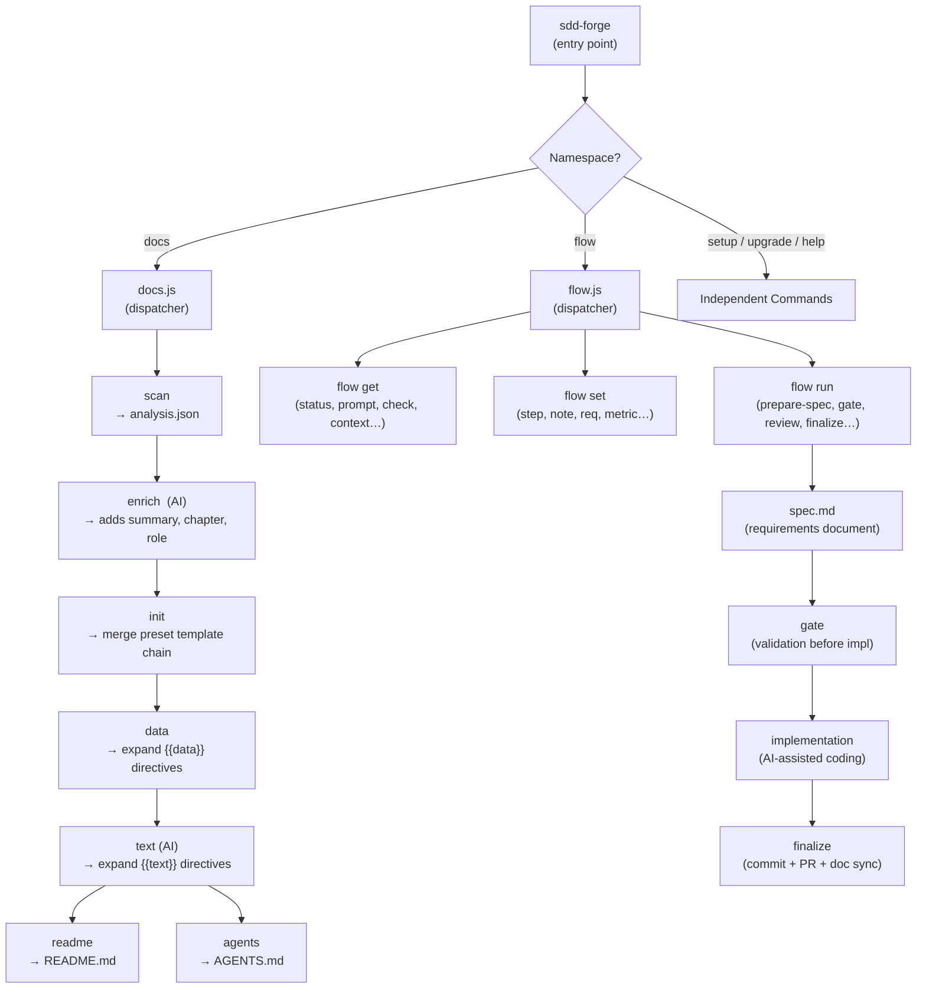

<!-- {{data("base.docs.langSwitcher", {labels: "relative"})}} -->
**English** | [日本語](ja/overview.md)
<!-- {{/data}} -->

# Tool Overview and Architecture

## Description

<!-- {{text({prompt: "Write a 1-2 sentence overview of this chapter. Include the tool's purpose, the problem it solves, and its primary use cases."})}} -->

sdd-forge is a CLI tool that automates documentation generation from source code analysis and enforces a Spec-Driven Development (SDD) workflow, keeping documentation synchronized with code as it evolves. Its primary use cases include generating structured project documentation through an AI-assisted pipeline, gating implementation behind validated specification documents, and providing AI coding agents with accurate, up-to-date project context.
<!-- {{/text}} -->

## Content

### Purpose

<!-- {{text({prompt: "Describe the problem this CLI tool solves and its target users. Derive the purpose from package.json and README."})}} -->

Software development teams face a persistent challenge: documentation drifts out of sync with rapidly changing source code, and AI coding agents need accurate, structured project context to stay within established design boundaries. Maintaining that context manually is expensive and error-prone, especially when multiple contributors or automated agents are involved.

sdd-forge addresses this by automatically extracting metadata from source code through a configurable scan pipeline, enriching it with AI-generated summaries, and rendering the results into structured Markdown documentation via template directives. The tool also enforces a Spec-Driven Development (SDD) workflow that gates implementation behind a validated specification document, keeping both AI agents and human developers aligned with the agreed design before a single line of production code is written.

Target users include:

- Development teams integrating AI coding assistants (such as Claude) who need reliable project context
- Projects adopting spec-first development practices to reduce rework and scope drift
- Teams that want to eliminate documentation drift without adding manual maintenance overhead
- Organizations managing multiple framework stacks, supported through a preset inheritance system covering Laravel, Next.js, Node CLI, Hono, Symfony, and more
<!-- {{/text}} -->

### Architecture Overview

<!-- {{text({prompt: "Generate a mermaid flowchart showing the tool's overall architecture. Include the dispatch structure from entry point to subcommands and the main processing flow (input → processing → output). Output only the mermaid code block.", mode: "deep"})}} -->

<!-- {{/text}} -->

### Key Concepts

<!-- {{text({prompt: "Explain the key concepts and terminology needed to understand this tool in table format. Extract the main concepts from source code."})}} -->

| Term | Definition |
|---|---|
| **Preset** | A framework-specific configuration bundle containing scan patterns, DataSource classes, and chapter templates (e.g., `laravel`, `nextjs`, `node-cli`). |
| **Preset Chain** | Single-inheritance hierarchy resolved at build time (e.g., `base → webapp → laravel`). Each preset declares its `parent` in `preset.json`. |
| **analysis.json** | Structured JSON file produced by `docs scan`, containing categorized entries (classes, routes, config keys, models, etc.) extracted from source files. |
| **Entry** | A single analyzed code artifact stored in `analysis.json`, such as a class, route definition, or configuration key. |
| **DataSource** | A class that bridges extracted analysis data and template rendering. Scannable DataSources also implement `match()` and `parse()` to contribute data during the scan step. |
| **Chapter** | A Markdown file representing one section of the generated documentation. Order is defined by the `chapters` array in `preset.json`. |
| **`{{data}}` directive** | A template macro that calls a DataSource method and injects the result as a Markdown table into the document. |
| **`{{text}}` directive** | A template macro that invokes an AI agent to generate narrative prose for the surrounding section. |
| **SDD Flow** | The four-phase Spec-Driven Development workflow (plan → implement → finalize → sync) tracked in `flow.json`. |
| **Spec** | A structured requirements document (`spec.md`) that must be written and approved before implementation begins. |
| **Gate** | A validation step (`flow run gate`) that checks all spec issues are resolved and approvals are in place before allowing implementation to proceed. |
| **Guardrail** | A project design principle enforced by `flow run lint` to prevent implementation from violating established architectural conventions. |
| **Enrich** | An AI-assisted pipeline step (`docs enrich`) that annotates each analysis entry with a summary, chapter assignment, and role description. |
| **Worktree** | An isolated Git worktree created per SDD flow, enabling parallel feature work without branch conflicts. |
<!-- {{/text}} -->

### Typical Usage Flow

<!-- {{text({prompt: "Describe the typical steps from installation to first output in step format. Derive the steps from help output and command definitions in the source code."})}} -->

**1. Install the tool**
Run `npm install -g sdd-forge` to install the CLI globally. Node.js 18 or later is required.

**2. Register your project**
From your project root, run `sdd-forge setup`. This creates `.sdd-forge/config.json`, generates `AGENTS.md`, and creates a `CLAUDE.md` symlink for AI agent consumption.

**3. Select a preset**
During setup, choose the preset that matches your framework (e.g., `laravel`, `nextjs`, `node-cli`). The preset determines which files are scanned and which documentation chapters are generated.

**4. Run the full build pipeline**
Execute `sdd-forge docs build` to run all pipeline steps in sequence:
- **scan** — parses source files and writes `.sdd-forge/output/analysis.json`
- **enrich** — calls an AI agent to annotate each entry with a summary and chapter assignment
- **init** — merges the preset template chain into the `docs/` directory
- **data** — expands `{{data}}` directives into Markdown tables
- **text** — expands `{{text}}` directives into AI-generated prose
- **readme** — assembles `README.md` from the generated chapter files
- **agents** — regenerates `AGENTS.md` with updated project context

**5. Review generated output**
The `docs/` directory now contains complete chapter files. `README.md` and `AGENTS.md` at the project root are also updated and ready for review.

**6. Iterate with individual steps**
After the initial build, run individual steps (e.g., `sdd-forge docs text`) to regenerate only the sections affected by source changes, rather than rebuilding the entire pipeline.
<!-- {{/text}} -->

---

<!-- {{data("base.docs.nav")}} -->
[Technology Stack and Operations →](stack_and_ops.md)
<!-- {{/data}} -->
