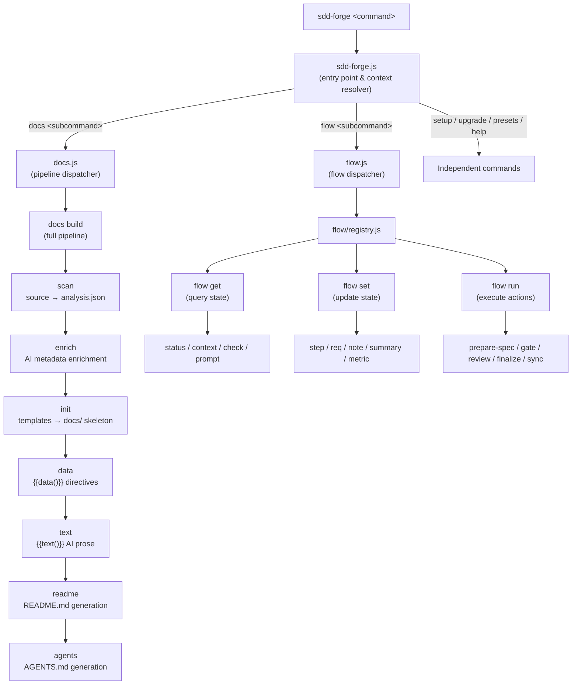

<!-- {{data("base.docs.langSwitcher", {labels: "relative"})}} -->
**English** | [日本語](ja/overview.md)
<!-- {{/data}} -->

# Tool Overview and Architecture

## Description

<!-- {{text({prompt: "Write a 1-2 sentence overview of this chapter. Include the tool's purpose, the problem it solves, and its primary use cases."})}} -->

This chapter introduces sdd-forge — a CLI tool that automates technical documentation generation from source code analysis and orchestrates Spec-Driven Development (SDD) workflows for AI coding agents. It covers the tool's design goals, architectural structure, and core concepts needed to work effectively with it.
<!-- {{/text}} -->

## Content

### Purpose

<!-- {{text({prompt: "Describe the problem this CLI tool solves and its target users. Derive the purpose from package.json and README."})}} -->

Development teams that work with AI coding agents face a recurring challenge: agents lack stable, structured project knowledge and frequently diverge from established architecture. sdd-forge solves this by scanning source code to produce `analysis.json`, then generating structured documentation from that data using a template and preset system. The generated `docs/` directory and `AGENTS.md` give agents consistent, reliable context — replacing ad-hoc prompts and manually maintained notes.

Target users are developers and teams who use AI-assisted workflows (Claude Code, Codex CLI, or compatible tools) and want documentation that stays synchronized with their codebase. The tool is particularly useful when onboarding AI agents to existing projects, enforcing architectural guardrails during feature development, or maintaining multi-language documentation without manual effort.
<!-- {{/text}} -->

### Architecture Overview

<!-- {{text({prompt: "Generate a mermaid flowchart showing the tool's overall architecture. Include the dispatch structure from entry point to subcommands and the main processing flow (input → processing → output). Output only the mermaid code block.", mode: "deep"})}} -->


<!-- {{/text}} -->

### Key Concepts

<!-- {{text({prompt: "Explain the key concepts and terminology needed to understand this tool in table format. Extract the main concepts from source code."})}} -->

| Concept | Description |
|---|---|
| **Preset** | A named package of scan rules, DataSources, and chapter templates for a specific framework or project type (e.g., `node-cli`, `laravel`, `nextjs`). Presets form an inheritance chain via the `parent` field. |
| **DataSource** | A class that either extracts data from source files during scanning, or reads `analysis.json` to produce structured markdown tables for `{{data()}}` directives. |
| **analysis.json** | The central data artifact produced by `docs scan`. It holds structured metadata about the project's files, classes, methods, routes, configuration, and dependencies, organized by category. |
| **`{{data()}}` directive** | A template directive that inserts structured data (tables, lists) into a documentation chapter. Its content is managed automatically and overwritten on each build. |
| **`{{text()}}` directive** | A template directive that triggers AI-generated prose for a defined section. The surrounding prompt and mode control what the AI writes. Content inside the directive is overwritten on each build. |
| **Flow / SDD** | The Spec-Driven Development workflow, covering phases: approach → spec → gate → test → implementation → review → merge. State is persisted in `.sdd-forge/.active-flow`. |
| **Gate** | A programmatic validation step that checks a spec for unresolved items and guardrail compliance before the implementation phase begins. |
| **Guardrail** | Project-level design principles stored in `.sdd-forge/guardrail.md`. They are enforced at the spec gate and referenced by AI agents during implementation. |
| **Enrich** | An AI-powered step that reads the full `analysis.json` and annotates each entry with a role, summary, and chapter assignment, improving the quality of subsequent documentation generation. |
| **AGENTS.md** | A machine-readable file generated by `sdd-forge docs agents` that provides AI coding agents with project context, skills, and configuration rules. `CLAUDE.md` is typically a symlink to this file. |
<!-- {{/text}} -->

### Typical Usage Flow

<!-- {{text({prompt: "Describe the typical steps from installation to first output in step format. Derive the steps from help output and command definitions in the source code."})}} -->

**Step 1 — Install the package globally**

```bash
npm install -g sdd-forge
```

**Step 2 — Run the setup wizard in your project directory**

```bash
cd /path/to/your/project
sdd-forge setup
```

The wizard prompts for the project name, source directory path, preset type (e.g., `node-cli`, `laravel`), and AI agent provider. It creates a `.sdd-forge/config.json` file to store these settings.

**Step 3 — Build the full documentation pipeline**

```bash
sdd-forge docs build
```

This runs the complete pipeline in sequence: `scan` analyzes source files into `analysis.json`, `enrich` adds AI-generated metadata, `init` creates the `docs/` directory from preset templates, `data` populates structured sections, `text` fills prose sections via AI, `readme` generates `README.md`, and `agents` produces `AGENTS.md`.

**Step 4 — Review the output**

Generated files are placed in `docs/` (chapter markdown files), `README.md` (project root), and `AGENTS.md`. The source data is stored in `.sdd-forge/output/analysis.json`.

**Step 5 — Iterate with individual pipeline steps**

After the initial build, individual steps can be re-run independently. For example, run `sdd-forge docs text` to regenerate only the AI prose sections after editing a template, or `sdd-forge docs scan` followed by `sdd-forge docs data` after modifying source code.
<!-- {{/text}} -->

---

<!-- {{data("base.docs.nav")}} -->
[Technology Stack and Operations →](stack_and_ops.md)
<!-- {{/data}} -->
