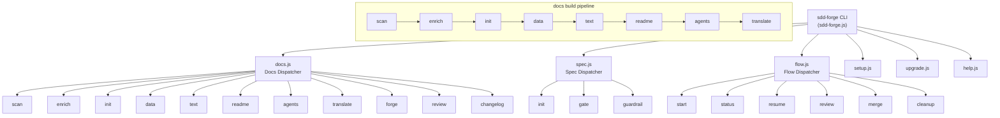

<!-- {{data("base.docs.langSwitcher", {labels: "relative"})}} -->
**English** | [日本語](ja/overview.md)
<!-- {{/data}} -->

# Tool Overview and Architecture

## Description

<!-- {{text({prompt: "Write a 1-2 sentence overview of this chapter. Include the tool's purpose, the problem it solves, and its primary use cases."})}} -->

sdd-forge is a CLI tool that automates technical documentation generation through source code analysis and provides a Spec-Driven Development (SDD) workflow. It addresses the challenge of keeping project documentation accurate and up-to-date by deriving content directly from the codebase, serving developers and teams who need reliable, structured documentation without manual authoring overhead.
<!-- {{/text}} -->

## Content

### Purpose

<!-- {{text({prompt: "Describe the problem this CLI tool solves and its target users. Derive the purpose from package.json and README."})}} -->

Software projects frequently suffer from outdated or incomplete documentation. Manually writing and maintaining technical docs is time-consuming, and the resulting content often drifts from the actual codebase. sdd-forge solves this by automatically scanning source code, analyzing its structure, and generating comprehensive documentation — all without requiring external dependencies beyond Node.js.

The tool targets developers and engineering teams who want to:

- **Eliminate documentation drift** — docs are generated from source code analysis, ensuring accuracy.
- **Reduce manual effort** — a single `sdd-forge docs build` command produces a full documentation set.
- **Adopt Spec-Driven Development** — write specs first, validate implementation against them with gate checks, and manage the entire flow from planning to merge.

sdd-forge ships as an npm package (`sdd-forge`) with zero external dependencies, running on Node.js 18 or later. It supports multiple programming languages and frameworks through a preset system with inheritance chains.
<!-- {{/text}} -->

### Architecture Overview

<!-- {{text({prompt: "Generate a mermaid flowchart showing the tool's overall architecture. Include the dispatch structure from entry point to subcommands and the main processing flow (input → processing → output). Output only the mermaid code block.", mode: "deep"})}} -->


<!-- {{/text}} -->

### Key Concepts

<!-- {{text({prompt: "Explain the key concepts and terminology needed to understand this tool in table format. Extract the main concepts from source code."})}} -->

| Concept | Description |
|---|---|
| **Preset** | A packaged set of scan rules, DataSources, and templates tailored to a specific framework (e.g., Laravel, Next.js). Presets form an inheritance chain via the `parent` field. |
| **DataSource** | A class that reads analysis data and produces markdown output. Scannable DataSources also define `match()` and `scan()` methods to collect data from source files. |
| **`{{data}}` directive** | A template directive replaced with structured data (tables, lists) generated by a DataSource method at build time. |
| **`{{text}}` directive** | A template directive replaced with AI-generated prose based on a prompt and the surrounding analysis context. |
| **analysis.json** | The intermediate data file produced by `scan`, containing categorized metadata about every source file in the project. |
| **enrich** | A pipeline step where an AI agent annotates each analysis entry with a summary, chapter assignment, and role classification. |
| **Chapter** | A single markdown document within `docs/` representing one section of the generated documentation. Chapter order is defined by the preset's `chapters` array. |
| **SDD Flow** | The Spec-Driven Development workflow managed by `flow` commands: start → status → review → merge. It coordinates spec creation, implementation, and finalization. |
| **Gate check** | A validation step (`spec gate`) that verifies whether the implementation satisfies the requirements defined in a spec. |
| **Template inheritance** | A mechanism using `` and `` directives that allows child presets to override specific sections of parent templates. |
<!-- {{/text}} -->

### Typical Usage Flow

<!-- {{text({prompt: "Describe the typical steps from installation to first output in step format. Derive the steps from help output and command definitions in the source code."})}} -->

1. **Install sdd-forge** — Install the package globally from npm.
   ```bash
   npm install -g sdd-forge
   ```

2. **Initialize your project** — Run the setup command in your project root. This creates the `.sdd-forge/` directory with a `config.json` file and detects the appropriate preset for your framework.
   ```bash
   sdd-forge setup
   ```

3. **Review the configuration** — Open `.sdd-forge/config.json` to verify the detected `type` (preset), `lang`, and `docs` settings. Adjust if needed.

4. **Generate documentation** — Run the full build pipeline. This scans your source code, enriches the analysis with AI, initializes chapter templates, fills in data and text directives, and produces the final docs.
   ```bash
   sdd-forge docs build
   ```

5. **Review the output** — The generated documentation is written to the `docs/` directory. Each chapter file corresponds to a section defined by your preset. An `AGENTS.md` file is also generated at the project root.

6. **Iterate** — After making code changes, re-run `sdd-forge docs build` to update the documentation. Only changed sections are regenerated when using incremental mode.
<!-- {{/text}} -->

---

<!-- {{data("base.docs.nav")}} -->
[Technology Stack and Operations →](stack_and_ops.md)
<!-- {{/data}} -->
