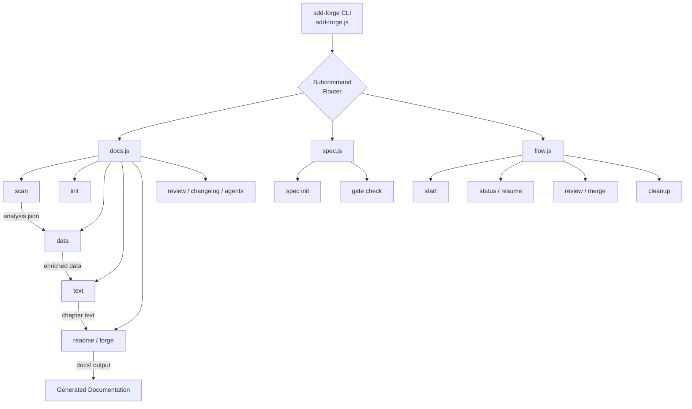

<!-- {{data("base.docs.langSwitcher", {labels: "relative"})}} -->
**English** | [日本語](ja/overview.md)
<!-- {{/data}} -->

# Tool Overview and Architecture

## Description

<!-- {{text({prompt: "Write a 1-2 sentence overview of this chapter. Include the tool's purpose, the problem it solves, and its primary use cases."})}} -->

This chapter introduces sdd-forge, a CLI tool that automates documentation generation from source code analysis and provides a Spec-Driven Development (SDD) workflow. It covers the tool's core purpose, architectural design, key concepts, and the steps required to produce your first documentation output.
<!-- {{/text}} -->

## Content

### Purpose

<!-- {{text({prompt: "Describe the problem this CLI tool solves and its target users. Derive the purpose from package.json and README."})}} -->

Maintaining accurate, up-to-date documentation alongside an evolving codebase is a persistent challenge for development teams. Documentation written by hand quickly falls out of sync with the source code, and the effort required to keep it current often means it is neglected entirely.

sdd-forge addresses this by analysing your source code directly and generating structured documentation through a pipeline of composable commands. Rather than asking developers to write and maintain prose manually, the tool derives content from the codebase itself and uses AI-assisted text generation to fill in chapter sections defined by template directives.

The tool also provides a Spec-Driven Development workflow through its `flow` commands, guiding teams from specification through implementation and review to merge. This makes it suitable for teams that want both living documentation and a structured approach to feature development.

Target users are software developers and technical leads working on Node.js projects — or projects with a compatible preset — who want their documentation to remain accurate without manual upkeep.
<!-- {{/text}} -->

### Architecture Overview

<!-- {{text({prompt: "Generate a mermaid flowchart showing the tool's overall architecture. Include the dispatch structure from entry point to subcommands and the main processing flow (input → processing → output). Output only the mermaid code block.", mode: "deep"})}} -->


<!-- {{/text}} -->

### Key Concepts

<!-- {{text({prompt: "Explain the key concepts and terminology needed to understand this tool in table format. Extract the main concepts from source code."})}} -->

| Concept | Description |
|---|---|
| **SDD (Spec-Driven Development)** | A development workflow in which a specification is written and gate-checked before implementation begins. Managed through `sdd-forge flow` commands. |
| **Directive** | A template marker embedded in a chapter file — either `{{data}}` or `{{text}}` — that defines where and how automated content is inserted. Content inside a directive is overwritten on each build; content outside is preserved. |
| **Preset** | A named configuration profile (e.g., `node-cli`, `laravel`, `cakephp2`) that determines scanning rules, data sources, and the default chapter structure for a project type. Presets are composable via a `parent` chain. |
| **Analysis** | The structured JSON snapshot of a project's source code produced by `sdd-forge scan`, stored in `.sdd-forge/output/analysis.json`. It is the primary input to all downstream pipeline steps. |
| **Enriched Analysis** | An AI-annotated form of the analysis in which each entry is assigned a role, a plain-language summary, and a chapter classification. Used by `text` generation to place content in the correct chapter. |
| **Chapter** | A single Markdown file within `docs/` representing one documentation section. The set of chapters and their order are defined in `preset.json` and can be overridden per project in `config.json`. |
| **Flow** | The SDD lifecycle — start, review, merge, cleanup — executed through `sdd-forge flow` subcommands. Flow state is tracked in `.sdd-forge/flow.json`. |
| **AGENTS.md** | A project-specific context file generated by `sdd-forge agents`. It is symlinked as `CLAUDE.md` so that AI coding agents automatically receive up-to-date project context. |
<!-- {{/text}} -->

### Typical Usage Flow

<!-- {{text({prompt: "Describe the typical steps from installation to first output in step format. Derive the steps from help output and command definitions in the source code."})}} -->

**Step 1 — Install the package**

Install sdd-forge globally from npm:

```
npm install -g sdd-forge
```

**Step 2 — Initialise your project**

Run `sdd-forge setup` in your project root. This creates the `.sdd-forge/` configuration directory, writes `config.json` with your chosen preset and language settings, and generates `AGENTS.md` with an initial project context.

**Step 3 — Scan the source code**

Run `sdd-forge scan` to analyse your project's source files. The result is written to `.sdd-forge/output/analysis.json` and serves as the input for all subsequent pipeline steps.

**Step 4 — Scaffold documentation chapters**

Run `sdd-forge init` to create the chapter Markdown files under `docs/` based on the preset's chapter definitions. Each file contains `{{data}}` and `{{text}}` directives that mark where generated content will be placed.

**Step 5 — Build the documentation**

Run `sdd-forge build` to execute the full pipeline in sequence: data enrichment, AI-assisted text generation for each `{{text}}` directive, and final readme assembly. Generated content is written into the directive blocks in each chapter file.

**Step 6 — Review the output**

Open the files in `docs/` to review the generated documentation. Content within directive blocks is managed by the tool; any text you write outside directive blocks is preserved across subsequent builds.
<!-- {{/text}} -->

---

<!-- {{data("base.docs.nav")}} -->
[Technology Stack and Operations →](stack_and_ops.md)
<!-- {{/data}} -->
