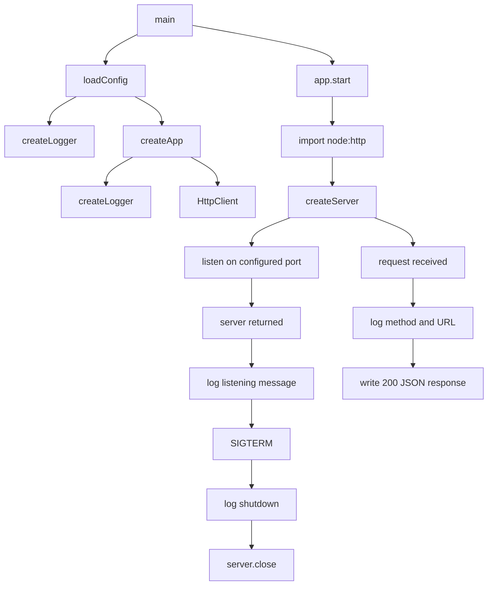

<!-- {{data("base.docs.langSwitcher", {labels: "relative"})}} -->
**English** | [日本語](ja/overview.md)
<!-- {{/data}} -->

# Tool Overview and Architecture

## Description

<!-- {{text({prompt: "Write a 1-2 sentence overview of this chapter. Include the tool's purpose, the problem it solves, and its primary use cases."})}} -->

This chapter covers a compact application bootstrap that loads runtime configuration, creates logging and HTTP client services, starts an HTTP server, and installs shutdown handling. It addresses the need for a single composition root that wires startup, request handling, and graceful termination for a small web application fixture.
<!-- {{/text}} -->

## Content

### Purpose

<!-- {{text({prompt: "Describe the problem this CLI tool solves and its target users. Derive the purpose from package.json and README."})}} -->

The available analysis data shows a module that solves application startup orchestration for a small web application fixture. Its target users are developers working with the fixture who need a clear entry point that loads configuration, initializes shared services, starts the server, logs lifecycle events, and shuts down cleanly on `SIGTERM`.
<!-- {{/text}} -->

### Architecture Overview

<!-- {{text({prompt: "Generate a mermaid flowchart showing the tool's overall architecture. Include the dispatch structure from entry point to subcommands and the main processing flow (input → processing → output). Output only the mermaid code block.", mode: "deep"})}} -->

<!-- {{/text}} -->

### Key Concepts

<!-- {{text({prompt: "Explain the key concepts and terminology needed to understand this tool in table format. Extract the main concepts from source code."})}} -->

| Concept | Description |
| --- | --- |
| `main` | The top-level async entry point that loads configuration, creates the application, starts the server, logs lifecycle events, and registers shutdown handling. |
| Configuration | Runtime settings loaded through `loadConfig`, including `logLevel`, `apiBaseUrl`, `timeout`, and `port`. |
| Composition root | The `createApp` function, which assembles the logger, HTTP client, and server startup behavior into a single application object. |
| Logger | A service created with `createLogger` and used to record startup, request, and shutdown messages. |
| `HttpClient` | A client initialized with `baseUrl` and `timeout` from configuration and exposed on the returned application object. |
| `start` method | An async method on the application object that imports `node:http`, creates the server, and resolves once listening begins. |
| HTTP server | A server created with `createServer` that logs each request and responds with a JSON body containing `{"status":"ok"}` and status `200`. |
| Graceful shutdown | A `SIGTERM` handler that logs shutdown and awaits `server.close()`. |
<!-- {{/text}} -->

### Typical Usage Flow

<!-- {{text({prompt: "Describe the typical steps from installation to first output in step format. Derive the steps from help output and command definitions in the source code."})}} -->

1. Load the application configuration with `loadConfig` to obtain the log level, API base URL, timeout, and port.
2. Create the startup logger and build the application through `createApp(config)`.
3. Initialize the internal services inside `createApp`, including a logger and an `HttpClient` configured from the loaded settings.
4. Start the application by calling `app.start()`, which imports `node:http`, creates the server, and begins listening on the configured port.
5. Confirm the first runtime output through log messages such as application startup and the listening port.
6. Send a request to the running server to receive the first HTTP response: a `200` JSON payload with `{"status":"ok"}`.
7. When the process receives `SIGTERM`, the shutdown handler logs the event and closes the server.
<!-- {{/text}} -->

---

<!-- {{data("base.docs.nav")}} -->
[Technology Stack and Operations →](stack_and_ops.md)
<!-- {{/data}} -->
