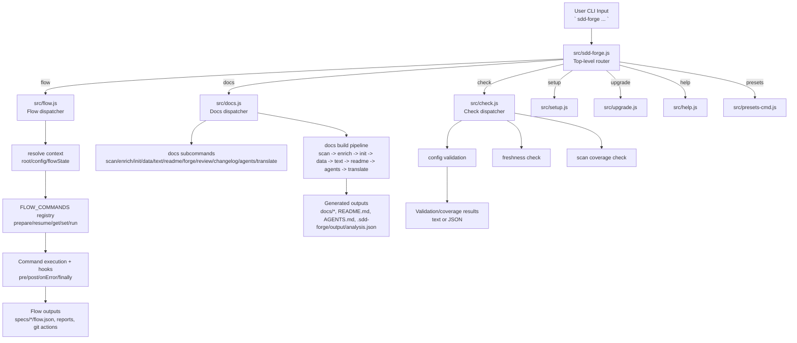

<!-- {{data("base.docs.langSwitcher", {labels: "relative"})}} -->
[日本語](ja/overview.md) | **English**
<!-- {{/data}} -->

# Tool Overview and Architecture

## Description

<!-- {{text({prompt: "Write a 1-2 sentence overview of this chapter. Include the tool's purpose, the problem it solves, and its primary use cases."})}} -->

sdd-forge is a Node.js CLI for Spec-Driven Development that combines source-code analysis, template-based documentation generation, and flow-state orchestration for implementation workflows. It solves drifting specs/docs and inconsistent AI-assisted development through deterministic commands for docs pipelines, gate checks, and phase-based execution (`plan`, `implement`, `finalize`).
<!-- {{/text}} -->

## Content

### Purpose

<!-- {{text({prompt: "Describe the problem this CLI tool solves and its target users. Derive the purpose from package.json and README."})}} -->

This CLI addresses two recurring problems: documentation that falls out of sync with code, and feature delivery without a controlled path from request to specification, implementation, and wrap-up.

From `package.json` and `README.md`, its purpose is "Spec-Driven Development tooling for automated documentation generation," implemented as a spec-first flow manager for AI coding agents.

Its target users are developers and teams maintaining existing codebases, onboarding into unfamiliar repositories, or running AI-assisted feature work that requires explicit gates, guardrails, and persistent workflow state.
<!-- {{/text}} -->

### Architecture Overview

<!-- {{text({prompt: "Generate a mermaid flowchart showing the tool's overall architecture. Include the dispatch structure from entry point to subcommands and the main processing flow (input → processing → output). Output only the mermaid code block.", mode: "deep"})}} -->


<!-- {{/text}} -->

### Key Concepts

<!-- {{text({prompt: "Explain the key concepts and terminology needed to understand this tool in table format. Extract the main concepts from source code."})}} -->

| Concept | Meaning in this project | Where it appears |
|---|---|---|
| Preset (`type`) | Project-type definition chain used to determine scan rules, templates, and data sources. | `src/lib/presets.js`, `src/presets/*`, `.sdd-forge/config.json` |
| DataSource / Scannable | Parser units that match files and extract structured analysis entries during scanning. | `src/docs/commands/scan.js`, `src/docs/lib/data-source-loader.js`, `src/presets/*/data/*.js` |
| `analysis.json` | Central machine-readable analysis artifact used by later docs stages. | `.sdd-forge/output/analysis.json`, `scan -> enrich -> data -> text` pipeline |
| `{{data}}` directive | Template directive resolved from analysis data into markdown content. | `src/docs/commands/data.js`, `src/docs/lib/directive-parser.js` |
| `{{text}}` directive | Template directive filled by configured AI agent with generated prose. | `src/docs/commands/text.js`, `src/docs/lib/text-prompts.js` |
| Flow state (`flow.json`) | Persistent state for SDD steps, requirements, notes, issue linkage, and phase progress. | `specs/<id>/flow.json`, `src/lib/flow-state.js` |
| Active flow pointer (`.active-flow`) | Pointer list to active flows for resume/recovery across branch/worktree contexts. | `.sdd-forge/.active-flow`, `src/lib/flow-state.js` |
| Guardrail | Project principles used in gate/lint checks to evaluate specs and implementation changes. | `src/lib/guardrail.js`, `src/flow/lib/run-gate.js`, preset `guardrail.json` files |
| Agent provider/profile | AI execution config for commands (provider command/args + commandId-based profile routing). | `src/lib/agent.js`, `src/lib/types.js`, `.sdd-forge/config.json` |
<!-- {{/text}} -->

### Typical Usage Flow

<!-- {{text({prompt: "Describe the typical steps from installation to first output in step format. Derive the steps from help output and command definitions in the source code."})}} -->

1. Install Node.js 18+ and install the CLI globally: `npm install -g sdd-forge`.
2. In your project, run `sdd-forge setup` to create `.sdd-forge/config.json` and initialize required directories.
3. Confirm available commands with `sdd-forge help`.
4. Run `sdd-forge docs build` to execute the docs pipeline (`scan -> enrich -> init -> data -> text -> readme -> agents -> translate`).
5. Open the first generated outputs in your repository (`docs/`, `README.md`, and `.sdd-forge/output/analysis.json`).
<!-- {{/text}} -->

# System Overview

<!-- {{data("monorepo.monorepo.apps", {labels: "overview", ignoreError: true})}} -->
<!-- {{/data}} -->

<!-- {{text({prompt: "Write a 1-2 sentence overview of this project."})}} -->

sdd-forge is a spec-first development CLI that unifies workflow orchestration and automated documentation generation from source code. It provides deterministic command pipelines for scanning code, generating docs, enforcing gates and guardrails, and tracking flow state across planning, implementation, and finalization.
<!-- {{/text}} -->


## Description

<!-- {{text({prompt: "Write a 1-2 sentence overview of this chapter. Include the project's architecture and whether it integrates with external systems."})}} -->

This chapter explains a modular CLI architecture centered on a single entrypoint router, with dedicated dispatchers for docs generation, flow execution, and quality checks, plus shared libraries for config, agent invocation, and state persistence. The project integrates with external systems through command-line interfaces (Git, GitHub CLI, and AI agent CLIs such as Claude/Codex), while keeping orchestration logic in local Node.js modules.
<!-- {{/text}} -->

## Content
### Architecture Diagram

<!-- {{text({prompt: "Generate a mermaid flowchart showing the project architecture. Include data flows between major components. Output only the mermaid code block."})}} -->

```mermaid
flowchart LR
  U[Developer / AI agent] --> CLI[sdd-forge CLI]

  CLI --> SETUP[setup.js]
  CLI --> UPGRADE[upgrade.js]
  CLI --> DOCS[docs.js dispatcher]
  CLI --> FLOW[flow.js dispatcher]
  CLI --> CHECK[check.js dispatcher]

  SETUP --> CFG[.sdd-forge/config.json]
  UPGRADE --> SKILLS[Skill/template-managed files]

  DOCS --> SCAN[scan: DataSources parse source files]
  SCAN --> ANALYSIS[.sdd-forge/output/analysis.json]
  DOCS --> ENRICH[enrich: AI metadata augmentation]
  ENRICH --> ANALYSIS
  DOCS --> DATA[data: resolve {{data}}]
  DOCS --> TEXT[text: resolve {{text}} via agent]
  DOCS --> DOCOUT[docs/*.md + README.md + AGENTS.md]

  FLOW --> STATE[specs/<id>/flow.json + .active-flow]
  FLOW --> GATE[gate/review/lint/finalize actions]
  GATE --> GIT[git repository state]

  CHECK --> REPORT[config/freshness/scan reports]

  AI[Agent CLI\nclaude/codex] <--> DOCS
  AI <--> FLOW
  GH[GitHub CLI gh] <--> FLOW
  GIT <--> FLOW
```
<!-- {{/text}} -->
### Component Responsibilities

<!-- {{text({prompt: "Describe the major components with their location, responsibilities, and I/O in table format.", mode: "deep"})}} -->

| Component | Location | Responsibility | Input | Output |
|---|---|---|---|---|
| CLI entrypoint/router | `src/sdd-forge.js` | Parses top-level args, initializes logging, dispatches namespaces and independent commands. | `process.argv`, project config | Routed execution, version/help/error output |
| Docs dispatcher + pipeline | `src/docs.js`, `src/docs/commands/*.js`, `src/docs/lib/*` | Runs docs subcommands and orchestrates `build` pipeline stages. | Source tree, templates, config, optional agent | `docs/*.md`, `README.md`, `AGENTS.md`, `.sdd-forge/output/analysis.json` |
| Flow dispatcher + registry | `src/flow.js`, `src/flow/registry.js`, `src/flow/lib/*` | Resolves context/state and executes flow commands with lifecycle hooks. | Flow args, `flow.json`, git state | JSON envelopes, updated step/requirement state, finalize artifacts |
| Check commands | `src/check.js`, `src/check/commands/*.js` | Validates config, doc freshness, and scan coverage. | `.sdd-forge/config.json`, `docs/`, `analysis.json`, source files | Pass/fail reports (text/json/md), exit status |
| Setup/Upgrade | `src/setup.js`, `src/upgrade.js` | Initializes project configuration and updates template-managed skills/files. | Interactive answers or CLI flags, existing config | `.sdd-forge/config.json`, directories, updated skills/template sections |
| Shared runtime libraries | `src/lib/*` | Common services: config validation, agent invocation, git/process wrappers, i18n, logging, flow-state persistence. | Command context and config | Normalized command behavior and reusable utilities |
| Preset ecosystem | `src/presets/*` | Defines scan include/exclude, DataSources, templates, and guardrails per project type. | `type` chain from config | Merged scan/template/guardrail behavior used by docs/flow/check |
<!-- {{/text}} -->
### External Integrations

<!-- {{text({prompt: "If there are external system integrations, describe their purpose and connection method in table format."})}} -->

| External system | Purpose | Connection method |
|---|---|---|
| Git (`git`) | Branch/worktree operations, diff/log collection, commit/merge/finalize actions. | Child-process execution through `runCmd` wrappers (`src/lib/process.js`, `src/lib/git-helpers.js`). |
| GitHub CLI (`gh`) | Fetch linked issue content and post issue comments during flow tasks. | `gh issue view ... --json ...` and `gh issue comment ...` from flow/git helper modules. |
| AI agent CLIs (`claude`, `codex`) | Generate/enrich documentation text, translate content, and run review/gate-related AI checks. | Provider command+args defined in config or built-ins and invoked via `execFileSync`/`spawn` in `src/lib/agent.js`. |
<!-- {{/text}} -->
### Environment Differences

<!-- {{text({prompt: "Describe the configuration differences across environments (local/staging/production)."})}} -->

| Environment | Built-in config differences | Practical implication |
|---|---|---|
| Local | No dedicated `local` schema block; uses a single `.sdd-forge/config.json` schema (`docs`, `type`, `agent`, `flow`, `commands`, `logs`, `experimental`, etc.). | Local behavior is controlled by standard config values and selected agent/profile, not by environment-specific sections. |
| Staging | No dedicated `staging` configuration model in the validated schema. | Staging behavior requires separate config values supplied externally; the CLI does not define a staging layer. |
| Production | No dedicated `production` configuration model in the validated schema. | Production behavior is handled through different config values/profiles outside a built-in environment switch. |
<!-- {{/text}} -->

---

<!-- {{data("base.docs.nav")}} -->
[Technology Stack and Operations →](stack_and_ops.md)
<!-- {{/data}} -->
