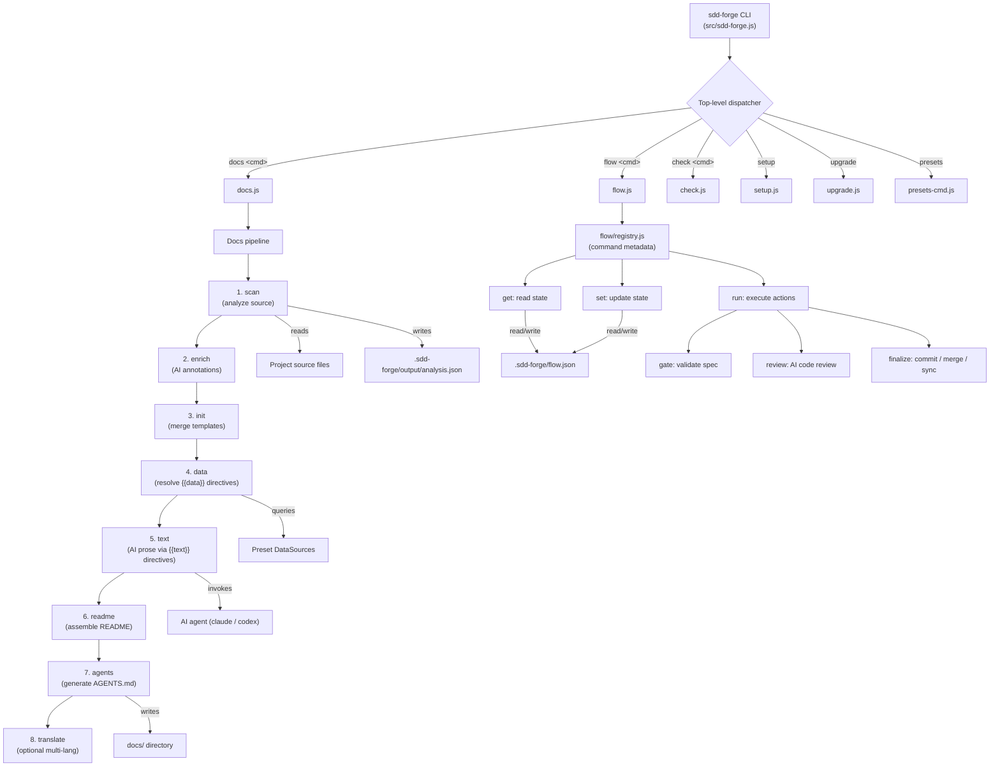
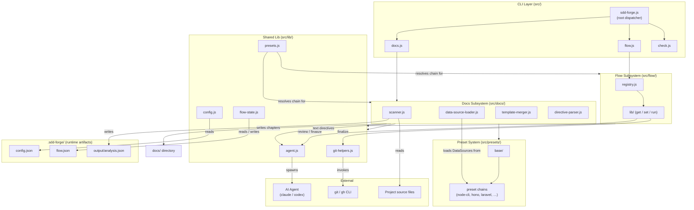

<!-- {{data("base.docs.langSwitcher", {labels: "relative"})}} -->
[日本語](ja/overview.md) | **English**
<!-- {{/data}} -->

# Tool Overview and Architecture

## Description

<!-- {{text({prompt: "Write a 1-2 sentence overview of this chapter. Include the tool's purpose, the problem it solves, and its primary use cases."})}} -->

This chapter introduces sdd-forge, a CLI tool that automates technical documentation generation from source code analysis and orchestrates a structured, AI-assisted Spec-Driven Development workflow. It covers the tool's core purpose, high-level architecture, key concepts, and the typical steps to get from installation to first documentation output.
<!-- {{/text}} -->

## Content

### Purpose

<!-- {{text({prompt: "Describe the problem this CLI tool solves and its target users. Derive the purpose from package.json and README."})}} -->

Engineering teams that rely on AI coding assistants face two persistent problems: technical documentation that drifts out of sync as code evolves, and AI agents that lack a deterministic, stateful workflow to take a feature from written requirements through to merged code. sdd-forge solves both by combining a source-code analysis pipeline that generates and refreshes Markdown documentation automatically with a three-phase SDD workflow (Plan → Implement → Finalize) whose state survives AI context resets.

The tool targets software developers and teams who use AI agents such as Claude Code and want accurate, always-current documentation alongside a repeatable, auditable development process. It runs entirely on Node.js built-in modules with no external dependencies and requires Node.js 18 or later.
<!-- {{/text}} -->

### Architecture Overview

<!-- {{text({prompt: "Generate a mermaid flowchart showing the tool's overall architecture. Include the dispatch structure from entry point to subcommands and the main processing flow (input → processing → output). Output only the mermaid code block.", mode: "deep"})}} -->


<!-- {{/text}} -->

### Key Concepts

<!-- {{text({prompt: "Explain the key concepts and terminology needed to understand this tool in table format. Extract the main concepts from source code."})}} -->

| Concept | Description |
|---|---|
| Preset | A framework-specific configuration bundle (e.g., `node-cli`, `hono`, `laravel`) that defines scan glob patterns, DataSource classes, and Markdown templates; presets inherit from a parent via a chain |
| DataSource | An OOP class inside a preset that either parses source files (Scannable variant) or formats extracted data into Markdown tables for `{{data}}` directives |
| `analysis.json` | JSON artifact produced by the `scan` step; contains structured source data such as files, classes, routes, and configuration entries |
| `{{data()}}` directive | A static template directive resolved by querying a DataSource; the result is a Markdown table injected into the document |
| `{{text()}}` directive | A dynamic template directive resolved by sending the directive's prompt to the configured AI agent; the result is AI-generated narrative prose |
| Docs pipeline | The sequential eight-step process (scan → enrich → init → data → text → readme → agents → translate) that produces complete, up-to-date documentation |
| Flow | The Spec-Driven Development workflow, persisted in `flow.json`, that guides a feature through phases: draft, spec, test, impl, and finalize |
| Spec | A structured Markdown file (`spec.md`) created at the start of a flow; it defines the feature requirements and scope that gate validation checks against |
| Gate | A validation checkpoint within the flow that verifies the current phase's requirements are met before the workflow may advance |
| Template inheritance | A mechanism by which preset Markdown templates extend parent templates using `` and `` syntax, enabling presets to share and override content |
| `config.json` | The project-level configuration file at `.sdd-forge/config.json` specifying preset type, language, AI agent, and documentation style |
| `flow.json` | A persistent state file at `.sdd-forge/flow.json` that stores the current workflow step statuses, requirements, metrics, and notes across AI context resets |
<!-- {{/text}} -->

### Typical Usage Flow

<!-- {{text({prompt: "Describe the typical steps from installation to first output in step format. Derive the steps from help output and command definitions in the source code."})}} -->

**Step 1 — Install the tool**

Install sdd-forge globally using npm:

```bash
npm install -g sdd-forge
```

Node.js 18 or later is required. AI-powered features (text generation, code review, enrichment) additionally require the `claude` CLI to be installed and authenticated on the host machine.

**Step 2 — Run the setup wizard**

Navigate to your project root and run:

```bash
sdd-forge setup
```

The interactive wizard prompts for the project name, preset type (e.g., `node-cli`, `hono`, `laravel`), operating language, output languages for multi-language documentation, AI agent selection, and documentation style guidance. On completion it writes `.sdd-forge/config.json` and creates the `docs/` and `specs/` directories.

**Step 3 — Build documentation**

```bash
sdd-forge docs build
```

This executes the full eight-step pipeline. The tool scans your source files, enriches the extracted data with AI annotations, merges preset templates, resolves all `{{data}}` and `{{text}}` directives, and writes the finished Markdown chapters to `docs/`. A `README.md` and an `AGENTS.sdd.md` for Claude Code integration are also generated.

**Step 4 — Review the output**

Open the `docs/` directory to review the generated chapters. The `README.md` in the project root is assembled from the chapter structure and reflects the current state of your codebase.

**Step 5 — (Optional) Start a Spec-Driven Development workflow**

To use the structured SDD workflow for a new feature:

```bash
sdd-forge flow prepare --title "Feature Name" --base main
```

This creates a `spec.md`, a dedicated git branch or worktree, and initialises `flow.json` to begin the plan → implement → finalize cycle.
<!-- {{/text}} -->

# System Overview

<!-- {{data("monorepo.monorepo.apps", {labels: "overview", ignoreError: true})}} -->
<!-- {{/data}} -->

<!-- {{text({prompt: "Write a 1-2 sentence overview of this project."})}} -->

sdd-forge is a Node.js CLI tool that automates technical documentation generation through source code analysis and orchestrates an AI-assisted, spec-driven development workflow for software projects. It operates entirely with Node.js built-in modules, integrates with AI agents such as Claude or Codex, and maintains documentation accuracy by deriving content directly from the live codebase rather than relying on manual authoring.
<!-- {{/text}} -->


## Description

<!-- {{text({prompt: "Write a 1-2 sentence overview of this chapter. Include the project's architecture and whether it integrates with external systems."})}} -->

This chapter describes the internal structure of sdd-forge, covering its major subsystems, component responsibilities, and the data flows between them. The tool integrates with external AI agents (Claude, Codex) for text generation and code review, and with the Git and GitHub CLI for branch management and merge operations during the Spec-Driven Development workflow.
<!-- {{/text}} -->

## Content
### Architecture Diagram

<!-- {{text({prompt: "Generate a mermaid flowchart showing the project architecture. Include data flows between major components. Output only the mermaid code block."})}} -->


<!-- {{/text}} -->
### Component Responsibilities

<!-- {{text({prompt: "Describe the major components with their location, responsibilities, and I/O in table format.", mode: "deep"})}} -->

| Component | Location | Responsibilities | Input | Output |
|---|---|---|---|---|
| Root dispatcher | `src/sdd-forge.js` | Parses the top-level subcommand and routes to the appropriate namespace handler; handles `--version` and `--help` flags | Raw CLI arguments | Delegates to sub-dispatcher |
| Docs dispatcher | `src/docs.js` | Orchestrates the docs pipeline; routes individual `docs <cmd>` invocations to step implementations | CLI arguments, `config.json` | Triggers pipeline step functions |
| Flow dispatcher | `src/flow.js` | Resolves flow context, reads `flow.json`, and delegates to `flow/registry.js` | CLI arguments, `flow.json` | JSON or plain-text output to stdout |
| Check dispatcher | `src/check.js` | Routes `check <cmd>` calls for config validation, freshness checks, and scan verification | CLI arguments | Validation result output |
| `scanner.js` | `src/docs/lib/` | Discovers source files matching preset glob patterns; computes content hashes for incremental cache invalidation | Source directory, scan config from preset | `analysis.json` entries |
| `data-source-loader.js` | `src/docs/lib/` | Loads DataSource classes from each preset in the inheritance chain; merges user overrides and injects context | Preset chain array, `analysis.json`, overrides | Instantiated DataSource objects |
| `template-merger.js` | `src/docs/lib/` | Resolves `` / `` inheritance to produce final Markdown templates | Preset template directories | Merged Markdown template strings |
| `directive-parser.js` | `src/docs/lib/` | Parses `{{data()}}` and `{{text()}}` directives and dispatches each to its resolver | Merged template strings | Fully resolved Markdown content |
| `flow/registry.js` | `src/flow/` | Single source of truth for all flow command metadata: argument definitions, hook callbacks, and help text | — | Command definition objects consumed by the flow dispatcher |
| `agent.js` | `src/lib/` | Spawns the configured AI agent as a child process; injects prompts via argv or stdin; normalises JSON output and tracks token usage | Prompt string, agent configuration | AI-generated text or structured JSON |
| `flow-state.js` | `src/lib/` | Loads and saves `flow.json`; derives the current workflow phase from step status fields | `.sdd-forge/flow.json` | Parsed and typed state object |
| `presets.js` | `src/lib/` | Discovers preset directories on disk; resolves parent inheritance chains; deduplicates multi-preset hierarchies | Preset root directory, `config.type` value | Ordered preset chain array |
| `git-helpers.js` | `src/lib/` | Wraps `git` and `gh` CLI calls for branch creation, worktree detection, squash merging, and pull request operations | Shell command results | Branch status objects, merge outcomes |
<!-- {{/text}} -->
### External Integrations

<!-- {{text({prompt: "If there are external system integrations, describe their purpose and connection method in table format."})}} -->

| External System | Purpose | Connection Method |
|---|---|---|
| AI Agent — Claude (Anthropic) | Generates `{{text}}` prose directives, enriches `analysis.json` entries with semantic metadata (summary, chapter, role), and performs code review during `flow run review` | Spawned as a child process via `child_process.spawn()`; prompts are passed as CLI arguments; payloads exceeding 100 KB are piped via stdin |
| AI Agent — Codex (OpenAI) | Alternative AI provider for text generation and code review; selected when `agent.default` is set to `"codex"` in `config.json` | Same child-process invocation model as Claude; provider command is configurable in `agent.providers` within `config.json` |
| GitHub CLI (`gh`) | Retrieves GitHub issue data for flow context, creates pull requests, and assists with branch merging during `flow run finalize` | Shell invocation through `src/lib/git-helpers.js` |
| Git | Branch creation, worktree management, file staging, committing, and squash-merge operations during the finalize step | Shell invocation through `src/lib/git-helpers.js` |
<!-- {{/text}} -->
### Environment Differences

<!-- {{text({prompt: "Describe the configuration differences across environments (local/staging/production)."})}} -->

sdd-forge is a developer-local CLI tool and does not define named deployment environments (local / staging / production) in the traditional sense. All runtime behavior is governed by `.sdd-forge/config.json` within the repository. The following settings typically differ between individual developer machines and CI environments:

| Setting | Location | Typical developer machine value | Typical CI value |
|---|---|---|---|
| `agent.default` | `config.json` | `"claude"` — assumes an interactive Claude CLI session | `"claude"` or `"codex"` depending on which agent credentials are available in the CI environment |
| `agent.providers.*.timeout` | `config.json` | `300` seconds (default) | May be increased for long-running text generation jobs in automated pipelines |
| `concurrency` | `config.json` | `5` parallel file processing tasks | May be reduced on memory-constrained runners |
| AI agent binary | Host environment | `claude` CLI installed and authenticated by the developer | Must be installed and authenticated as part of the CI setup step |
| `docs.languages` | `config.json` | Typically a single language during active development | May include all supported languages for a full pipeline run on merge or release |

The `flow.json` state file is written to `.sdd-forge/` within the repository and is intended to be committed to version control so that workflow state is preserved across agent context resets and is visible to all contributors.
<!-- {{/text}} -->

---

<!-- {{data("base.docs.nav")}} -->
[Technology Stack and Operations →](stack_and_ops.md)
<!-- {{/data}} -->
