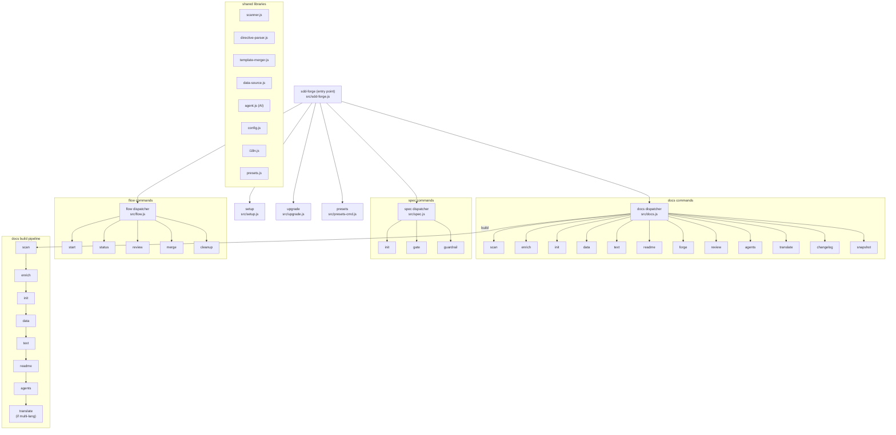

# 01. Tool Overview and Architecture

## Description

<!-- {{text: Write a 1-2 sentence overview of this chapter. Include the tool's purpose, the problem it solves, and its primary use cases.}} -->

This chapter introduces sdd-forge, a CLI tool for Spec-Driven Development that automates technical documentation generation from source code analysis. It covers the tool's architecture, key concepts, and the typical workflow from project setup to document output.

<!-- {{/text}} -->

## Content

### Purpose

<!-- {{text: Describe the problem this CLI tool solves and its target users. Derive the purpose from package.json and README.}} -->

sdd-forge addresses the challenge of keeping technical documentation accurate and up-to-date with a constantly evolving codebase. Manually written documentation tends to drift from reality over time, creating confusion for developers who rely on it.

This tool targets development teams that need to maintain comprehensive project documentation — including architecture overviews, API references, and developer guides — without the overhead of manual authoring. By analyzing source code directly, sdd-forge extracts structural information (classes, controllers, models, routes, database schemas) and uses AI to generate human-readable documentation organized into chapters.

sdd-forge supports multiple project types including web applications (CakePHP 2, Laravel, Symfony) and CLI/library projects, with a preset system that adapts scanning and documentation strategies to each framework's conventions. It requires only Node.js (>=18.0.0) and has zero external dependencies.

<!-- {{/text}} -->

### Architecture Overview

<!-- {{text[mode=deep]: Generate a mermaid flowchart showing the tool's overall architecture. Include the dispatch structure from entry point to subcommands and the main processing flow (input → processing → output). Output only the mermaid code block.}} -->



<!-- {{/text}} -->

### Key Concepts

<!-- {{text: Explain the key concepts and terminology needed to understand this tool in table format. Extract the main concepts from source code.}} -->

| Concept | Description |
|---|---|
| **Preset** | A framework-specific configuration bundle (e.g., `symfony`, `laravel`, `cakephp2`, `node-cli`) that defines DataSources, chapter templates, and scan logic tailored to a particular project type. Presets are layered: a child preset inherits from its parent (e.g., `symfony` extends `webapp`). |
| **DataSource** | A class responsible for matching source files, scanning them to extract structured data, and providing resolve methods that return markdown tables or text. Each DataSource (e.g., `EntitiesSource`, `ModelsSource`) handles a specific domain such as models, controllers, or migrations. |
| **Directive** | A template marker embedded in documentation chapter files. `{{data: source.method("labels")}}` inserts structured data from a DataSource, while `{{text: instruction}}` triggers AI-generated prose. Directives define *where* content appears, ensuring stable document structure. |
| **Chapter** | A single markdown file within `docs/` that represents one section of the generated documentation. Chapter ordering is controlled by the `chapters` array in `preset.json` or `config.json`. |
| **Build Pipeline** | The end-to-end documentation generation sequence: `scan → enrich → init → data → text → readme → agents → translate`. Running `sdd-forge docs build` executes all steps in order. |
| **Enrichment** | An AI-powered analysis step that takes raw scan output and assigns roles, summaries, details, and chapter classifications to each source file entry, providing context for downstream text generation. |
| **Flow** | The Spec-Driven Development workflow managed by `sdd-forge flow` commands. It orchestrates the cycle from spec creation through gate checks, implementation, review, and merge. |
| **Spec** | A structured specification document created by `sdd-forge spec init` that defines requirements before implementation begins. Specs are validated by `spec gate` to ensure completeness. |
| **Config** | Project-specific settings stored in `.sdd-forge/config.json`, including project type, output language, documentation style, and AI agent configuration. Generated by `sdd-forge setup`. |

<!-- {{/text}} -->

### Typical Usage Flow

<!-- {{text: Describe the typical steps from installation to first output in step format. Derive the steps from help output and command definitions in the source code.}} -->

1. **Install sdd-forge** — Install the package globally via npm:
   ```
   npm install -g sdd-forge
   ```

2. **Initialize your project** — Run the interactive setup wizard in your project root. This creates `.sdd-forge/config.json`, `AGENTS.md`, `CLAUDE.md`, and deploys skill templates:
   ```
   sdd-forge setup
   ```
   The wizard prompts you to select a project type (webapp/cli/library), framework preset, documentation purpose, tone, output languages, and AI agent provider.

3. **Generate documentation** — Run the full build pipeline to scan your source code and produce documentation under `docs/`:
   ```
   sdd-forge docs build
   ```
   This executes the complete pipeline: `scan → enrich → init → data → text → readme → agents`, plus `translate` if multiple output languages are configured.

4. **Run individual steps (optional)** — You can execute pipeline steps independently for fine-grained control:
   ```
   sdd-forge docs scan      # Analyze source code, output analysis.json
   sdd-forge docs enrich    # AI-enrich the analysis with roles and summaries
   sdd-forge docs data      # Resolve {{data}} directives in chapter files
   sdd-forge docs text      # Generate {{text}} content via AI
   ```

5. **Use the SDD workflow (optional)** — For feature development driven by specifications:
   ```
   sdd-forge flow start --request "add login feature"
   sdd-forge flow status
   ```
   The flow orchestrates spec creation, gate validation, implementation, review, and merge as a structured development cycle.

<!-- {{/text}} -->
