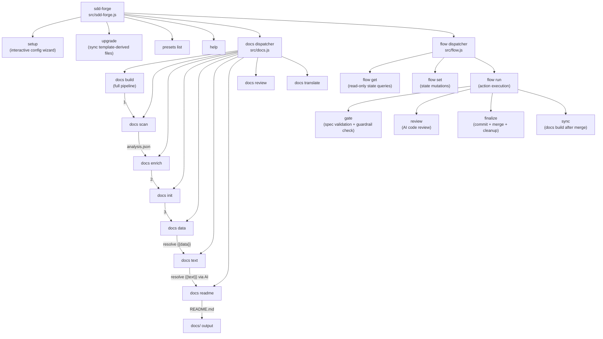

<!-- {{data("base.docs.langSwitcher", {labels: "relative"})}} -->
**English** | [日本語](ja/overview.md)
<!-- {{/data}} -->

# Tool Overview and Architecture

## Description

<!-- {{text({prompt: "Write a 1-2 sentence overview of this chapter. Include the tool's purpose, the problem it solves, and its primary use cases."})}} -->

sdd-forge is a CLI tool that combines automated documentation generation — driven by static source code analysis — with a structured Spec-Driven Development (SDD) workflow for teams using AI coding agents. This chapter introduces the tool's purpose, describes its overall architecture, and defines the key concepts needed to work with it effectively.
<!-- {{/text}} -->

## Content

### Purpose

<!-- {{text({prompt: "Describe the problem this CLI tool solves and its target users. Derive the purpose from package.json and README."})}} -->

Development teams using AI agents frequently encounter two persistent challenges: documentation that falls out of sync with code, and AI assistants that drift outside the intended scope of a task. sdd-forge addresses both problems in a single tool.

On the documentation side, the tool analyzes source code statically — parsing files, extracting function signatures, module relationships, and configuration — and generates structured Markdown documentation through a pipeline of commands (`scan → enrich → init → data → text → readme`). Because generation is driven from the actual source, documentation reflects the code as it exists rather than as it was last remembered.

On the workflow side, sdd-forge enforces a **plan → implement → merge** lifecycle called Spec-Driven Development. A specification document is written and validated through a deterministic gate check before any implementation begins. Guardrails defined in the project configuration constrain what the AI may change, and each phase transition is logged in a structured flow state file.

The primary target users are software engineers and development teams who:
- Use Claude Code or other AI agents for day-to-day coding tasks
- Need always-current technical documentation for onboarding, audits, or maintenance
- Want to reduce rework caused by vague requirements or unchecked AI scope creep
- Work with Node.js, PHP, Python, or YAML-based projects across a variety of frameworks (Next.js, Hono, Laravel, CakePHP 2, Symfony, and others)
<!-- {{/text}} -->

### Architecture Overview

<!-- {{text({prompt: "Generate a mermaid flowchart showing the tool's overall architecture. Include the dispatch structure from entry point to subcommands and the main processing flow (input → processing → output). Output only the mermaid code block.", mode: "deep"})}} -->


<!-- {{/text}} -->

### Key Concepts

<!-- {{text({prompt: "Explain the key concepts and terminology needed to understand this tool in table format. Extract the main concepts from source code."})}} -->

| Concept | Description |
|---|---|
| **Spec-Driven Development (SDD)** | A development methodology in which a specification document is written and validated before any implementation begins, ensuring AI agents and developers stay aligned with the agreed scope. |
| **SDD Flow** | The three-phase lifecycle managed by sdd-forge: **plan** (draft requirements and create a spec), **implement** (write code and run AI review), and **merge** (commit, sync docs, and clean up). |
| **Spec Gate** | A deterministic validation checkpoint (`flow run gate`) that checks the specification against guardrail rules. Implementation is only permitted after a PASS result. |
| **Guardrail** | A project-defined rule stored in configuration that restricts what an AI agent or developer may change during a flow, preventing unintended scope expansion. |
| **Preset** | A framework-specific configuration bundle — containing templates, DataSource classes, and scan rules — that tailors documentation generation for a given tech stack (e.g., `nextjs`, `laravel`, `node-cli`). Presets form an inheritance chain rooted at `base`. |
| **analysis.json** | The structured output of `docs scan`, containing metadata extracted from every source file: function signatures, module relationships, exports, and configuration values. |
| **`{{data}}` directive** | A template placeholder resolved with structured data returned by a named DataSource method. The result is deterministic and reproducible without AI involvement. |
| **`{{text}}` directive** | A template placeholder resolved by sending a prompt and the surrounding analysis data to an AI agent. Content between the opening and closing tags is replaced on each run. |
| **DataSource** | A class (one per preset or cross-preset namespace) that exposes named methods supplying data to `{{data}}` directives. DataSources read from `analysis.json` and project configuration. |
| **Flow State** | A JSON file (`flow.json`) that persists the current phase, step statuses, requirements, notes, and metrics for an active SDD flow. |
| **AGENTS.md** | A project-specific context file read by AI agents at session start. Generated and updated by `sdd-forge docs agents`, it describes the project structure, design decisions, and development rules. |
| **Enrich** | An AI-powered pipeline step (`docs enrich`) that annotates each entry in `analysis.json` with a role description, a plain-language summary, and a chapter classification, making downstream text generation more accurate. |
<!-- {{/text}} -->

### Typical Usage Flow

<!-- {{text({prompt: "Describe the typical steps from installation to first output in step format. Derive the steps from help output and command definitions in the source code."})}} -->

**Step 1 — Install the package**

Install sdd-forge globally so the `sdd-forge` binary is available in your PATH:

```bash
npm install -g sdd-forge
```

Node.js 18 or later is required.

**Step 2 — Run the setup wizard**

From the root of your project, run the interactive setup command:

```bash
sdd-forge setup
```

The wizard prompts for the project language, framework type (preset), documentation language settings, and AI agent configuration. On completion it writes `.sdd-forge/config.json` and creates an `AGENTS.md` file (with a `CLAUDE.md` symlink) for AI agent context.

**Step 3 — Generate documentation**

Run the full documentation pipeline with a single command:

```bash
sdd-forge docs build
```

This executes the following stages in sequence:
1. `scan` — parses source files and writes `analysis.json`
2. `enrich` — AI annotates each entry with role, summary, and chapter classification
3. `init` — initializes the `docs/` directory from preset templates (skipped if already present)
4. `data` — resolves all `{{data}}` directives using the analysis
5. `text` — resolves all `{{text}}` directives via AI generation
6. `readme` — regenerates `README.md` from the docs structure

**Step 4 — Review the output**

Inspect the generated files in `docs/` and the updated `README.md`. Run `sdd-forge docs review` to check documentation quality and completeness.

**Step 5 — Keep documentation in sync**

After code changes, re-run `sdd-forge docs build` (or individual pipeline steps such as `docs scan` followed by `docs text`) to update documentation to reflect the current state of the source.

**Step 6 (optional) — Use the SDD flow for new features**

When developing new functionality with an AI agent, use the flow commands (or the corresponding Claude Code skills `/sdd-forge.flow-plan`, `/sdd-forge.flow-impl`, `/sdd-forge.flow-finalize`) to enforce the plan → implement → merge lifecycle with spec gating and guardrail checks.
<!-- {{/text}} -->

---

<!-- {{data("base.docs.nav")}} -->
[Technology Stack and Operations →](stack_and_ops.md)
<!-- {{/data}} -->
