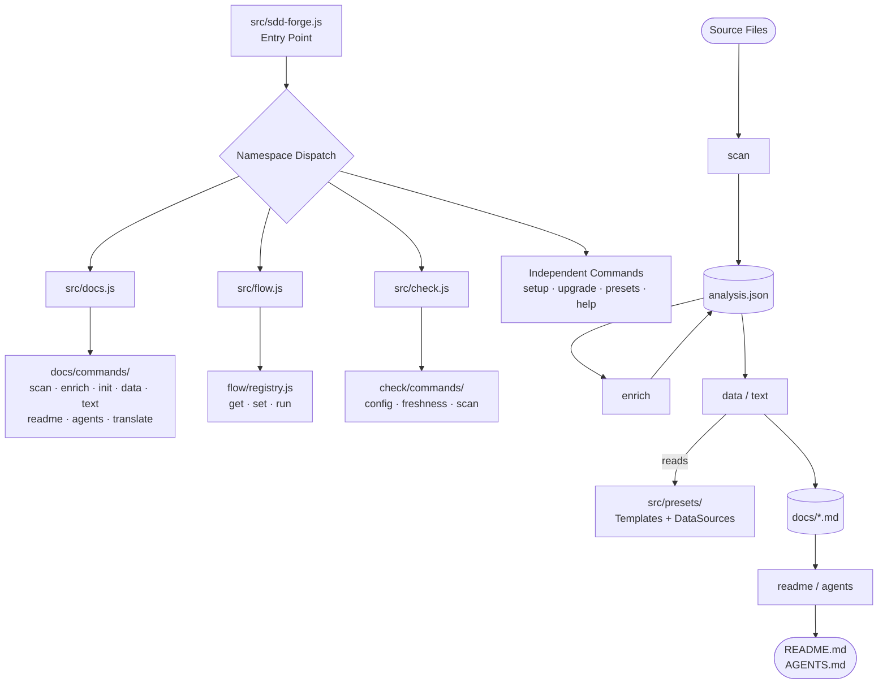
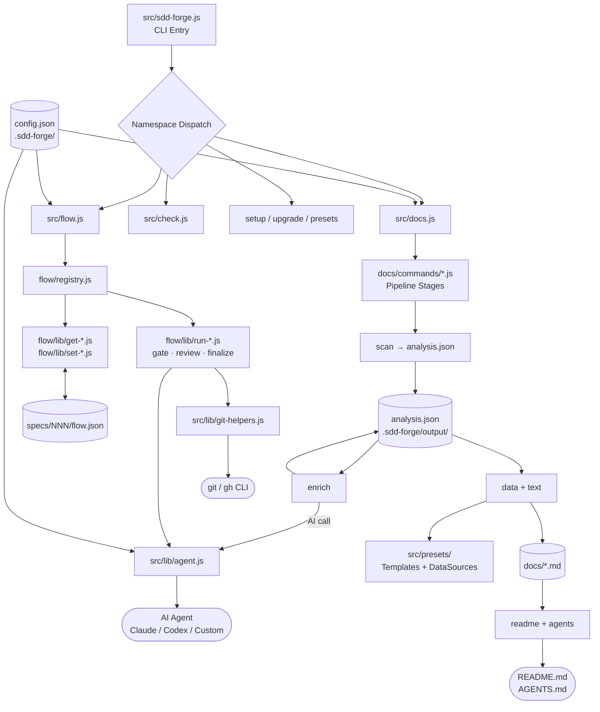

<!-- {{data("base.docs.langSwitcher", {labels: "relative"})}} -->
[日本語](ja/overview.md) | **English**
<!-- {{/data}} -->

# Tool Overview and Architecture

## Description

<!-- {{text({prompt: "Write a 1-2 sentence overview of this chapter. Include the tool's purpose, the problem it solves, and its primary use cases."})}} -->

This chapter introduces sdd-forge, a CLI tool that automates documentation generation from source code analysis and enforces a Spec-Driven Development (SDD) workflow. It describes the tool's purpose—eliminating documentation drift and ungoverned AI implementation—along with its internal architecture and primary use cases for teams working with AI coding agents.
<!-- {{/text}} -->

## Content

### Purpose

<!-- {{text({prompt: "Describe the problem this CLI tool solves and its target users. Derive the purpose from package.json and README."})}} -->

Engineering teams using AI coding agents face two persistent problems: documentation that drifts out of sync with evolving source code, and AI agents that implement features without validated specifications. sdd-forge addresses both by providing a pipeline that automatically regenerates structured documentation from live source analysis, and a three-phase SDD workflow that gates implementation behind programmatic spec validation. The tool targets software development teams—particularly those using Claude Code, Codex CLI, or similar AI agents—who need always-current documentation and a disciplined process for feature development.

The package is distributed as a Node.js CLI (`sdd-forge`) and requires no external npm dependencies, relying solely on Node.js built-in modules. It is configured per project via `.sdd-forge/config.json` and supports over 35 built-in presets covering technology stacks such as Node.js CLI tools, Next.js, Laravel, Hono, Drizzle ORM, Cloudflare Workers, and more.
<!-- {{/text}} -->

### Architecture Overview

<!-- {{text({prompt: "Generate a mermaid flowchart showing the tool's overall architecture. Include the dispatch structure from entry point to subcommands and the main processing flow (input → processing → output). Output only the mermaid code block.", mode: "deep"})}} -->

<!-- {{/text}} -->

### Key Concepts

<!-- {{text({prompt: "Explain the key concepts and terminology needed to understand this tool in table format. Extract the main concepts from source code."})}} -->

| Concept | Description |
|---|---|
| **Preset** | A named bundle of scan patterns, chapter templates, and DataSource classes (e.g., `node-cli`, `laravel`). Presets form a single-inheritance chain via the `parent` field in `preset.json`. |
| **Analysis** | A structured JSON snapshot (`.sdd-forge/output/analysis.json`) produced by `docs scan`, containing file metadata, classes, methods, imports, exports, and configuration values extracted from source code. |
| **DataSource** | A class that reads `analysis.json` and returns structured data for insertion into a documentation template via `{{data(...)}}` directives. |
| **Directive** | A special comment in a markdown template: `{{data(...)}}` for structured data tables and `{{text(...)}}` for AI-generated prose. Both are replaced in-place during the pipeline. |
| **Pipeline** | The ordered documentation generation sequence: `scan → enrich → init → data → text → readme → agents → [translate]`. Each stage is also executable individually. |
| **Flow** | A single SDD cycle with three phases—Plan, Implement, Finalize—whose state is persisted in `specs/<NNN>/flow.json`. |
| **Spec** | A specification document (`spec.md`) created in the Plan phase that defines requirements and acceptance criteria before any implementation begins. |
| **Guardrail** | A set of design principles defined in a preset's `guardrail.json` that a spec must satisfy, validated by `flow run gate` before implementation is allowed. |
| **Template** | A markdown file in a preset's `templates/` directory that structures a documentation chapter using directives and `` inheritance markers. |
| **Template Inheritance** | The `` / `` mechanism that allows child preset templates to override specific sections of a parent template without duplicating the entire file. |
<!-- {{/text}} -->

### Typical Usage Flow

<!-- {{text({prompt: "Describe the typical steps from installation to first output in step format. Derive the steps from help output and command definitions in the source code."})}} -->

1. **Install the package globally** — Run `npm install -g sdd-forge` to make the `sdd-forge` command available in your terminal.

2. **Run the interactive setup wizard** — In your project root, run `sdd-forge setup`. The wizard prompts for your project's type (preset, e.g., `node-cli`), documentation output languages, default language, and AI agent provider. It writes `.sdd-forge/config.json` and creates the initial skill files.

3. **Scan source code** — Run `sdd-forge docs scan`. The scanner traverses source files defined by the preset's scan patterns and produces `.sdd-forge/output/analysis.json` with structured metadata.

4. **Enrich the analysis** — Run `sdd-forge docs enrich`. The AI agent adds summaries, chapter assignments, and role annotations to the entries in `analysis.json`.

5. **Initialize chapter templates** — Run `sdd-forge docs init`. The preset's template inheritance chain is resolved and chapter files are written to `docs/`.

6. **Populate structured data** — Run `sdd-forge docs data`. Each `{{data(...)}}` directive in `docs/*.md` is replaced with a generated table from the corresponding DataSource.

7. **Generate AI prose** — Run `sdd-forge docs text`. Each `{{text(...)}}` directive is replaced with AI-generated content based on the directive's prompt and the current analysis.

8. **Build README and agent context** — Run `sdd-forge docs readme` and `sdd-forge docs agents` to produce `README.md` and `AGENTS.md`.

9. **Run the full pipeline at once** — Use `sdd-forge docs build` as a shortcut to execute steps 3–8 in a single command.
<!-- {{/text}} -->

# System Overview

<!-- {{data("monorepo.monorepo.apps", {labels: "overview", ignoreError: true})}} -->
<!-- {{/data}} -->

<!-- {{text({prompt: "Write a 1-2 sentence overview of this project."})}} -->

sdd-forge is a CLI tool that automates documentation generation from source code analysis and provides a Spec-Driven Development workflow for teams building with AI coding agents. It keeps project documentation synchronized with the codebase and enforces specification validation before implementation begins.
<!-- {{/text}} -->

## Description

<!-- {{text({prompt: "Write a 1-2 sentence overview of this chapter. Include the project's architecture and whether it integrates with external systems."})}} -->

This chapter describes the internal component architecture of sdd-forge, showing how the CLI dispatcher, documentation pipeline, SDD flow engine, preset system, and shared libraries relate to one another. The tool integrates with external AI agent providers (Claude CLI, Codex CLI, or custom commands) and optionally with Git and the GitHub CLI for branch management and pull request workflows.
<!-- {{/text}} -->

## Content
### Architecture Diagram

<!-- {{text({prompt: "Generate a mermaid flowchart showing the project architecture. Include data flows between major components. Output only the mermaid code block."})}} -->

<!-- {{/text}} -->
### Component Responsibilities

<!-- {{text({prompt: "Describe the major components with their location, responsibilities, and I/O in table format.", mode: "deep"})}} -->

| Component | Location | Responsibility | Input | Output |
|---|---|---|---|---|
| **CLI Entry** | `src/sdd-forge.js` | Parse the top-level command and dispatch to namespace handlers or independent commands | Raw CLI arguments | Delegated command invocation |
| **Docs Dispatcher** | `src/docs.js` | Route `docs <subcmd>` to the corresponding pipeline stage handler | `docs` subcommand + args | Pipeline stage execution |
| **Flow Dispatcher** | `src/flow.js` | Route `flow <subcmd>` to registry-defined handlers with hook support | `flow` subcommand + args | Registry-resolved command execution |
| **Flow Registry** | `src/flow/registry.js` | Single declarative source of truth for all flow subcommands; manages lazy imports, argument schemas, and pre/post hooks | Command name lookup | Resolved handler, hooks, and argument spec |
| **Scanner** | `src/docs/commands/scan.js` | Traverse source files, invoke language parsers, and write analysis metadata | Source files (via scan patterns in preset) | `.sdd-forge/output/analysis.json` |
| **Enricher** | `src/docs/commands/enrich.js` | Invoke AI agent to add summaries, chapter assignments, and role metadata to analysis entries | `analysis.json` | Enriched `analysis.json` |
| **Template Init** | `src/docs/commands/init.js` | Resolve preset parent chain, merge `` overrides, and write chapter files | Preset templates, parent chain | `docs/*.md` chapter files |
| **Data Stage** | `src/docs/commands/data.js` | Execute `{{data(...)}}` directives by calling DataSource classes with analysis data | `docs/*.md`, `analysis.json`, DataSources | Updated `docs/*.md` with data tables |
| **Text Stage** | `src/docs/commands/text.js` | Execute `{{text(...)}}` directives via AI agent calls using per-directive prompts | `docs/*.md`, `analysis.json`, AI prompts | Updated `docs/*.md` with generated prose |
| **Readme Builder** | `src/docs/commands/readme.js` | Assemble `README.md` from chapter summaries, navigation links, and project metadata | `docs/*.md`, `config.json` | `README.md` |
| **Agents Builder** | `src/docs/commands/agents.js` | Generate the AI agent context file from project metadata, structure, and docs | `package.json`, `config.json`, `docs/` | `AGENTS.md` |
| **Preset System** | `src/presets/`, `src/lib/presets.js` | Auto-discover built-in and project-local presets; resolve inheritance chains; expose templates and DataSources | `config.json` `type` field | Resolved preset object with full parent chain |
| **Config Loader** | `src/lib/config.js` | Load, parse, and validate `.sdd-forge/config.json`; expose path helper utilities | `.sdd-forge/config.json` | Validated config object |
| **Agent Spawner** | `src/lib/agent.js` | Spawn AI agent subprocesses for enrichment, prose generation, and code review | Provider config, system prompt, user prompt | Parsed JSON response string |
| **Flow State** | `src/lib/flow-state.js` | Read and write `flow.json`; manage step statuses, phases, requirements, and metrics | `specs/<NNN>/flow.json` | Typed flow state object |
| **Language Parsers** | `src/docs/lib/lang/*.js` | Parse, minify, and extract structural metadata from source files per language (JS, PHP, etc.) | Raw source file content | Structured analysis entries |
| **Directive Parser** | `src/docs/lib/directive-parser.js` | Identify and resolve `{{data}}`, `{{text}}`, and `` directives within markdown | Template markdown string | Resolved markdown content |
| **Git Helpers** | `src/lib/git-helpers.js` | Wrap `git` and `gh` CLI operations used in flow actions | Command parameters | Git operation results or error |
| **Check Commands** | `src/check/commands/*.js` | Validate configuration schema, detect stale documentation, and verify scan integrity | `config.json`, `analysis.json`, `docs/` | Validation report with pass/fail status |
<!-- {{/text}} -->
### External Integrations

<!-- {{text({prompt: "If there are external system integrations, describe their purpose and connection method in table format."})}} -->

| System | Purpose | Connection Method |
|---|---|---|
| **Claude CLI** | AI prose generation for `{{text}}` directives, analysis enrichment, spec gate validation, and code review | Spawned as a subprocess by `src/lib/agent.js`; configured via `agent.providers.claude` in `config.json`; communicates via stdout/stderr |
| **Codex CLI** | Alternative AI agent provider for all AI-driven pipeline steps | Spawned as a subprocess by `src/lib/agent.js`; configured via `agent.providers.codex`; same interface as Claude CLI |
| **Custom AI Providers** | Support for any AI agent accessible via a CLI command | Defined in `agent.providers` as a command template with argument placeholders; spawned as a subprocess by `agent.js` |
| **Git CLI** | Branch creation, worktree management, commit, merge, and push operations during SDD flow execution | Called directly via `git` CLI in `src/lib/git-helpers.js`; must be installed and available on PATH |
| **GitHub CLI (`gh`)** | Link flow specs to GitHub Issues and support pull request creation and management during finalization | Called via `src/lib/git-helpers.js`; requires `gh` installed, authenticated, and `commands.gh: "enable"` set in `config.json` |
<!-- {{/text}} -->
### Environment Differences

<!-- {{text({prompt: "Describe the configuration differences across environments (local/staging/production)."})}} -->

sdd-forge is a local developer CLI tool and does not have built-in environment tiers (local, staging, production). All configuration is stored in a single `.sdd-forge/config.json` file at the project root.

Differences across runtime contexts are managed through the following configuration fields:

| Field | Local Development | CI / Automated Pipelines |
|---|---|---|
| `agent.timeout` | Can be left at the default; interactive sessions tolerate longer waits | Recommended to set explicitly to prevent pipeline hangs |
| `agent.retryCount` | Lower values acceptable for interactive use | Higher values recommended for unattended runs |
| `concurrency` | Default (5) suits most workstations | May be increased on CI hosts with more CPU cores |
| `agent.profiles` | Named profiles can point to a developer's local AI provider | Profiles can be switched to a CI-appropriate provider command |
| `commands.gh` | Set to `"enable"` when `gh` is authenticated on the developer's machine | Set to `"enable"` only if the CI runner has `gh` authenticated with a token |
| `logs.enabled` | Optional; useful for debugging agent calls locally | Can be enabled to capture JSONL prompt logs for audit trails |

Documentation output files (`docs/`, `README.md`, `AGENTS.md`) are generated artifacts committed to the repository and are not environment-specific. The SDD flow state in `specs/<NNN>/flow.json` is local to the developer's worktree and is not shared between environments.
<!-- {{/text}} -->

---

<!-- {{data("base.docs.nav")}} -->
[Technology Stack and Operations →](stack_and_ops.md)
<!-- {{/data}} -->
