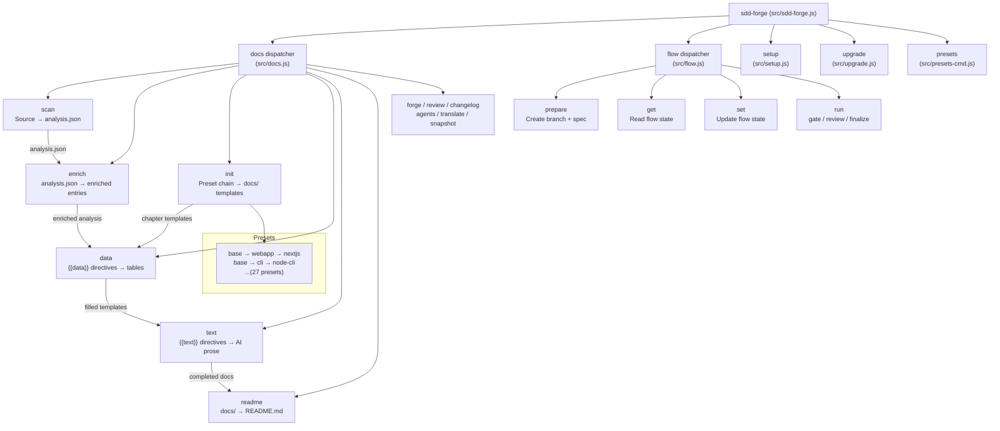

<!-- {{data("base.docs.langSwitcher", {labels: "relative"})}} -->
**English** | [日本語](ja/overview.md)
<!-- {{/data}} -->

# Tool Overview and Architecture

## Description

<!-- {{text({prompt: "Write a 1-2 sentence overview of this chapter. Include the tool's purpose, the problem it solves, and its primary use cases."})}} -->

sdd-forge is a zero-dependency CLI tool that automates technical documentation generation through static source code analysis and AI-powered prose generation, while providing a structured Spec-Driven Development (SDD) workflow for teams working with AI coding agents. It solves the problem of documentation drifting out of sync with code by injecting extracted structural data directly into versioned templates, and it enforces a disciplined plan → implement → merge cycle for feature development.
<!-- {{/text}} -->

## Content

### Purpose

<!-- {{text({prompt: "Describe the problem this CLI tool solves and its target users. Derive the purpose from package.json and README."})}} -->

Software projects that rely on AI coding agents face a recurring problem: documentation quickly falls out of sync with the codebase, and feature development lacks a repeatable, auditable structure. sdd-forge addresses both concerns in a single tool.

On the documentation side, it statically analyzes source code to extract structural data — modules, classes, routes, configuration — and injects that data into template-driven docs via deterministic `{{data}}` directives. AI-generated prose fills `{{text}}` directives within clearly bounded prompts, keeping human-readable narrative aligned with machine-extracted facts. The result is documentation that can be regenerated at any time and stays consistent with the actual codebase.

On the workflow side, sdd-forge provides an SDD flow that guides developers and AI agents through three phases: **Plan** (spec drafting, gate validation, test writing), **Implement** (code, AI review), and **Merge** (doc sync, commit, branch cleanup). Flow state is persisted across context resets, making it safe to use with agents that have limited context windows.

The primary target users are development teams that use Claude Code or similar AI coding assistants and want consistent, auditable documentation and feature development practices without introducing external runtime dependencies.
<!-- {{/text}} -->

### Architecture Overview

<!-- {{text({prompt: "Generate a mermaid flowchart showing the tool's overall architecture. Include the dispatch structure from entry point to subcommands and the main processing flow (input → processing → output). Output only the mermaid code block.", mode: "deep"})}} -->


<!-- {{/text}} -->

### Key Concepts

<!-- {{text({prompt: "Explain the key concepts and terminology needed to understand this tool in table format. Extract the main concepts from source code."})}} -->

| Concept | Description |
|---|---|
| **Preset** | A named, inheritable configuration package that bundles doc templates, data-source classes, and scanner definitions for a specific framework or project type (e.g., `node-cli`, `nextjs`, `laravel`). Presets form a single-inheritance chain such as `base → cli → node-cli`. |
| **analysis.json** | The primary artifact produced by `docs scan`. It holds all structurally extracted data — modules, classes, routes, configuration entries — organized by category, each with `entries` and optional `summary`. Subsequent pipeline steps consume this file. |
| **`{{data}}` directive** | An HTML-comment directive in a chapter template that is replaced with structured output (tables, lists) derived from `analysis.json` via a DataSource method. The content between `{{data}}` and `{{/data}}` tags is overwritten on every `docs data` run. |
| **`{{text}}` directive** | An HTML-comment directive that carries a `prompt` string. During `docs text`, an AI agent reads the surrounding context and analysis data, then writes prose into the directive's body. Supports `mode: "light"` (summary-based) and `mode: "deep"` (full source re-read). |
| **DataSource** | A class inside a preset's `data/` directory that reads `analysis.json` and exposes named methods (e.g., `list()`, `summary()`). These methods supply the values that fill `{{data}}` directives. |
| **SDD Flow** | A three-phase feature-development workflow — Plan, Implement, Merge — orchestrated by `sdd-forge flow` commands. State is persisted in `.sdd-forge/active-flow.json` so it survives AI context resets. |
| **Gate** | A deterministic validation step (`docs gate` / `flow run gate`) that checks a spec or codebase against a set of rules before allowing the flow to advance to the next phase. |
| **Spec** | A structured Markdown document (`spec.md`) created during the Plan phase. It captures requirements, design decisions, and acceptance criteria for a single feature or change. |
| **Chapter** | A single Markdown file in the `docs/` directory representing one section of the project's technical documentation. Chapter order is defined by the `chapters` array in `preset.json` and can be overridden in the project's `config.json`. |
| **Enrich** | An AI-assisted pipeline step that reads the raw `analysis.json` and annotates each entry with a human-readable summary, a chapter assignment, and a role label — bridging raw scan output and prose generation. |
<!-- {{/text}} -->

### Typical Usage Flow

<!-- {{text({prompt: "Describe the typical steps from installation to first output in step format. Derive the steps from help output and command definitions in the source code."})}} -->

**1. Install the package globally**

```sh
npm install -g sdd-forge
```

**2. Run the setup wizard in your project root**

```sh
cd /path/to/your-project
sdd-forge setup
```

The interactive wizard asks you to select a preset (project type), configure an AI agent, and choose an output language. It writes `.sdd-forge/config.json` when complete.

**3. Scan your source code**

```sh
sdd-forge docs scan
```

This statically analyzes the codebase and produces `.sdd-forge/output/analysis.json`, which all subsequent steps depend on.

**4. Initialize documentation templates**

```sh
sdd-forge docs init
```

This resolves the preset inheritance chain and writes the chapter template files into your `docs/` directory.

**5. Populate data directives**

```sh
sdd-forge docs data
```

Fills all `{{data}}` directives in the chapter files with tables and structured output derived from `analysis.json`.

**6. Generate AI prose**

```sh
sdd-forge docs text
```

Runs the configured AI agent to fill each `{{text}}` directive with generated narrative content.

**7. Build README.md**

```sh
sdd-forge docs readme
```

Assembles the final `README.md` from the completed chapter files.

> **Shortcut:** Run all documentation steps in sequence with a single command:
> ```sh
> sdd-forge docs build
> ```
<!-- {{/text}} -->

---

<!-- {{data("base.docs.nav")}} -->
[Technology Stack and Operations →](stack_and_ops.md)
<!-- {{/data}} -->
