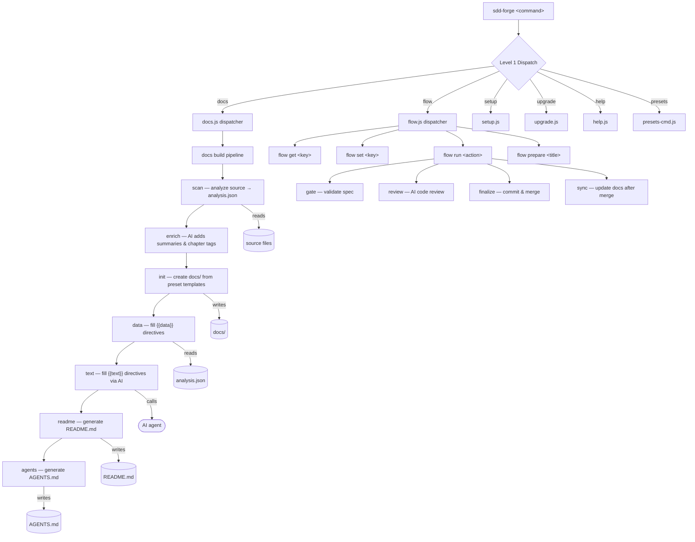

<!-- {{data("base.docs.langSwitcher", {labels: "relative"})}} -->
**English** | [日本語](ja/overview.md)
<!-- {{/data}} -->

# Tool Overview and Architecture

## Description

<!-- {{text({prompt: "Write a 1-2 sentence overview of this chapter. Include the tool's purpose, the problem it solves, and its primary use cases."})}} -->

This chapter introduces sdd-forge, a CLI tool that automates documentation generation from source code analysis and provides a structured Spec-Driven Development (SDD) workflow for AI-assisted projects. It covers the tool's purpose, its three-level command architecture, the core concepts you need to work with it effectively, and the typical sequence from installation to first generated output.
<!-- {{/text}} -->

## Content

### Purpose

<!-- {{text({prompt: "Describe the problem this CLI tool solves and its target users. Derive the purpose from package.json and README."})}} -->

Development teams working with AI coding agents face two persistent challenges: documentation that drifts out of sync with evolving source code, and AI contributions that lack structure or guardrails. sdd-forge addresses both by combining static source-code analysis with a gated, three-phase development workflow (plan → implement → merge).

The tool statically analyzes a project's files — extracting modules, routes, dependencies, configurations, and database schemas — then injects the results into preset-driven Markdown templates to produce structured `docs/` chapters, a `README.md`, and an `AGENTS.md` context file for AI agents. Because output is regenerated from the latest analysis on every build, documentation remains consistent with the code.

The SDD workflow component enforces that requirements are written and validated before implementation begins. Deterministic gates and guardrails check spec completeness at each transition, while AI assistance is scoped to clearly defined tasks such as spec drafting, code review, and prose generation.

Primary users are development teams that rely on AI coding agents (such as Claude Code) and want reproducible documentation alongside a disciplined feature delivery process. The tool supports any project type through a composable preset system and requires only Node.js 18 or later with no external npm dependencies.
<!-- {{/text}} -->

### Architecture Overview

<!-- {{text({prompt: "Generate a mermaid flowchart showing the tool's overall architecture. Include the dispatch structure from entry point to subcommands and the main processing flow (input → processing → output). Output only the mermaid code block.", mode: "deep"})}} -->


<!-- {{/text}} -->

### Key Concepts

<!-- {{text({prompt: "Explain the key concepts and terminology needed to understand this tool in table format. Extract the main concepts from source code."})}} -->

| Concept | Description |
|---|---|
| **Preset** | A composable template package that encodes how to scan and document a specific language or framework. Presets form an inheritance chain (e.g., `base` ← `cli` ← `node-cli`) defined by a `preset.json` with `parent`, `chapters`, and `scan` fields. |
| **`{{data}}` directive** | A template placeholder replaced with static, structured data extracted from `analysis.json` at build time (e.g., dependency tables, route lists). Content between opening and closing tags is overwritten on every build. |
| **`{{text}}` directive** | A template placeholder filled by an AI agent with human-readable prose. The AI receives source code context and analysis data; the prompt and optional `mode` (light or deep) are defined inline in the template. |
| **analysis.json** | The JSON file produced by `sdd-forge docs scan` that captures the project's structure — modules, routes, configurations, dependencies, database schemas, and more. It is the shared input for the `enrich`, `data`, and `text` pipeline stages. |
| **Enrich** | The pipeline stage (`docs enrich`) where an AI agent reads `analysis.json` in full and annotates each entry with a `summary`, `detail`, `chapter` classification, and `role`. This provides richer context for the `text` stage. |
| **SDD Flow** | The three-phase development workflow (plan → implement → merge) managed by `sdd-forge flow` commands. State is persisted in `.sdd-forge/flow.json` and progresses through gated steps. |
| **Spec** | A Markdown file created at the start of a flow that captures requirements, design decisions, Q&A, and acceptance criteria before any code is written. Gates validate the spec before the implement phase begins. |
| **Gate** | A deterministic validation check (`flow run gate`) that verifies a spec is sufficiently complete before allowing progression to the next flow phase. |
| **Guardrail** | A rule that checks whether proposed changes fall within the scope defined in the spec, preventing scope creep during implementation. |
| **AGENTS.md** | A context document generated by `docs agents` containing project-specific rules and structure descriptions for AI agents. In Claude Code environments it is symlinked as `CLAUDE.md`. |
| **DataSource** | A JavaScript class inside a preset's `data/` directory that reads `analysis.json` and returns formatted data (e.g., Markdown tables) for `{{data}}` directives. |
| **Build pipeline** | The full sequence `scan → enrich → init → data → text → readme → agents → translate` executed by `sdd-forge docs build`. Each stage can also be run individually. |
<!-- {{/text}} -->

### Typical Usage Flow

<!-- {{text({prompt: "Describe the typical steps from installation to first output in step format. Derive the steps from help output and command definitions in the source code."})}} -->

**1. Install the package globally**

```bash
npm install -g sdd-forge
```

Requires Node.js 18 or later. No additional dependencies are needed.

**2. Initialize your project**

Run the interactive setup wizard from your project root:

```bash
sdd-forge setup
```

The wizard prompts for the project type (preset), documentation language(s), default AI agent, and documentation style preferences. It generates `.sdd-forge/config.json` and, for Claude Code users, deploys the SDD flow skills.

**3. Build documentation**

```bash
sdd-forge docs build
```

This runs the full pipeline in sequence:
- `scan` reads your source files and writes `.sdd-forge/output/analysis.json`
- `enrich` calls the AI agent to annotate each entry with summaries and chapter assignments
- `init` creates `docs/` from the preset templates
- `data` fills every `{{data}}` placeholder with tables and lists from the analysis
- `text` calls the AI agent to generate prose for every `{{text}}` placeholder
- `readme` assembles `README.md` from the completed chapter files
- `agents` generates or updates `AGENTS.md`

After this step, `docs/`, `README.md`, and `AGENTS.md` are ready in your project root.

**4. Review and refine**

Open the generated chapter files in `docs/`. Content inside `{{data}}` and `{{text}}` blocks is managed automatically; any text you write outside those blocks is preserved on subsequent builds.

**5. Keep documentation in sync**

After source code changes, re-run the build to regenerate affected sections:

```bash
sdd-forge docs build
```

**6. (Optional) Start a Spec-Driven Development flow**

For new features or bug fixes, initiate a guided development flow:

```bash
sdd-forge flow prepare "Add user authentication"
```

This creates a spec file and a dedicated branch, then guides you through the plan, implement, and merge phases with gated checkpoints and AI-assisted review.
<!-- {{/text}} -->

---

<!-- {{data("base.docs.nav")}} -->
[Technology Stack and Operations →](stack_and_ops.md)
<!-- {{/data}} -->
