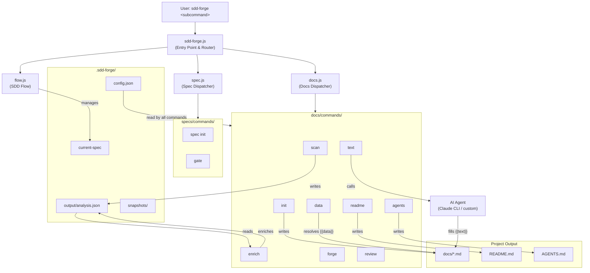

# 01. System Overview

## Description

<!-- {{text: Write a 1-2 sentence overview of this chapter. Include the project's architecture and whether it integrates with external systems.}} -->

This chapter describes the high-level architecture of sdd-forge, a Node.js CLI tool that automates documentation generation through Spec-Driven Development. It covers how the three-layer command dispatch system orchestrates the build pipeline, how components interact with the local file system, and how the tool integrates with external AI agents such as Claude CLI.
<!-- {{/text}} -->

## Content

### Architecture Diagram

<!-- {{text: Generate a mermaid flowchart showing the project architecture. Include data flows between major components. Output only the mermaid code block.}} -->

<!-- {{/text}} -->

### Component Responsibilities

<!-- {{text[mode=deep]: Describe the major components with their location, responsibilities, and I/O in table format.}} -->

| Component | Location | Responsibilities | Input | Output |
|---|---|---|---|---|
| **Entry Point** | `src/sdd-forge.js` | CLI argument parsing, project context resolution, subcommand routing to dispatchers | Raw `process.argv`, `.sdd-forge/projects.json` | Sets `SDD_SOURCE_ROOT` / `SDD_WORK_ROOT` env vars; delegates to dispatcher |
| **Docs Dispatcher** | `src/docs.js` | Routes docs subcommands; orchestrates the full build pipeline with progress tracking | Subcommand name + args | Delegates to individual `docs/commands/*.js` scripts |
| **Spec Dispatcher** | `src/spec.js` | Routes `spec` and `gate` subcommands | Subcommand name + args | Delegates to `specs/commands/init.js` or `gate.js` |
| **Flow Runner** | `src/flow.js` | Automates the end-to-end SDD workflow (spec → gate → implement → forge → review) | `--request` flag and flow state | `.sdd-forge/current-spec` state file; AI agent calls |
| **Scanner** | `src/docs/commands/scan.js` | Recursively scans source files and extracts structural metadata per preset configuration | Source files under `srcRoot` | `.sdd-forge/output/analysis.json` |
| **Enrich** | `src/docs/commands/enrich.js` | Calls the AI agent to annotate each analysis entry with `summary`, `detail`, `chapter`, and `role` fields; supports batch resumption | `analysis.json` | Updated `analysis.json` with enrichment fields added in-place |
| **Init** | `src/docs/commands/init.js` | Copies preset templates into `docs/` to create the initial chapter file structure | Preset templates from `src/presets/{key}/templates/{lang}/` | `docs/*.md` chapter files |
| **Data Resolver** | `src/docs/commands/data.js` | Resolves `{{data}}` directives in chapter files using structured data from `analysis.json` | `docs/*.md`, `analysis.json` | Updated `docs/*.md` with data tables injected |
| **Text Generator** | `src/docs/commands/text.js` | Resolves `{{text}}` directives by invoking the AI agent with source context; supports light and deep modes | `docs/*.md`, source files, `analysis.json` | Updated `docs/*.md` with AI-generated prose |
| **Readme Generator** | `src/docs/commands/readme.js` | Assembles `README.md` from the generated chapter files | `docs/*.md` | `README.md` |
| **Agents Updater** | `src/docs/commands/agents.js` | Regenerates the SDD and PROJECT sections of `AGENTS.md` from preset templates and `analysis.json` | Preset AGENTS template, `analysis.json` | `AGENTS.md`; creates `CLAUDE.md` symlink |
| **Forge** | `src/docs/commands/forge.js` | Iteratively improves existing `docs/*.md` files using AI feedback loops | `docs/*.md`, change summary prompt | Updated `docs/*.md` |
| **Review** | `src/docs/commands/review.js` | Evaluates documentation quality against a checklist and reports pass/fail | `docs/*.md`, review checklist | Console report; structured pass/fail result |
| **Gate** | `src/specs/commands/gate.js` | Validates a spec file for completeness before (pre) or after (post) implementation | `specs/NNN-xxx/spec.md` | PASS/FAIL console report; blocks flow on FAIL |
| **Agent Caller** | `src/lib/agent.js` | Wraps external AI CLI invocations; handles sync/async modes, stdin fallback for large prompts, and timeout management | Prompt string, agent config from `config.json` | AI-generated text returned as string |
| **Config Loader** | `src/lib/config.js` | Loads and validates `.sdd-forge/config.json`; resolves paths for all sdd-forge managed files | `.sdd-forge/config.json` | Validated config object; resolved file paths |
| **Command Context** | `src/docs/lib/command-context.js` | Builds the shared `CommandContext` object consumed by all pipeline commands | CLI args, env vars, `config.json` | `CommandContext` with `root`, `srcRoot`, `config`, `lang`, `agent`, `t()` etc. |
| **Preset System** | `src/lib/presets.js` + `src/presets/` | Auto-discovers `preset.json` files, maps project types to scan targets and template sets | `src/presets/**/preset.json` | `PRESETS` constant; type alias map |
<!-- {{/text}} -->

### External Integrations

<!-- {{text: If there are external system integrations, describe their purpose and connection method in table format.}} -->

| External System | Purpose | Connection Method | Configuration |
|---|---|---|---|
| **Claude CLI** | AI text generation for `{{text}}` directives, enrich annotations, forge improvements, and AGENTS.md generation | Spawned as a child process via `execFileSync` (sync) or `spawn` (async) | `providers.claude` in `.sdd-forge/config.json`: `command`, `args`, optional `timeoutMs` and `systemPromptFlag` |
| **Custom AI Agent** | Any alternative AI CLI tool can replace Claude (e.g., a local model wrapper) | Same child-process mechanism; command and args are fully configurable | `providers.<name>` entries in `config.json`; `defaultAgent` selects which provider is active |
| **npm Registry** | Package distribution; sdd-forge is published as `sdd-forge` on npmjs.com | `npm publish` CLI; `npm dist-tag` for tag management | `package.json` `files`, `bin`, and `version` fields |
| **Git** | Branch and worktree management during the SDD flow; commit and merge operations | `child_process` calls to the system `git` binary | Configured via `flow.merge` in `config.json` (`squash` / `ff-only` / `merge`) |

All external integrations are invoked through the operating system's process model. sdd-forge itself carries **no npm runtime dependencies** — only Node.js built-in modules are used.
<!-- {{/text}} -->

### Environment Differences

<!-- {{text: Describe the configuration differences across environments (local/staging/production).}} -->

sdd-forge is a local developer CLI tool and does not have traditional staging or production server environments. Instead, "environments" correspond to different project setups and operator contexts:

| Context | Description | Key Configuration |
|---|---|---|
| **Single-project local** | Developer runs sdd-forge directly inside their project repository | `.sdd-forge/config.json` present in the project root; no `projects.json` needed |
| **Multi-project (global)** | sdd-forge manages several projects from a central location using `--project <name>` | `.sdd-forge/projects.json` lists each project with its `path` and `workRoot`; `SDD_WORK_ROOT` / `SDD_SOURCE_ROOT` env vars are set automatically per project |
| **Worktree mode** | SDD flow runs inside a Git worktree for isolated feature development | Flow state stored in `.sdd-forge/current-spec`; `isInsideWorktree()` detection adjusts branch handling automatically |
| **CI / non-interactive** | Automated runs (e.g., in a pipeline) where no interactive prompts are expected | Agent timeouts apply (`DEFAULT_AGENT_TIMEOUT_MS` = 120 s, up to `LONG_AGENT_TIMEOUT_MS` = 300 s); `CLAUDECODE` env var is cleared to prevent CLI hangs |
| **Multi-language output** | Projects configured with more than one output language (e.g., `["en", "ja"]`) | `output.languages`, `output.default`, and `output.mode` in `config.json`; build pipeline appends a `translate` step automatically |

The `lang` field in `config.json` controls the CLI interaction language and the language of generated AGENTS.md and skill files, independently of `output.languages` which governs documentation output.
<!-- {{/text}} -->
